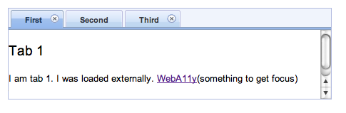
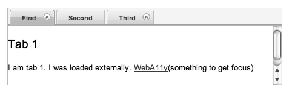
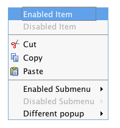
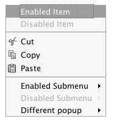
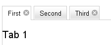
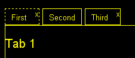
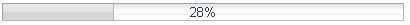
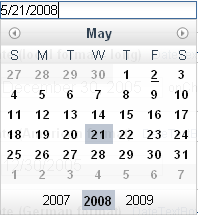
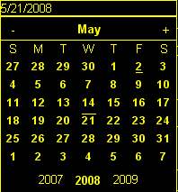
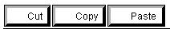

#format dojo_rst

A11y Requirements
=================

:Author: Becky Gibson

.. contents::
   :depth: 2

===================
5 A11y Requirements
===================

Below are the 5 basic Dojo Accessibility requirements which must be met when creating and styling user interface components. Each Dojo developer and designer are required to implement accessibility for dijit components. The folks with a11y experience will help but it is each developer's responsibility to understand and follow these guidelines. If you need help with a11y, create a trac ticket with the category a11y-review but remember that it is not the a11y team's job to implement accessibility for you!

**Visual**

  + `Identification and interaction with visual elements does not rely on color alone <developer/a11y-requirements#interaction-does-not-rely-on-color-alone>`_
  + `All functionality is perceivable without color or Images <developer/a11y-requirements#perceivable-without-color-or-images>`_
  + `All functionality is visible and usable at various font sizes <developer/a11y-requirements#visible-at-various-font-sizes>`_

**Functional**

  + `All functionality is usable via the mouse and keyboard <developer/a11y-requirements#usable-via-the-mouse-and-keyboard>`_
  + `All functionality is enabled for assistive technology <developer/a11y-requirements#enabled-for-assistive-technology>`_

Note that this is not a comprehensive list of Web Accessibility requirements, just the list of items most likely to be encountered by a Dojo Designer or Developer. For complete Accessibility Guidelines see:

  + `W3C Web Content Accessibility Guidelines 2.0 <http://www.w3.org/WAI/GL/>`_
  + `US Section 508 of the Rehabilitation Act <http://www.section508.gov/>`_
  + `W3C provided list of accessibility policies around the world <http://www.w3.org/WAI/Policy/>`_

======
Visual
======

Interaction does NOT rely on color alone
----------------------------------------

This is perhaps the most confusing requirement and most difficult to describe. It tries to address color blindness issues where a person may not be able to perceive certain colors. It does not mean you can not use color! However, when you use color to distinguish behavior such as active, selected, or focused elements, there must be enough contrast between the colors used for the difference to be apparent if the color itself can not be seen. A few examples are in order.

Here is a dojo tab container displayed using the blue soria theme. The first tab is active and has a darker blue background color. The non-active tabs are displayed in the lighter blue. Since there is a difference in contrast, the use of the background color is acceptable. 

If color is removed, the difference between the active and non-active tabs can still be distinguished as demonstrated in the image below. 

The following two images show another example using the dojo menu in the tundra theme. A blue background is applied to to the menu item with focus. 

This background is still apparent when color (but not contrast) is removed.

How to Test
~~~~~~~~~~~

If you are developing on the Mac the simplest way to test for this is to open Universal Access from System Properties, pick the Seeing panel and click on "Use grayscale". If you can still detect the contrast difference in modes, you have met the a11y requirement. Even better if you can increase the contrast on the "Enhance Contrast" slider and still see the difference. Try to be reasonable about the contrast level - if it isn't obvious or you have to ask for a second opinion the contrast probably isn't sufficent. If you have an image editing program you can capture an image of the component, load it into your editing program, reduce the saturation and make sure you can still perceive a contrast difference. Hey, anyone should be able to test for this!

If you want examples of contrast ratios for different background and foreground colors see Gez Lemon's `Example Luminosity Contrast Ratios <http://juicystudio.com/services/coloursaferatio.php>`_ or pick your own colors and use his `Luminosity Contrast Ratio Analyser <http://juicystudio.com/services/luminositycontrastratio.php>`_.

More Details
~~~~~~~~~~~~
This requirement comes from the W3C Web Content Accessibility Guidelines (WCAG) 2.0; Use of Color: `Color is not used as the only visual means of conveying information, indicating an action, prompting a response, or distinguishing a visual element <http://www.w3.org/TR/WCAG20/#visual-audio-contrast-without-color>`_. The more contrast that the color difference provides, the better.

WCAG 2.0 has techniques demonstrating the proper use of color:

  + `C15: Using CSS to change the presentation of a user interface component when it receives focus <http://www.w3.org/TR/2008/WD-WCAG20-TECHS-20080430/C15.html>`_.
  + `C16: Changing the background color or border of the element with hover and focus <http://www.w3.org/TR/2008/WD-WCAG20-TECHS-20080430/C16.html>`_

WCAG 2.0 has some specific requirements about the contrast ratio of text and images of text to the background but that doesn't generally apply to Dijit UI where text within the widgets is kept to a minimum. There are formulas for determining the color contrast as well as testing tools - see the How to Test section.

Perceivable without color or images
-----------------------------------

This requirement is intended to target low vision users who may have special display settings to help with a specific visual impairment. It can often get confused with the requirement that "Identification and interaction with visual elements does not rely on color alone" which must be met for the default display mode seen by the majority of users. Low Vision users often use a display setting referred to as High Contrast Mode. In Windows, this setting removes all colors and background images from Web pages. See `Widgets and High Contast Mode <http://www.dojotoolkit.org/2007/03/30/widgets-and-high-contrast-mode>`_ for a more complete description.

In Windows High Contrast mode any action or function that is differentiated by color or via a CSS background image is no longer visible. Using a background color to distinguish the active tab within a tab container which meets the first requirement does not meet this requirement since there is no longer any color differentiation for the user to comprehend. An additional means of identifying the active tab, such as a different outline around the tab or underlining the tab title must be provided for this mode. Icons and visual elements created via CSS background images are no longer visible and a real  element or text equivalent must be provided.

This requirement will take additional styles in order to meet. Dijit has code to detect high contrast mode and add a dijit-a11y class to the body element of the page. This will trigger additional styles to enable text equivalents, underlining, borders or other visual clues to make the components usable in high contrast mode. See High Contrast/Images Off in the `Dijit Accessibility Strategy <dijit/a11y/strategy>`_ section for more implementation details. Some of the mechanisms to visually identify elements in high contrast mode are to add a different border or outline, increase the border width, or add an underline or overline to text. Background-images can be replaced by text or  elements (but the  elements must also have text alternatives). Examples in the Dojo widgets include:

**a dotted border on the tab title of the active tab container**

standard display

high contrast (yellow on black)

**a wide border to represent the progress within a progress bar**

standard display

high contrast (white on black)

**an overline on the selected date in the calendar**

standard display

high contrast (yellow on black)

**text alternatives for the editor toolbar buttons**

standard display

high contrast (black on white)

In addition to high contrast mode, the UI must also be usable if images are turned off. Turning images off in the browser will prevent  elements and CSS background images from being displayed but colors and styles will still be visible. If you have properly supported high contrast mode, text alternatives will exist for the CSS background images. If any  elements have been used and they convey meaning within the UI, they must have alt and title attributes. An image conveys meaning when it must be present in order to access the functionality. For example, an image on a toolbar button conveys meaning if without the image displayed the user will have no way to determine the button's function.

How to Test
~~~~~~~~~~~

In order to completely test this requirement you will need to use Windows and turn on high contrast mode. The `Widgets and High Contast Mode <http://www.dojotoolkit.org/2007/03/30/widgets-and-high-contrast-mode>`_ post has instructions for enabling high contrast mode. With high contrast mode turned on verify that all of the visual elements of the component can be seen and identified. Perform all actions associated with the component such as selection, focus, and activation and verify that all are visually identifiable. Note that browser provided focus indication is sufficient - you don't need to add additional styles to enhance focus.

In High Contrast mode  elements will still be displayed. To confirm that text alternatives have been provided for  elements turn display of images off in the browser. Verify that an appropriate text alternative is provided for any images which are essential to the UI.

More Details
~~~~~~~~~~~~

This requirement comes from the WCAG 2.0 guideline Text Alternatives: `Provide text alternatives for any non-text content so that it can be changed into other forms people need, such as large print, braille, speech, symbols or simpler language <http://www.w3.org/TR/WCAG20/#text-equiv>`_. If there are images that have meaning they must have text alternatives. The color requirements are stricter interpretations of Use of Color: `Color is not used as the only visual means of conveying information, indicating an action, prompting a response, or distinguishing a visual element <http://www.w3.org/TR/WCAG20/#visual-audio-contrast-without-color>`_.

Visible at various font sizes
-----------------------------

Some users set their browser to use larger font sizes. All of the Dojo components should render and work properly at larger and smaller font sizes. In order for the user's font size preference to work, Dojo should use relative font sizes with em and % units, and avoid fixed font sizes such as 12px or 10pt. Items such as the size of the color palette square or checkbox and radio button may be defined using fixed sizes since they do not need to change in response to larger font sizes. While fixed sizes can be used for margins and padding, note that the margin or padding will no longer change in relation to the font size which may affect the overall visual look and feel. In addition, larger or smaller fonts may cause line wrapping within components so keep that in mind when implementing specific layouts and placement. Make certain that any parameters to widgets that are used to specify height and width can accept and respond to relative sizes.

How to Test
~~~~~~~~~~~

IE, Firefox, and Safari all have a mechanism to increase text size. IE 7, Firefox 3 and Opera provide a mechanism to zoom the entire page - text and images. When a View text size option is selected in IE 6 & 7, text with explicit sizes will not scale. This is a great way to check whether or not you have incorrectly set any font sizes to a specific value - if the text doesn't change size in IE 6 & 7 when you select view text size largest you need to make changes to the style of that text.

To check for proper layout, select View Text Size largest in IE 6 & 7 or increase the text size two or three times in Firefox 2 or Safari. Reload your test page and verify that any components are rendered in a manner that is still usable. Items may wrap (such as a large set of tabs in a tab container) but the functionality should still be understandable.

More Details
~~~~~~~~~~~~

This requirement comes from WCAG 2.0 Resize text: `Text (but not images of text) can be resized without assistive technology up to 200 percent without loss of content or functionality <http://www.w3.org/TR/WCAG20/#visual-audio-contrast-scale>`_. This is not a top level requirement but is important in order to properly support IE 6. The advent of the Zoom feature in IE 7, Firefox 3 and Opera negate the need for ensuring that font sizes are relative since the entire page gets uniformly scaled. But as long as IE 6 is supported fixed font sizes can be an issue.

==========
Functional
==========

Usable via the mouse and keyboard
---------------------------------

Not all users want or are able to use a mouse for navigation so a keyboard mechanism to access all of the functionality on a page must be provided. This does not mean that every visual element must be capable of receiving focus and activation via the keyboard! Rather, it means that the same functionality is provided via that keyboard as can be achieved with the mouse. For example, Dojo dialogs have a close icon in the upper corner of the dialog title bar. The user can click on this icon to cancel the dialog. The keyboard user can not tab to that icon but pressing escape with focus in the dialog performs the same cancel function. Thus, the keyboard version of the functionality to cancel a dialog has been provided.

How to Test
~~~~~~~~~~~

Break free from your mouse! Any developer can test using just the keyboard. You may have to learn a few basic keystrokes for general navigation within your browser. There are some references for general keyboard usage in the `Testing Widgets For Accessibility <quickstart/writingWidgets/a11yTesting>`_ section. Make certain that all functionality of the component can be accessed via the keyboard. The keyboard usage of all existing dijit widgets are documented on the book page for each widget in Part 2: Dijit.

More Details
~~~~~~~~~~~~

This requirement comes from a WCAG 2.0 guideline: `Keyboard Accessible: Make all functionality available from a keyboard <http://www.w3.org/TR/WCAG20/#keyboard-operation>`_.

By default browsers provide focus to form fields and links. The user can use the tab key to move focus within these items on a page. With many sophisticated UI components on a page, tabbing to interact within all of these items would be tedious. Thus, it is recommended, and Dijit has implemented, arrow key and other keyboard navigation within widgets. There are various Dojo and dijit functions to make implementation of keyboard support easier. See the `Creating Accessible Widgets <quickstart/writingWidgets/a11y>`_ section.

When creating a new component for use on the Web follow any existing keyboard conventions of a similar Desktop component. There is a group working on a `DHTML Style Guide <http://dev.aol.com/dhtml_style_guide>`_ to define the keystrokes and behaviors to implement for Web components. As of October, 2008, this document is still in draft stage but is a good reference for implementing keyboard support.

Enabled for assistive technology
--------------------------------

People who use screen readers and other assistive technology need additional information about the user interface components such as the type and current state. The Accessible Rich Internet Applications specification from the W3C describes the roles and states which can be applied to scripted user interface controls. The browser interprets this addition semantic information and provides it to assistive technologies via the Accessibility API of the operating system. ARIA has been implemented in all of the widgets in the Dojo core widget set - dijit. See the Implement ARIA Specification material in the `Dijit Accessibility Strategy <dijit/a11y/strategy>`_ section.

Since ARIA is still new, assistance from a developer familiar with ARIA and assisitive technology will be needed to implement and test this feature. However, any developer can implement and test the basic ARIA roles and state. The `Dijit Accessibility Resources <dijit/a11y/resources>`_ section provides details on the api's that Dojo developers can use to implement ARIA. The `Add ARIA Information <quickstart/writingWidgets/a11y#add-aria-information>`_ part of the `Creating Accessible Widgets <quickstart/writingWidgets/a11y>`_ section has more details on implementing ARIA when creating a widget.

How to Test
~~~~~~~~~~~

The ARIA specification is currently only implemented on Windows in Firefox 2 and works with the Window-Eyes and JAWS screen readers. Firefox 3 will support ARIA on Windows and Linux. ARIA support is being added to IE 8, Opera 9.5 and a post 3.0 version of Safari. The Testing Widgets for Accessibility section has information on how to test ARIA. Anyone can perform basic ARIA testing using the MS Inspect or ACCProbe tools. For complete testing screen reeder skills are required. If a developer requires assistance creating or verifying ARIA implementation, create a Dojo Trac ticket with the component set to a11y - review. Please try to do as much ARIA implementation and testing as possible on your own and don't just throw the work at an accessibility person. Engage accessibility help before the widget is complete so accessibility can be included in the design process.

More Details
~~~~~~~~~~~~

See the following resources for more details on ARIA

  + `A recorded demo of using the Dijit Demo Mail app with a screen reader <http://weba11y.com/demos/DojoMailDemo/lib/playback.html>`_
  + `W3C Protocols and Formats Working Group Page <http://www.w3.org/WAI/PF/>`_ (the group developing the ARIA spec)
  + `ARIA: Accessible Rich Internet Applications <http://developer.mozilla.org/en/Accessible_DHTML>`_ in the Mozilla Developer Center
  + `Various Presentations on Dojo and ARIA <http://www.weba11y.com/Presentations/presentations.html>`_
