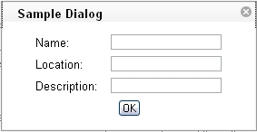
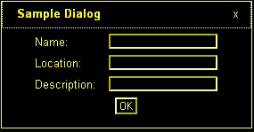

## page was renamed from dijit-a11y-strategy
#format dojo_rst

Dijit Accessibility Strategy
============================

:Author: Becky Gibson

.. contents::
  :depth: 3

Support High Contrast /Images Off
---------------------------------

Customizing the dijit Widgets look and feel is very important, as is performance. The Dojo team uses background images in the creation of the widgets because it allows the look and feel of the widgets to be easily customized by modifying the CSS. In addition, using CSS allows several images to be combined into one file and then the proper subset of the image to displayed using positioning. Thus all of the images for a particular widget element can be retrieved via one HTTP request rather than a separate request for each separate image file. For these reasons, Dojo did not want to require the use of image elements when creating widgets. This presents a problem for users with high contrast mode settings because in this mode, background images are not displayed.

This problem is solved in dijit by checking for high-contrast mode when the widgets get loaded. If high-contrast mode is detected, an additional style sheet is added to the body element of the page. This is NOT a style sheet to provide a set of high-contrast mode colors and styles – it is an enhancement to the existing style sheet to enable text equivalents for the items that rely on CSS images.

For example, in the default Dojo theme called tundra, the close icon for a dialog box is represented using a CSS background image of an x within a shaded circle which is displayed in the upper right hand corner of the dialog box.

Within the dialog template there is an additional span that contains the character ‘x’ to serve as the text alternative for the background image icon.

.. code-block :: javascript

  

    

      ${title}
      
        x
      
    

    

  

This span has a style of .closeText which is defined as follows:

.. code-block :: css

  .dijitDialog .closeText {
        display:none;
        position:absolute;
  }

Notice that the closeText style is encapsulated within .dijitDialog so this style applies when it is cascaded within an element which has the 
.dijitDialog style applied. The span with .closeText applied is set to display:none. The dijit.css style sheet contains an additional style:

.. code-block :: css

  .dijit_a11y .dijitDialog .closeText { 
        display:inline;
  }

When high-contrast mode is detected the .dijit_a11y class is applied to the body element of the page and now the span with class .closeText is made visible via the display:inline directive. In high-contrast mode, the background image of the close icon is no longer visible but the character ‘x’ is displayed.

In some cases, an HTML entity character such as, &#x25BC; - the Unicode black down pointing triangle (▼) is used as the text alternative. This character is used to provide the down arrow character to indicate a popup is available. This provides some issues for screen readers that may not correctly speak the HTML entity character, but the ARIA describedby and labelledby attributes are used to provide the correct text description for the character when necessary.

The high contrast detection code is in dijit._base.wai.js in the onload function. This function is run before the widgets are created to detect if a Windows system running Internet Explorer or Firefox is in high contrast mode. This function can also detect if images are turned off in Firefox when running via http (images are not turned off in Firefox when running from the file system even if Tools Options Content Load images automatically has been unchecked).

The high contrast detection code uses scripting to create an element, set specified style attributes on the element and append it to the body element. The styles assigned are two different border colors to the top and side borders, a background image, and absolute positioning to render it off screen. Next the computed style for the element is obtained and the border colors are compared. If high contrast mode is turned on, the top and right border colors will both be the same color since high contrast mode overrides CSS specified colors for the high contrast theme color.

Image detection works by examining the background image for the element. If images are turned off the background image style will “none” in IE or “url(invalid-url:)” in Firefox. Note however, that image off is only detected in IE when it is already in high contrast mode. Additional work is underway to determine images off mode in Internet Explorer in all cases.

Support Device Independent Interaction
---------------------------------------

One way of providing keyboard support in HTML is to use form and list elements which can accept keyboard focus by default. The user can use the tab key to navigate to these types of elements. The problem is that building sophisticated widgets using these elements in not practical. And, navigating via only the tab key can be very tedious. The solution is to provide full keyboard support within the widgets using additional keystrokes such as the arrow keys to provide more intuitive navigation.

One of the keys to supporting the keyboard is to allow focus to be set to any element. The tabindex attribute can be used to include additional elements in the tab order and to set programmatic focus to them. This was a feature implemented in Internet Explorer that has been extended to Firefox and Mozilla. The following table outlines the use of the tabindex attribute:

+------------------------+-----------------------------------+-------------------------------------+ 
|tabindex Attribute Value| Focusable via mouse or scripting  | Tab Navigation                      |
|                        | via element.focus()               |                                     |
+========================+===================================+=====================================+ 
| not present            | Follow default behavior of element| Follows default behavior of element | 
|                        | element (only form controls and   |                                     |
|                        | anchors receive focus)            |                                     |
+------------------------+-----------------------------------+-------------------------------------+ 
| zero - tabindex="0"    | Yes	                             | In tab order relative to element's  |
|                        |                                   | position in document                |
|                        |                                   |                                     |
+------------------------+-----------------------------------+-------------------------------------+
| positive - tabindex="x"| Yes                               | tabindex value directly specifies   |            
| (where x is a positive |                                   | where this element is positioned in |
| integer between 1 and  |                                   | he tab order                        |
| 32768)                 |                                   |                                     |
| negative-tabindex="-1" | Yes                               | Not in tab order, author must focus |
|                        |                                   | it with element.focus() as result of| 
|                        |                                   | a key press.                        |
+------------------------+-----------------------------------+-------------------------------------+

Adding a tabindex of -1 to an element allows the element to receive focus via JavaScript using the element.focus() method. This is used to allow arrow key navigation to elements. Each element that can be navigated to via arrow keys must have a tabindex of -1 to allow it to receive focus. A keydown event handler can determine the next object to receive focus and call that element’s focus() method. In addition, the style of the element may need to be updated in order to show the focus as brower’s are inconsistent in displaying focus for items that receive focus programmatically.

In order to assist with key event handling, an onkey event has been added to Dojo to normalize key events. The appropriate key event, either onkeydown or onkeypress, will be used depending upon the browser. The key codes have been normalized as well. See dojo.event.browser class in dojo.event.browser.js. In addtion, there is a special onDijitClick event implemented in the dijit system to provide support for a mouse click, Enter key press or Spacebar key press to invoke an action. By subscribing to the onDijitClick dijit event, the provided handler will be called when a click, enter key or space key is received allowing the developer to easily support both mouse and keyboard. This event is utilized by the core dijit widget set and is available to developers building custom widgets.

Implement ARIA Specification
----------------------------

ARIA techniques (described in the `Dijit Accessibility <dijit/a11y/index>`_ section) allow creating sophisticated UI components using scripting which can be identified to assistive technology. In the future, user agents can also make use of this information to provide additional visual clues about components as well. For example, client side validation of a text entry component that was marked using the ARIA invalid attribute could be visually identified by the browser rather than requiring the developer to provide a specific style or text identification on the component.

The ARIA information is being added into the dijit widgets Methods have been added into dijit to enable setting the ARIA information. The roles and states for a widget can be set via the widget template or within the widget scripting code. The details of these methods are discussed later in this document. In addition to providing the roles and states for each component, there are some architectural considerations as well. For components that represent a hierarchy, such as a tree or menu, it is important to identify parent and child relationships. For items where position or count are important it may be necessary to hierarchically group elements or identify a set of related elements as a group. In some cases there are specific ARIA roles for grouping items such as treegroup for tree items within the same level. If no specific grouping role is provided the generic group role can be used.
