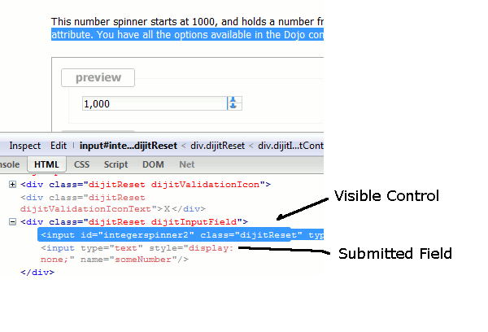

## page was renamed from 1.2/dijit/form
## page was renamed from dijit/form
#format dojo_rst

dijit.form
==========

:Status: Draft
:Version: 1.0
:Authors: Doug Hays, Bill Keese, Nikolai Onken, Marcus Reimann, Craig Riecke
:Developers: multiple developers
:Available: since V0.9

.. contents::
    :depth: 2

The dijit.form package contains "form widgets". What's a form widget? It roughly means a widget that appear inside a form, but technically we think of it as "anything that has a value".

The widgets can be used in a FORM tag, in a `dijit.form.Form <dijit/form/Form>`_ widget, or outside of a form.

Note not to confuse the dijit.form module with the dijit.form.Form widget.

======================
Available Form Widgets
======================

The dijit.form widgets are:

Buttons
-------

* `dijit.form.Button <dijit/form/Button>`_

  A representation of a normal <button> or <input type="submit/reset/button" />

* `dijit.form.DropDownButton <dijit/form/DropDownButton>`_ 

  A button which displays a menu or some other popup when you press it

* `dijit.form.ComboButton <dijit/form/ComboButton>`_

  A button with an arrow to show a drop down (often a menu)

* `dijit.form.ToggleButton <dijit/form/ToggleButton>`_

  A cross between a Button and a Checkbox widget

Input widgets 
-------------

All Widgets, that are similar to <input>:

* `dijit.form.CurrencyTextBox <dijit/form/CurrencyTextBox>`_

  A specialized input widget for monetary values, much like the currency type in spreadsheet programs

* `dijit.form.DateTextBox <dijit/form/DateTextBox>`_

  An easy-to-use date entry control which allows either typing or choosing a date from any calendar widget

* `dijit.form.NumberSpinner <dijit/form/NumberSpinner>`_

  A input widget which restricts input to numeric input and offers down and up arrow buttons to "spin" the number up and down

* `dijit.form.NumberTextBox <dijit/form/NumberTextBox>`_

  A input widget which restricts input to numeric input

* `dijit.form.TextBox <dijit/form/TextBox>`_

  A basic <input type="text">-style form control

* `dijit.form.TimeTextBox <dijit/form/TimeTextBox>`_

  A time input control which allows either typing or choosing a time from any time-picker widget

* `dijit.form.ValidationTextBox <dijit/form/ValidationTextBox>`_

TextArea
--------

* `dijit.form.SimpleTextarea <dijit/form/SimpleTextarea>`_

  A simple wrapper of <textarea>; equivalent functionality

* `dijit.form.Textarea <dijit/form/Textarea>`_

  An auto expanding/contracting <textarea>

Select widgets
--------------

* `dijit.form.Select <dijit/form/Select>`_

  A styleable drop down select box (similar to html select element)

* `dijit.form.ComboBox <dijit/form/ComboBox>`_

  This is often called "auto complete" and perhaps should be listed in the "Input widgets" section above since it allows the user to type any value and just gives suggested completions

* `dijit.form.MultiSelect <dijit/form/MultiSelect>`_

  The MultiSelect widget allows the selection of multiple items

* `dijit.form.FilteringSelect <dijit/form/FilteringSelect>`_

  Similar to a <select> but with type-ahead filtering of the drop down list

There are also some select widgets in the `dojox.form <dojox/form>`_ project.

Miscellaneous
-------------

* `dijit.form.Form <dijit/form/Form>`_

  Corresponds to a <form> itself; wraps other widgets

* `dijit.form.Slider <dijit/form/Slider>`_

  A scale with a handle you can drag up/down or left/right to select a value

* `dijit.form.CheckBox <dijit/form/CheckBox>`_

  Nearly the same as an HTML checkbox, but with fancy styling

* `dijit.form.RadioButton <dijit/form/RadioButton>`_

  To select one choice from a list

There are also some notable widgets in `dojox.form <dojox/form>`_ and `dojox.widget <dojox/widget>`_ that complement the dijit.form pieces and will probably be incorporated into dijit eventually.

===============
Form validation
===============

There are three parts to form validation:

* color change / icon: fields turn yellow and display an icon when they have an invalid value, or when a required field is empty

* validation tooltips

* prevention of form submit: using the `dijit.form.Form <dijit/form/Form>`_ widget you can prevent form submission if any of the fields are invalid

Color change
------------
The input-type form widgets (including ComboBox and FilteringSelect, but excluding Textarea) turn yellow and display an icon when the value is invalid, or a required field is blank.

In general the color change is deferred until the field is blurred. I.e. the field won't turn yellow while the user is typing because the value they have is incomplete. However, the field will still turn yellow instantly if the value the user is typing isn't valid (and can't be made valid by typing more characters). This change should provide good feedback to users.

For number fields, the field will also turn yellow instantly if the user has entered a value that is out of range (like 1000 for a field with max=999), assuming that the value can't be made in range by typing more characters (ex: "1" in a field with a min of 1000).

Validation Tooltips
-------------------
You can define the following types of tooltip prompts for the input type form widgets (same list as above):

  * promptMessage: hint message on focus/mouse over of an empty field.  Note that this is not recommended from a Ux perspective as it might make the user think they've done something wrong.
  * invalidMessage: when the value is invalid.
  * missingMessage: when a required value is missing
  * rangeMessage: when the value is outside a min/max range

If you don't define a message then dijit uses built-in generic messages, except for the promptMessage, which just isn't displayed.

The validation tooltips are only displayed while the field is focused (and after dijit has decided that there is indeed an error, see above section).

Prevent form submission
-----------------------
Using the `dijit.form.Form <dijit/form/Form>`_ widget you can prevent form submission if any of the fields are invalid.  Dijit provides hooks so you can either disable the submit button, or popup an error message when the user tries to submit, or even focus on the invalid field.

=================================
Use Dijit Form Controls All Over!
=================================

Because they're easy to mix and match, novice Dojo users often combine Dijit form controls with plain ol' HTML controls.  That's not good for several reasons:

* The Dijit form controls follow the Dijit Theme but plain HTML controls will not.  They will stick out like a sore thumb amongst other nicely-colored widgets.  
* dijit.form.Form and derived controls like Dialog can only deal with dijit.form widgets.

Never fear.  For every HTML control, there's a Dijit equivalent that does the same thing, and obeys most of the HTML attributes.

* <input type="text"> becomes dojoType="dijit.form.TextBox", dojoType="dijit.form.ValidationTextBox", dojoType="dijit.form.NumberTextBox", etc.
* <input type="checkbox"> becomes dojoType="dijit.form.Checkbox"
* <textarea> becomes dojoType="dijit.form.Textarea" or dojoType="dijit.form.SimpleTextArea"
* <select> becomes dojoType="dijit.FilteringSelect"
* <input type="radio"> becomes dojoType="dijit.form.RadioButton"
* <button> (or <input type="submit"> etc.) becomes dojotype="dijit.form.Button"

.. _mapped:

====================
Mapped Form Controls
====================

Many of the form controls have a concept of "displayed value" vs. "serialized value" (aka the "real value"), which is the value passed to the server on form submit.  For example, a NumberSpinner may be declared like

.. code-block :: html

  

(note the "value" keyword).  But when it's displayed in America it looks like "1,000" (with the comma).   And if they user types in "1,234,567", it gets sent back to the server as "123456789".

This is handled internally by having two <input> fields in the widget:

The upshot of this is that Dijit handles localization issues on the client, the server doesn't have to worry about it (except of course for translating the boilerplate text on the page, like the label for the above control).

========================
Styling of Form Controls
========================

To style any of the form controls, the first thing to do is to look at the template of the form control, for example, Button.html:

.. code-block:: html

  <button class="dijitReset dijitStretch dijitButtonContents"
				dojoAttachPoint="titleNode,focusNode" 
				name="${name}" type="${type}" value="${value}" waiRole="button" waiState="labelledby-${id}_label"
				>&#10003;</button
		>

And then to look in firebug to see it in action.

The template, however, does not tell the whole story.  Each form widget (and many other widgets too) have something called a "baseClass", which is applied to the root node of the widget.   In Button's case, the baseClass is called "dijitButton".  Also, depending on the *state* of the widget, additional classes are applied to the widget's DOM node.  The additional classes are a combination of baseClass and various keywords:

  * Focused
  * Active  (when pressing the button)
  * Hover   (when hovering over the button)
  * Checked (for toggle-type widgets like CheckBox)
  * Selected (button for currently selected pane/tab)
  * Disabled
  * ReadOnly

For example, a dormant button will have the class:

  * dijitButton

When the user hovers over it, the classes will become:

  * dijitButton
  * dijitButtonHover

There are also combination classes that are applied.  For example, if a user focuses and hovers over a button, the classes become:

  * dijitButton
  * dijitButtonHover
  * dijitButtonFocused
  * dijitButtonFocusedHover

Using the classes defined on the DOM node you can affect the styling of any sub-nodes within the widget.   For example:

.. code-block:: css

  .dijitButtonFocused .dijitButtonContents {
       color: red;
   }
