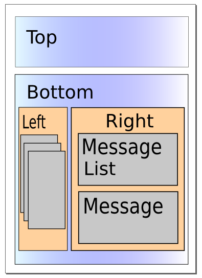

## page was renamed from 1.2/dijit/layout
#format dojo_rst

dijit.layout
============

:Status: Contributed, Draft
:Version: 1.0

HTML and Layouts
----------------

Typically HTML has bottom-up sizing, where a container is as big as it's contents, so that given

.. code-block :: html
  :linenos:

  

    

      Part 1
    

    

      Part 2
    

  

inner1 is big enough to hold the text "Part 1", inner2 is big enough to hold the text "Part 2", and outer is big enough to hold the inner divs. And if outer is bigger than the browser's viewport, the browser window displays a scrollbar. The web page you're reading now uses that layout, and unless your monitor is 3 feet tall (in which case, we envy you!) you see the scrollbar on the right.

But for some web pages, you want them to work with the opposite pattern, where you start with a given size, typically the browser viewport, and then partition it into smaller sections. This is the way desktop application look, for example a mail program that has a tree on the left, a list of messages in the upper right, and the message preview on the lower right.

Note that in this scenario, there's no scrollbar on the browser window itself, but if any pane is too small to display all the text it contains then it gets a scroll bar.

.. image:: maildemo.png
   :alt: mail demo screen shot

Layout like the picture above can be done using tables or fancy CSS (see recent `A List Apart article <http://www.alistapart.com/articles/conflictingabsolutepositions>`_ about CSS sizing), but that technique has it's limits... it doesn't allow things like tabs or accordions or split containers where the user can adjust the size of each pane.

Dijit Layout
------------

Dijit has a number of layout widgets which can be combined in a hierarchy to achieve that. Every layout widget contains a list of other layout widgets, except for the "leaf" nodes in the hierarchy, which are typically ContentPanes.

How does this work in practice? You need to think about the application above in a top-down (or outside-in) way:

   1. the screen is split into two parts. The top is a toolbar and
   2. the bottom is split into a left section and right section
   3. the left section has three panes one of which is shown at a time
   4. the right section is split into two parts, a list of messages and a preview pane.

Conceptually it's a set of containers like this:

There are three types of elements in that picture:

   1. containers that display all their children side by side
   2. containers that display one child at a time
   3. leaf nodes containing content

#1 is either LayoutContainer or SplitContainer. A LayoutContainer is used when all but one of the elements is a constant size. (In this case, the toolbar is a constant size and the the bottom section takes the rest of the screen, so we will use a LayoutContainer for that, and SplitContainers for the other parts.

#2 is AccordionContainer, TabContainer, or StackContainer. They all do basically the same thing, but look different.

#3 is typically ContentPane but could be any widget. An important consideration is whether or not the widget's size is adjustable (like a ContentPane) or not (like a Toolbar). See #1 above.

So keeping those rules in mind and picking which widgets to use it will look like:

* LayoutContainer
    
  * Toolbar
  * Horizontal Split Container

    * Accordion Container

      * ContentPane #1
      * ContentPane #2
      * ContentPane #3

    * Vertical Split Container

      * Content Pane #4
      * Content Pane #5

And then from there it's easy to convert to HTML. Starting from the outside:

.. code-block :: html
  :linenos:

  

    
...

    

    see below
    

  

Note that the layoutAlign arguments on the child nodes are actually processed by the parent, but the other arguments are processed by the child. A bit confusing but that's the way it works.

The split container will look like:

.. code-block :: html
  :linenos:

  

    (left part)
    

        
...

        
...

        
...

    

    (right part, see below)
  

And on the right... since you want to split the screen vertically the SplitContainer would actually contain another SplitContainer:

.. code-block :: html
  :linenos:

  

    

        
...

        
...

        
...

    

    

            
...

        
...

    

  

Tips
----

Sizing to browser viewport: To make the outermost layout widget size to the browser's viewport, in your page CSS you should have:

.. code-block :: css
  :linenos:

  html, body, #mainDiv {
    width: 100%; height: 100%;
    border: 0; padding: 0; margin: 0;
  }

where mainDiv is the id of the outermost div.

Note that height=width=100% means different things depending on the browser when you have padding or border, so when using those tags it's best not to have either of those. Put your padding, border, and margin on elements inside the outer layout container.

Restrictions about visibility: none of the layout widgets work if they are inside a hidden element. This is very important and a mistake many people make.  Dialog, etc. are created using visibility:hidden rather than display:none to avoid this problem.

Startup call: when building widgets programmatically, you create the parent first, then add the children, and grandchildren... and finally call startup(). Startup() is called once on the top element in the hierarchy, after the whole hierarchy has been setup and the element inserted.
