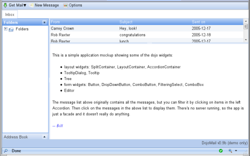
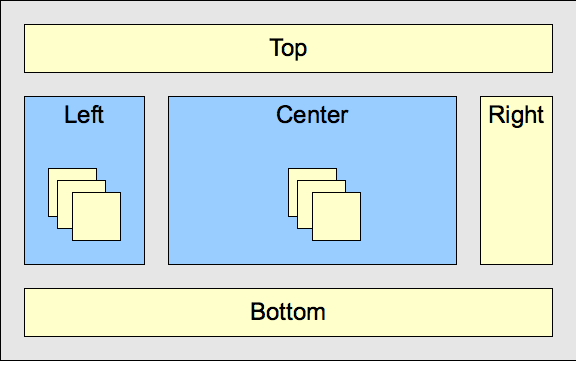

## page was renamed from 1.2/dijit/layout
#format dojo_rst

dijit.layout
============

:Status: Contributed, Draft
:Version: 1.0

HTML and Layouts
----------------

Typically HTML has bottom-up sizing, where a container is as big as it's contents, so that given

.. cv-compound::

  .. cv:: css

     

  .. cv:: html

    

      

        Part 1
      

      

        Part 2
      

    

The two inner (green) divs are each large enough to hold their text ("Part 1" and "Part 2"), and the outer is in turn big enough to hold the two inner divs. And if outer is bigger than the browser's viewport, the browser window displays a scrollbar. The web page you're reading now uses that layout, and unless your monitor is 3 feet tall (in which case, we envy you!) you see the scrollbar on the right.

But for some web pages, you want them to work with the opposite pattern, where you start with a given size, typically the browser viewport, and then partition it into smaller sections. This is the way desktop application look, for example a mail program that has a tree on the left, a list of messages in the upper right, and the message preview on the lower right.

Note that in this scenario, there's no scrollbar on the browser window itself, but if any pane is too small to display all the text it contains then it gets a scroll bar.

Layout like above can be done using tables or fancy CSS (see recent `A List Apart article <http://www.alistapart.com/articles/conflictingabsolutepositions>`_ about CSS sizing):

.. cv-compound::

  .. cv:: css

      

  .. cv:: html

        <table>
          <tr>
             <td colspan=3>
Top Pane
</td>
          </tr>
          <tr>
             <td>
Leading pane
</td>
             <td>
Center pane
</td>
             <td>
Trailing pane
</td>
          </tr>
          <tr>
             <td colspan=3>
Bottom pane
</td>
          </tr>
        </table>

However, that technique has it's limits... it doesn't allow things like tabs or accordions or split containers where the user can adjust the size of each pane.

Dijit Layout
------------

Dijit has a number of layout widgets which can be combined in a hierarchy to achieve that. Every layout widget contains a list of other layout widgets, except for the "leaf" nodes in the hierarchy, which are typically ContentPanes.

You typically start off the page using a BorderContainer, like this, to split the screen into sections:

.. cv-compound::

  .. cv:: javascript

     

  .. cv:: html

        

             
Top pane

             
Leading pane

             
Center pane

             
Trailing pane

             
Bottom pane

        

Then you start nesting containers.  For instance, on the left you might want an AccordionContainer:

.. cv-compound::

  .. cv:: javascript

     

  .. cv:: html

        

             
accordion pane #1

             
accordion pane #2

             
accordion pane #3

        

And a TabContainer in the middle:

.. cv-compound::

  .. cv:: javascript

     

  .. cv:: html

        

             
tab pane #1

             
tab pane #2

             
tab pane #3

        

Nesting those inside of the BorderContainer will look like this:

.. cv-compound::

  .. cv:: javascript

     

  .. cv:: html

        

             
Top pane

             

                  
accordion pane #1

                  
accordion pane #2

                  
accordion pane #3

             

             

                  
tab pane #1

                  
tab pane #2

                  
tab pane #3

             

             
Trailing pane

             
Bottom pane

        

There are three types of elements in that example:

   1. BorderContainer: displays all it's children at once in top/bottom/left/right/center positions
   2. StackContainers: containers that display one child at a time
   3. Leafs: leaf nodes containing content

The StackContainers in dijit are the AccordionContainer, TabContainer, or StackContainer itself. They all do basically the same thing, but look different.

The leafs are typically ContentPanes but could be any widget, such as dojox.grid.Grid or dijit.Toolbar. An important consideration is whether or not the widget's size is adjustable (like a ContentPane) or not (like a Toolbar).

Conceptually it looks like this:

Sizing to Viewport
------------------

Sizing to browser viewport: To make the outermost layout widget size to the browser's viewport, in your page CSS you should have:

.. code-block :: css
  :linenos:

  html, body, #mainDiv {
    width: 100%; height: 100%;
    border: 0; padding: 0; margin: 0;
  }

where mainDiv is the id of the outermost div.

Note that height=width=100% means different things depending on the browser when you have padding or border, so when using those tags it's best not to have either of those. Put your padding, border, and margin on elements inside the outer layout container.

Visibility
----------
Restrictions about visibility: none of the layout widgets work if they are inside a hidden element. This is very important and a mistake many people make.  Dialog, etc. are created using visibility:hidden rather than display:none to avoid this problem.

Programmatic Creation
---------------------
Startup call: when building widgets programmatically, you create the parent first, then add the children, and grandchildren... and finally call startup(). Startup() is called once on the top element in the hierarchy, after the whole hierarchy has been setup and the element inserted.
