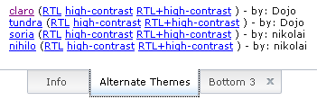
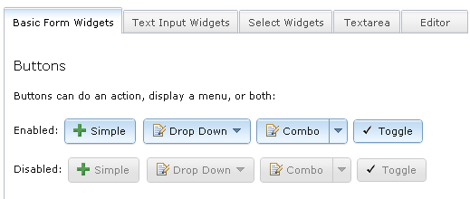
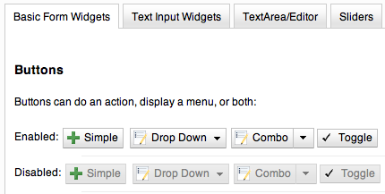
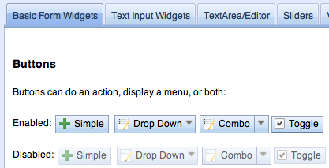
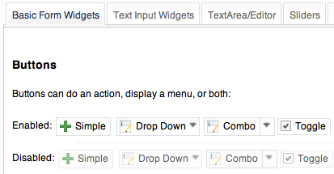
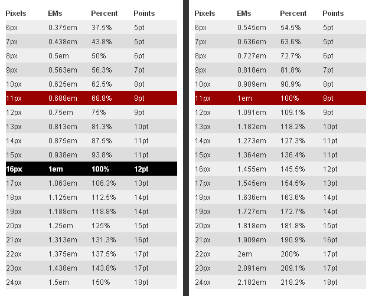
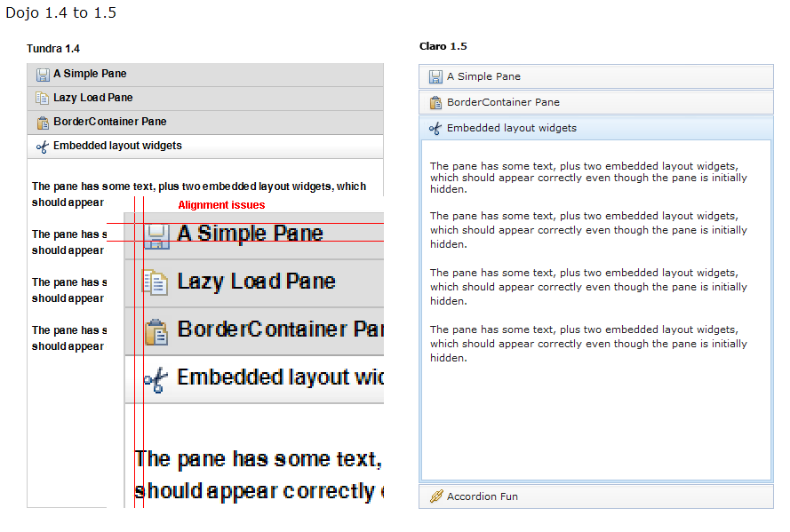
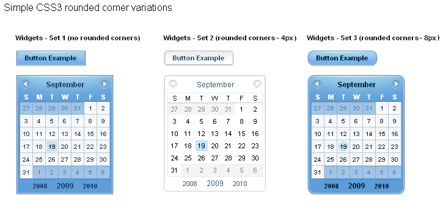
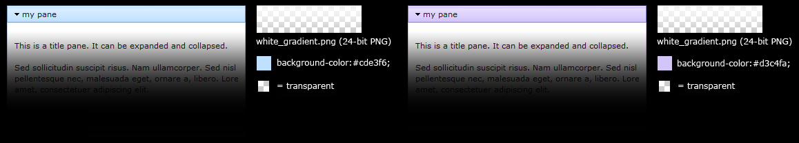
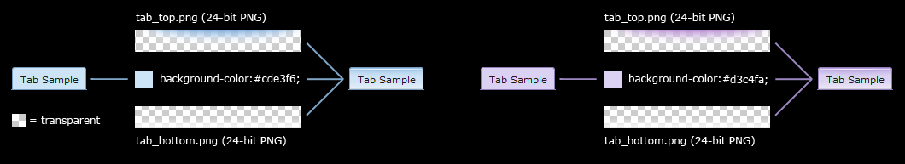

## page was renamed from dijit-themes
#format dojo_rst

Themes and Theming
==================

:Version: 1.3

.. contents::
  :depth: 2

Dijit Themes lend a consistent look and feel to widgets. Themes are collections of images (icons and background images) and CSS files that bring a common visual style (font, color, texture, layout, animation, etc) to all the widgets.  Dijit comes bundled with four themes which can be used as is, modified, and users can write their own themes too. Both global theming (such as at a container level) and widget-specific theming is doable.

================
Available Themes
================

The four available themes in Dijit are Claro, Tundra, Nihilo and Soria.

Claro
-----

A new theme for Dijit and the dojox.Grid is called Claro (nee Lucid).  The Claro theme has several aims:

   - to deliver a modern and engaging visual style for rich internet applications using the Dojo Dijit library, with the visual enhancements of transparent gradient background images, drop shadows, and appropriate CSS animation (on webkit and mozilla);
   - to deliver the 'fit and finish' professional quality with consistent padding, font treatment and alignment; and fix missing expected behavioral states (hover, active and selected) in widgets;
   - to improve ease of customizing the theme CSS that allows designers to easily create their own theme by styling elements such as padding and color, without designing new background images.

The Claro theme supports both left-to-right (LTR) and right-to-left (RTL) display, and all Dojo 1.5 supported browsers: IE (6, 7 and 8); FF (3.0, 3.5 and 3.6); Safari 4.0/5.0 and Chrome 3, 4 and 5, albeit with graceful degradation of some styling: no 24 bit PNG's in IE6; and no rounded corners in IE6, 7 and 8.

Claro will be accessibility and globalization compliant in Dojo 1.5.

IE7 sample:

The visual style of Claro is clear, light, luminous, translucent.

See `Claro <http://download.dojotoolkit.org/release-1.5.0/dojo-release-1.5.0/dijit/themes/themeTester.html?theme=claro>`_ rendered in the themeTester.html page.

**BluePrints**

See Claro blueprints for a visualization of the CSS styling mapped in each widget. (To be added for Dojo 1.5 release)

----

Tundra
------

See `Tundra <http://download.dojotoolkit.org/release-1.5.0/dojo-release-1.5.0/dijit/themes/themeTester.html?theme=tundra>`_ rendered in the themeTester.html page.

Tundra is accessibility and globalization compliant in Dojo 1.4 and will be in 1.5.

----

Soria
-----

See `Soria <http://download.dojotoolkit.org/release-1.5.0/dojo-release-1.5.0/dijit/themes/themeTester.html?theme=soria>`_ rendered in the themeTester.html page.

----

Nihilo
------

See `Nihilo <http://download.dojotoolkit.org/release-1.5.0/dojo-release-1.5.0/dijit/themes/themeTester.html?theme=nihilo>`_ rendered in the themeTester.html page.

----

=======================
CSS Directory Structure
=======================

Hierarchy of the base and theme CSS files:

.. code-block :: html

  dojo/
    resources
    dojo.css   <-- Baseline CSS file for general usage; not intended for specific dijit widget styling.

.. code-block :: html

  dijit/
    themes/
    djit.css     <-- Essential styles that themes can inherit
    dijit_rtl.css  <-- Essential styles that themes can inherit for right-to-left (BiDi) language support
    themeTester.html    <-- Displays all the Dijit widgets in the four Dijit themes

Theme-specific and widget-specific CSS:

.. code-block :: html

  dijit/
    themes/
      claro/
      claro.css  <-- Imports the theme-specific CSS files for all the widgets
      claro_rtl.css  <-- Imports the theme-specific CSS files for all the widgets for right-to-left (BiDi) language support
      common.css  <-- Theme-specific styling; Claro\common.css overrides dojo.css
      widgetX.css  <-- Some Dijit widget CSS files
        form/
          widgetX.css  <-- Form-based Dijit widget CSS files
          common.css
          common_rlt.css
        layout/
          widgetX.css   <-- Layout-based Dijit widget CSS files

The themeX.css file has rules like:

.. code-block :: css

  .claro .dijitButtonNode { ... }

================================
Common and theme-specific images
================================

Common
------

.. code-block :: html

  dijit/
    icons/
      CSS
      images/

All common icon images are located in dijit/icons/images and their respective CSS files are located in dijit/icons/. These are 16px X 16px icons in the commonIconsObjAct*.png sprites containing action and object type images which can be used in the following widgets: accordionContainer, menu, tab, titlepane, tree and all button widgets. Note: an RTL version of these common icons is being assessed.

The editor icons are also located in this same directory; these images are in the editorIcons*.png sprite files.

Icons
-----

Many widgets take a parameter called iconClass to specify an icon.
The idea is that the theme defines a CSS class loading the icon as a background-image.

For efficiency in loading icons, themes tend to put multiple icons into one image file called a 'sprite'.  For example,
the Cut button with class "dijitEditorIconCut" has the following definition in editorIcons.css found in dijit/icons/ :

.. code-block ::  css

   .dijitEditorIcon {
     background-image: url('images/editorIconsEnabled.png');
     background-repeat: no-repeat;
     width: 18px;
     height: 18px;
     text-align: center;
   }

Then all the selectors for the icons are listed:
Example of a selector for an icon:

.. code-block ::  css

   {
     .dijitEditorIconCut { background-position: -54px; }
   }

The CSS class(es) "dijitEditorIcon dijitEditorIconCut" indicate the Cut icon.

The Cut icon starts 54 px from the right edge, and measures 18px by 18px. 108 equals 6 * 18, so it's the 4th image from the left in the sprite. You can define your own buttons by setting up CSS selectors using code similar to the previous code, and wiring up the iconClass.

Themes may even specify variations on an icon depending on state.  So for example, there can be a faded, or black and white Cut icon for when the Cut function is disabled.

The special icon would be triggered by a rule like:

.. code-block:: css

  .dijitDisabled .dijitEditorIcon {
	background-image: url('images/editorIconsDisabled.png');}

Icons need to be rendered to support both left-to-right (ltr) and right-to-left (rtl) directions to be BiDi globalization compliant; therefore, two sets of files is required - widgtXIcons.png (ltr) and widgetXIcons_rtl.png.

Here are some best practices on when to mirror an icon to right-to-left. (info to come.)

Claro theme-specific
--------------------

.. code-block :: html

  themes/
    claro/
       images/   <-- Some Dijit widget image files
          commonHighlight.png   <--All the common highlight images in one 'sprite' image used across the widgets
          spriteArrows.png   <--All the common arrow images in one 'sprite' used across the widgets
          treeExpandImages.png and treeExpandImages8bit.png <-- example of a widget 'sprite' file containing all the tree images. Note there are two files for these images; the '8bit'.png file supports IE6 256 color rendering quality output, while treeExpandImages.png is default to '24bit' colors.

The forms and layout widgets each have their respective /form/images and layout/images folders:

.. code-block :: html

   forms/
     images/
   layout/
     images/

All images are .png files except for the loadingAnimation.

All images are referenced from the widget via CSS rules (via the background-image property of a dummy node).

Tundra theme-specific
---------------------

.. code-block :: html

    tundra/
      images/
         checkbox.gif	<--- all the checkbox and radio button images
         fader.gif	<--- background image referenced by tundra.css

The icons are located in the images directory (along with background images) and are referenced from the widget via CSS rules (via the background-image property of a dummy node).

===========
Theme Setup
===========

To include a given theme on your page or application, include the `themeName.css` file: (one of `claro.css`, `tundra.css`, `nihilo.css`, or `soria.css`)

.. code-block :: html

    <link rel="stylesheet" href="dojo/dijit/themes/tundra/tundra.css" />

Then add a theme class name to the parent <body> element, like:

.. code-block :: html

  <body class="tundra">

`note:` The reason the Tundra theme requires a class=tundra on the "<body>" tag (or some other tag) is because the rules all list a hierarchy like ".tundra .dojoButton". This is done to prevent the `tundra` class from affecting any of your page styles. This also ensures all widgets in the page have the same CSS rules (some widgets like `Dialog <dijit/Dialog>`_ intentionally attach themselves to the ``<body>`` element, so no styling is present if the class identifier is on some child node):

.. code-block :: html

  <html>
  <head>
      <title>Hello, Dijit</title>
      <link rel="stylesheet" href="lib/dijit/themes/tundra/tundra.css">
      
      
  </head>
  <body class="tundra">
      <h1>Hello, Dijit</h1>
  </body>
  </html>

It is recommended you include the theme CSS file **before** ``dojo.js`` to avoid any potential latency issues.

=====================
Using multiple themes
=====================

To use multiple themes such as Claro, Tundra, Nihilo and Soria, (assuming Tundra is your base theme) include the additional theme CSS files into your document, like:

.. code-block :: html

  

The themeX.css file(s) will define rules like:

.. code-block :: css

   .nihilo .dijitButton { ... }

so it won't conflict with other themeX.css styling.

To have different sections of your document that are different themes, you just change the class of each section.   For example, to make the main document Claro theme, but then have sections that are Tundra and Soria themes, do:

.. code-block :: html

  <body class=claro>
    ...
        

                

                        <input dojoType="dijit.form.TextBox">
                        <button dojoType="dijit.form.Button">Tundra Button</button>
                        ...
                

                

                        <input dojoType="dijit.form.TextBox">
                        <button dojoType="dijit.form.Button">Soria Button</button>
                        ...
                

        

    ...
  </body>

All the widgets in the first tab will have the Tundra theme and all the widgets in the second tab will have the Soria theme, and the rest of the UI will be Claro.

=======================
Theming several widgets
=======================

This is the base list of files needed when theming only a few widgets (such as Tree, Calendar, TimePicker (dijit.form.TimeTextBox) and dijit.form.DropDownButton (requires Menu):

.. code-block :: html

  dojo/
    resources/
    dojo.css   <-- Baseline CSS file for general usage; not intended for specific dijit widget styling.

  dijit/
    themes/
    djit.css     <-- Essential styles that themes can inherit
    dijit_rtl.css  <-- Essential styles that themes can inherit for right-to-left (BiDi) language support
    themeTester.html    <-- Displays all the Dijit widgets in the four Dijit themes
    icons/images/

  dijit/
    themes/
      claro/
      claro.css  <-- Imports the theme-specific CSS files for all the widgets
      claro_rtl.css  <-- Imports the theme-specific CSS files for all the widgets for right-to-left (BiDi) language support
      common.css  <-- Theme-specific styling; Claro\common.css overrides dojo.css
      widgetX.css  <-- Some Dijit widget CSS files
        form/
          widgetX.css  <-- Form-based Dijit widget CSS files
          <widgets JS files> <-- Form-based Dijit widget JS files
          templates/  <-- Form-based Dijit widget HTML files
          common.css
          common_rlt.css
        layout/
          widgetX.css   <-- Layout-based Dijit widget CSS files
          <widgets JS files> <-- Layout-based Dijit widget JS files
          templates/ <-- Layout-based Dijit widget HTML files
     _CssStateMixin.js
    <widgets JS files>  <-- Some Dijit widget JS files
      templates/ <widgets html files> <-- Some Dijit widget HTML files

======================
Widget CSS inheritance
======================

(WIP)
The following Claro widgets inherit styling from other Claro widgets:

- dijit.Editor.css inherits dijit.Toolbar.css styles
- dijit.DropDownButton.css and dijit.ComboButton.css inherit some dijit.Menu.css styles
- dijit.form.TimeTextBox.css inherits dijit.Menu.css
- dijit.form.ComboBox and dijit.form.FilteringSelect inherit pop up styles from dijit.Menu.css
- dijit.TooltipDialog.css inherits dijit.Tooltip.css
- dijit.AccordionContainer.css inherits TitlePane.css
- dijit.Toolbar inherits and overwrites dijit.form.Button.css

===================
Theme customization
===================

The following visual style elements are the most common aspects of customizing a theme: color, font, layout (padding=spacing), corner style, images.

Color
-----

Color customization can be applied to the behavioral states of a widget. In Dojo 1.5, six behavioral state class names have been defined in the widgets to support a better user experiences, with hover, active and selected behavioral states as the most pervasively applied:

1. Normal
2. Hover
3. Active (aka 'mouse down')
4. Selected (and browser 'Focus' for A11y)
5. Disabled
6. SelectedHover (only for dijit.Layout.AccordionContainer).

In the Claro theme, each of these states is defined by a specific hex value that can be modified:

.. code-block :: css

  .claro .dijitAccordionInnerContainerActive {
       	  border:1px solid #769DC0;
	  background-color:#7dbefa;
  }

Font
----

Fonts can be customized in the following ways:

1. Font family

   Maintain font family order as is; re-order family or modify the list of fonts

   * in dojo/resources/dojo.css

     .. code-block :: css

        body {
          font: 12px Myriad,Helvetica,Tahoma,Arial,clean,sans-serif;
          *font-size: 75%;
        }

   * in theme/claro/common.css (overrides dojo.css)

     .. code-block :: css

        .claro {
          font-family: Verdana,Arial,Helvetica,sans-serif;
        }

2. Font styling

   The following font style treatments can be applied for emphasis and hierarchical information cueing:

   * Regular
   * Bold
   * Italics (use sparingly)

3. Font measurements

   * Relative: 'EM' and '%' units of font measure to ensure support across all browsers (accessibility).

     In Dojo.css: 75%=12px.

   * Absolute: not recommended

Dojo's font size defaults to the browser which is 16px. To define your theme font size, start with 16px, choose your default font size, define that in your theme/common.css body font size and then define all other sizes based off of that. A good tool to reference is the `PX to EM converter <http://www.pxtoem.com/>`_

Example:

For the Claro theme, 11px (.688em) has been defined as the body font size in claro/common.css.

.. code-block :: css

       .claro {
	font-family:Verdana,Arial,Helvetica,sans-serif;
	font-size: .688em;
	color:#131313;
       }

So in claro/Calendar.css, the font sizes for the following MonthLabel and DayLabel style elements are relative to the claro default body font size. (i.e. MonthLabel= 12px, DayLabel= 10px)

.. code-block :: css

        .claro .dijitCalendarMonthLabel {
	color:#000000;
	font-size: 1.091em;
        }

and

.. code-block :: css

        .claro .dijitCalendarDayLabelTemplate {
	text-align:center;
	font-size:0.909em;
        }

Note: There is some unique font styling applied across all themes within specific widgets.

Layout
------

Layout is the process of arranging the various visual components of a user interface (e.g., menus, panes, tabs, text fields, icons, etc.) to enhance usability, clarity, legibility and aesthetics. Layout encompasses spacing, positioning, grouping, emphasis, and alignment.

The example below illustrates the before and after implementation of the best practice for alignment.

Corner styling
--------------

In Dojo 1.5 CSS3 ('border-radius') is used to render corner styling; CSS3 is supported in all browsers except IE where styling defaults to square corners.

* Claro theme defaults to 4px rounded corners (based on Dojo community feedback), with the exception of dijit.tabContainer at 2px.

Example of CSS3 corner styling:

.. code-block :: css

   .claro .dijitTabContainerTop-tabs .dijitTabInnerDiv,
   .claro .dijitTabContainerTop-tabs .dijitTabContent {
	   border-radius: 2px 2px 0px 0px;
	   -moz-border-radius: 2px 2px 0px 0px;
	   -webkit-border-top-left-radius:2px;
	   -webkit-border-top-right-radius:2px;
   }

* If rounded corner styling is required in IE, it will need to be implemented using rounded corner images and will require significant modifications to CSS, JS and HTML templates; basically, not recommended.

Examples of corner style output renderings:

Images
------

Typical images in themes are icons, background images, and accent graphics.

Dojo 1.5 supports:

  - 8–bit and 24-bit PNG and GIFs(exception for loading animation)
  - ‘Sprite’image (contains all images for one widget) e.g. dijit.Editor. Sprite images can be vertical or horizontal sprites help improve overall Dojo performance, however there is no header in the sprite file to label the list of images in the sprite file.
  - Specific ‘/images’folders (forms/images, layout/images; etc)

See *Common and theme-specific images* above.

**Customizing images**

You can customizing any of the following ways: color bit, individual image vs combined image set (sprite), no background image, modify existing or create new image.

**Customizing background images in 1.5**

- dijit.titlePane–transparent white image (using PNG technology)

- dijit.tabContainer–colored highlight image

Drop Shadows
------------

In Dojo 1.5, drop shadows can generated as graphics or can be coded using CSS3 (supported in FireFox, Safari & Chrome); the latter is preferred.

Several widgets have inherited .lucid dijitPopup(CSS3) drop shadow treatment:

 - dijit.form.Button; dijit.form.ComboButton, dijit.form.DropDownButton, dijit.form.ToggleButton
 - dijit.Calendar, dijit.form.TimeTextBox, dijit.form.DateTextBox
 - dijit.ColorPalette
 - dijit.Menu

(generic) .claro .dijitPopup{

.. code-block :: css

  box-shadow: 0px 1px 3px rgba(0,0,0,0.25);
  -webkit-box-shadow: 0px 1px 3px rgba(0,0,0,0.25);
  -moz-box-shadow: 0px 1px 3px rgba(0,0,0,0.25);
  }

Widgets with unique CSS3 drop shadow treatment:

 - dijit.Dialog
 - dijit.Tooltip

Animation
---------

Animation is another styling element that can be customized depending on the audience, task, widget and performance requirements and expectations.

There are various kinds of transitions: fade, ease, wipe, glow, zoom, fisheye, etc. Animated effects serve as an added visual cue to in context information.  As well they can provide visual delight without rendering effects that are too 'eye candy' or gratuitous, at least within rich internet applications.

Animation is generated using several of the following technologies: Dojo APIs, CSS3 and animated GIF files.

**Using Dojo APIs and CSS3**

In Dojo 1.5, APIs and CSS3 -webkit-transition (supported and viewable in Safari & Chrome) have been applied for effective visual cueing to a change of state and some aesthetic appeal, to the following Dijit widgets:

 - AccordionContainer (ease API / fade CSS3)
 - Calendar (fade CSS3)
 - Tree (ease API / fade CSS3)
 - Tab (fase CSS3)
 - Button (fade CSS3)
 - TextBox (fade CSS3) (list widgets you pick up this styling)

Using CSS3 -webkit-transition enables designers to define styling for animations.

Sample of CSS3 animation styling in .claro .dijitAccordionInnerContainer {

.. code-block :: css

	background-color: #e6e6e7;
	border:solid 1px #b5bcc7;
	margin-bottom:1px;
	-webkit-transition-property:background-color,border;  /* "property" describes what styling you want to animate */
 	-webkit-transition-duration:.3s; /* "duration" describes the timing of your animation */
	-webkit-transition-timing-function:linear;  /* "timing-function" allow an animation to change speed over its duration (ease-in, ease-out, etc) */
        }

**Animated GIFs**

In Dojo 1.5, the loadingAnimation.gif is used in the following widgets: dijit.Tree, dijit.Dialog ('Test Slow Loading HREF Dialog' test file), and Dojox.Grid.

See animation in action in the `Claro <http://download.dojotoolkit.org/release-1.5.0/dojo-release-1.5.0/dijit/themes/themeTester.html?theme=claro>`_ theme rendered in the themeTester.html page.

See more on `Animations and Effects with Dojo. <quickstart/Animation>`_

Overriding a theme
------------------

You can also define a variation on a theme (much like `Handel <http://en.wikipedia.org/wiki/Variations_and_Fugue_on_a_Theme_by_Handel>`_). Let's say that you like the Tundra theme but for each tab above, you just want to change the background color of the form widgets. You would define yellowForm and blueForm to just change the background color:

.. code-block :: css

  .yellowForm .dijitButton, .yellowForm .dijitInputField { background-color: yellow; }
  .blueForm .dijitButton, .blueForm .dijitInputField { background-color: blue; }

Then you would reference the override class in a similar way to the above:

.. code-block :: html

  

        

                <input dojoType="dijit.form.TextBox">
                <button dojoType="dijit.form.Button">Yellow Button</button>
                ...
        

        

                <input dojoType="dijit.form.TextBox">
                <button dojoType="dijit.form.Button">Blue Button</button>
                ...
        

  

The two tabs would then be the Tundra theme except for the background color on form fields.

Writing Your Own Theme
----------------------

If you want to develop your own theme just make rules like

.. code-block :: css

  .myTheme .dijitButtonNode { ... }

and include them into your page.

The dijit.form.Checkbox widget displays the checkbox image using an  tag.   However, it grabs the image location from the CSS.

The class names used on widgets do not change based on the theme, although they will change based on the state of the widget.  For example, an input field will have class="dojoInputField", but a disabled input field will have class= "dojoInputField dojoInputFieldDisabled"

===================================
Applying style directly to a widget
===================================

You can apply styles to plain dom nodes in various ways:

.. code-block :: html

  
...

or

.. code-block :: html

  
  
...

or

.. code-block :: html

  
  
...

The first two techniques should work for widgets also. However, the third technique is not likely to work, because some of style rules like ".tundra .dijitButton", will take precedence.
