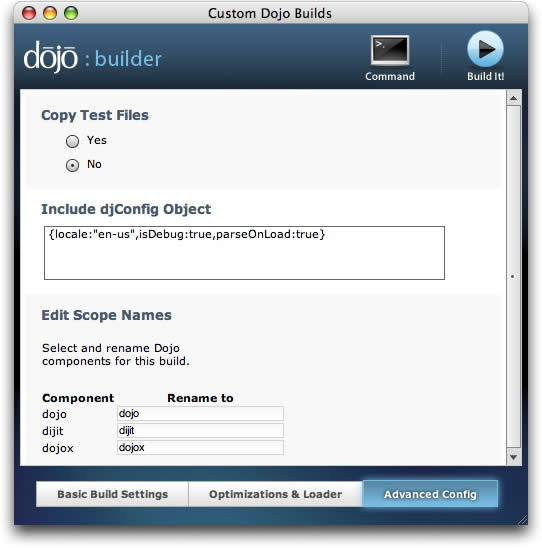

#format dojo_rst

djConfig
========

:Status: Draft
:Version: 1.0
:Available: since V0.4

.. contents::
   :depth: 2

Configuring Dojo with djConfig

============
Introduction
============

Dojo allows developers to override certain global settings that control how the framework operates. Frequently this is unnecessary, but it can be useful in the following situations:

* When using the dojo.parser to trigger automatic parsing of dijit objects
* During the debugging phase of application development
* When setting specific `i18n <dojo/i18n>`__ or localization settings
* If you rename core dojo components or place dojo resources in non-standard locations

We will first describe the various ways to define the djConfig object, and then explain the various uses listed above.

=====
Usage
=====

How to Define djConfig
----------------------

djConfig is a JavaScript object that is typically created in one of three ways:

* By specifying its properties in the djConfig="..." attribute of the 
  </head>
  <body>
      
...

  </body>
  </html>

Note that the content of the djConfig="..." attribute is a comma-delimited list of name/value pairs the same as one would use when creating any JavaScript object.

**Warning:  This approach will not work correctly if** your code goes through a proxy that re-writes the HTML and possibly inlines script src files in the HTML. One known case this happens is with UMTS broadband connections. Favor approach #2 below for those cases.

2. Explicitly creating the djConfig object BEFORE including the dojo core
~~~~~~~~~~~~~~~~~~~~~~~~~~~~~~~~~~~~~~~~~~~~~~~~~~~~~~~~~~~~~~~~~~~~~~~~~

In cases where lots of attributes must be set in the djConfig object, or for developers who prefer not to use dojo's non-standard attributes, the djConfig object can be created explicitly BEFORE the main dojo.js library is included in the document. This looks something like:

.. code-block :: javascript
  :linenos:

  <!DOCTYPE HTML PUBLIC "-//W3C//DTD HTML 4.01//EN" "http://www.w3.org/TR/html4/strict.dtd">
  <html>
  <head>
      <meta http-equiv="Content-Type" content="text/html; charset=UTF-8">
      <title>Dojo djConfig Tutorial</title>
      
      
  </head>
  <body>
      
...

  </body>
  </html>

Note in this example that we've explicitly set a locale for this dojo instance (i.e. US English), and also specified that alongside that the locale resources for Japanese be loaded as well.

3. Including djConfig in the Dojo Toolbox Builder
~~~~~~~~~~~~~~~~~~~~~~~~~~~~~~~~~~~~~~~~~~~~~~~~~

When creating a custom build it is possible to include the djConfig object into the build via the scopeDjConfig parameter. The `Dojo Toolbox Builder <http://www.sitepen.com/labs/toolbox/>`_ provides a GUI interface via which to do this. The text box for filling in the djConfig object is on the "Advanced Config" tab:

Note that if you click on the "Command" button at the top of the window, you can see that filling in the djConfig object box sets the scopeDjConfig variable. You can learn more about the scopeDjConfig parameter in the `Dojo Book page on custom builds <http://dojotoolkit.org/book/dojo-book-0-9/part-4-meta-dojo/package-system-and-custom-builds>`_ [except I think this page needs to be updated]. The SitePen blog also has a `good introductory tutorial on using the Dojo Toolbox Builder <http://www.sitepen.com/blog/2008/07/08/dojo-toolbox-first-look/>`__.

djConfig Parameters
-------------------

So now that you know *how* to set global parameters for dojo using djConfig, you'd probably like to know *what* parameters are available for setting. For a quick reference, check out the `djConfig API page <http://api.dojotoolkit.org/jsdoc/dojo/HEAD/djConfig>`_. 

The parameters you specify in djConfig are meant to **override** the default settings and do several basic things:

* Tell dojo to load resources for **debugging** along with the core libraries
* Tell dojo which **language and localization** resources to load with the core libraries
* Tell dojo where to find key resources in the event that you are using a **customized naming scheme or a cross-domain (xdomain) build**

Now we'll describe the configuration settings that apply to each of these purposes.

Debugging settings in djConfig
------------------------------

djConfig is a quick and easy way to turn dojo's built-in debugging features on and off. Regardless of whether you are using a custom build, or the uncompressed source, the debugging features will be available for you to turn on whenever necessary. The parameters you'll use are the following:

isDebug: true
  When set to "true," isDebug will load dojo's extended debugging tools via Firebug, or Firebug Lite. You will have access to a debugging window regardless of what browser you are using. You can run arbitrary code statements from the debugging console, and also view output statements via dojo's built-in `console.* functions <http://api.dojotoolkit.org/jsdoc/dojo/HEAD/console>`_. Default value is "false."

debugContainerId: "yourContainerId"
  If specified, when the page is rendered dojo will look for an element with the specified id and will put the Firebug Lite console window inside that element. This allows developers extra control over the display of the console window and to easily reference it in their own scripts. By default the div containing the console window does not have an id associated with it.

debugAtAllCosts: true
  This setting offers advanced functionality for debugging your own classes. There is much more information here on `this tutorial on debugging with dojo <http://dojotoolkit.org/book/book-dojo/part-4-meta-dojo-making-your-dojo-code-run-faster-and-better/debugging-facilities/deb>`_.

Language and Localization Settings in djConfig
----------------------------------------------

There is an extensive discussion of the i18n features of dojo in the `book chapter on i18n <dojo/i18n>`__. Here we'll briefly cover the two djConfig variables that apply to these settings:

locale: 'en-us'
  By default, dojo sets the locale of all dijits by pulling the locale from the browser. However, developers can force the default locale by using the djConfig locale setting.

extraLocale: ['en-us','jp-jp']
  In addition to the default locale, developers can specify that extra locale files also be downloaded in parallel to the default. The argument to the extraLocale parameter is an array of locale strings.

  The extraLocale is used for multi-lingual pages or for dynamically switching languages. A use case would be a language tutorial – an English page that teaches Japanese.

  Unless you have a multi-language use-case, it's not recommended that you use extraLocale and switch languages dynamically. Since it will have to download all those language packages, and it will not be efficient.

Finding Resources in Non-Standard Locations
-------------------------------------------

On occasion, developers may choose not to locate dojo resources in the standard location (i.e. relative to the dojo/dojo.js core file). In such cases it is necessary to tell dojo where to find those resources. The djConfig parameters available for this are as follows:

baseUrl: '/assets/mydojo/'
  When using multiple versions of dojo in parallel in a given site, or if the core dojo.js file has been renamed when creating a custom build, the baseUrl parameter should be used to indicate where the dojo core is located. This may also be necessary for sites that use the <base> tag which can confuse some browsers (e.g. IE6). The value for baseUrl should be the directory that contains the dojo.js or dojo.xd.js file. The value should always be defined with an ending slash (/) character.

modulePaths: {'foo': '../../bar'}
  Using this parameter is the equivalent of calling dojo.registerModulePath('foo','../../bar') and is necessary to allow dojo to locate custom modules. For more information on creating and using custom modules, some informations you can find at `dojo.registerModulePath <dojo/registerModulePath>`__.

Other Options
-------------

afterOnLoad: true 
  (defaults to false). Set to true if you are attempting to inject dojo.js into the page after the initial page load has occurred. 

.. code-block :: html

    

Configuring dojox Modules
-------------------------

There is one final way in which djConfig is used, and that is to set preferences or configuration options for dojo extension (i.e. dojox) modules. Since the djConfig object is created and available globally on every page request, if you are creating a new dojox module this may be a good location to store global resources. Since dojox modules are by their very nature new and/or experimental, you may need to consult the specific documentation or the source code for the dojox module in question to discover what parameters are available for setting and what they do. A good way to do this is to search the API and/or source code for the string "djConfig" which should turn up cases in which it is used. A good example of a dojox extension that uses djConfig is dojox.storage, which specifies options for client-side storage providers like Google Gears, and the What WG storage providers. The documentations for the storage providers indicates that you can disable a specific provider by setting an appropriate djConfig parameter such as: 

.. code-block :: javascript
  :linenos:

  var djConfig = { disableWhatWGStorage: true }

Using djConfig in your Code
---------------------------

The ambiguity of djConfig is very helpful. You can provide functionality and configuration options for users through the pattern outlined by this doc.

If you are developing a widget or otherwise providing an API not available in Dojo, you are still able to utilize the global nature of the djConfig variable with one minor caveat: After dojo.js is loaded on a page, the settings passed to djConfig (as outlined above) are moved to: `dojo.config`. This is an artifact of the scopeName changing capabilities of Dojo. 

.. code-block :: javascript
  :linenos:

  var djConfig = { parseOnLoad:true, myCustomVariable:true }

This creates a `new` configuration parameter named ``myCustomVariable``. To use this in your application code or widgets, use the ``dojo.config`` member. For instance, a simple `dojo.declare <dojo/declare>`_ call:

.. code-block :: javascript
  :linenos:

  dojo.declare("my.Thinger", null, {
      thingerColor: (dojo.config.myCustomVariable ? "wasTrue" : "wasFalse"),
      constructor: function(){
         if(dojo.config.myCustomVaraible){ ... }
      }  
  });

By referencing `dojo.config.myCustomVariable` as opposed to relying on `djConfig.myCustomVariable` you will be able to utilize the variable safely in built versions using an alternate scopeName
