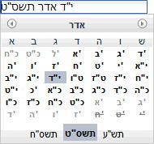

#format dojo_rst

dojox.date.islamic
==================

:Status: Draft
:Version: 1.0
:Contributor: Hossam Katory
:Available: since V1.4

.. contents::
   :depth: 2

Implements the traditional Islamic (Hijri) calendar. This is the civil calendar in Saudi Arabia and the liturgical calendar of the Islamic faith worldwide.

============
Introduction
============

The Islamic calendar (Hijri calendar) is a purely lunar calendar. It contains 12 months that are based on the motion of the moon, and because 12 synodic months is only 12 x 29.53=354.36 days, the Islamic calendar is consistently shorter than a tropical year, and therefore it shifts with respect to the Gregorian calendar. The calendar is based on the Qur'an (Sura IX, 36-37) and its proper observance is a sacred duty for Muslims. 

=====
Usage
=====

Code snippet below illustrates most common usage of Islamic calendar.

.. code-block :: javascript
 :linenos:

  
  <html><title> Islamic calendar </title><body>
    <input id="Hijcal" 
       name="noDOMvalue" 
       value="2009-03-10" 
       type="text" 
       dojoType="dijit.form.DateTextBox" 
       datePackage = "dojox.date.islamic"
       constraints="{min:'2008-03-01',max:'2009-04-01',datePattern:'dd MMMM yyyy'}"
    >
  </body></html>

Islamic calendar package
------------------------

Islamic calendar package comprises of following two files:

    * dojox.date.islamic.Date implements logic of Islamic calendar and provides support for date conversion between Gregorian and Islamic calendars
    * dojox.date.islamic.locale includes implementation of functions responsible for conversion between two possible representations of Islamic date: String representation and Date object. It also provides date formatting capabilities.

Islamic calendar and DateTextBox
--------------------------------

Islamic calendar implemented in this package can be used in conjunction with DateTextBox in order to provide graphical date picker for Islamic calendar. For example, image below illustrates DateTextBox using Islamic calendar with default language set to Islamic.

========
Examples
========

Programmatic example
--------------------

The code snippet below illustrates conversion between two possible representations of Islamic date: String and Date object.

.. code-block :: javascript
 :linenos:

  

Declarative example
-------------------

Code snippet below illustrates usage of Islamic calendar in the context of graphical date picker - DateTextBox

.. code-block :: javascript
 :linenos:

  
  <html><title> Islamic calendar </title><body>
    <input id="hijcal" 
       name="noDOMvalue" 
       value="2009-03-10" 
       type="text" 
       dojoType="dijit.form.DateTextBox" 
       datePackage = "dojox.date.islamic"
       constraints="{min:'2008-03-01',max:'2009-04-01',datePattern:'dd MMMM yyyy'}"
    >
  </body></html>

========
See also
========

Islamic Calendar: http://en.wikipedia.org/wiki/Islamic_calendar
Islamic Calendar History and Motivation: http://www.al-inaam.com/library/calendar3.htm
