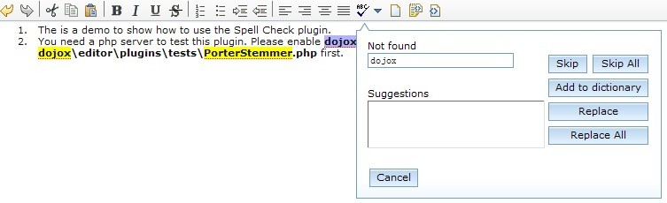
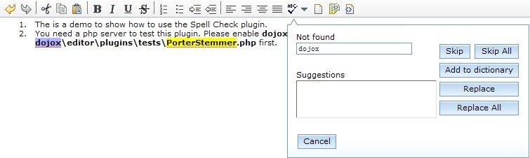
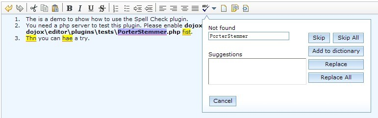
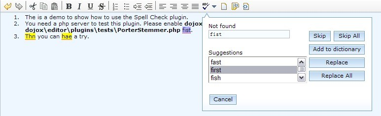
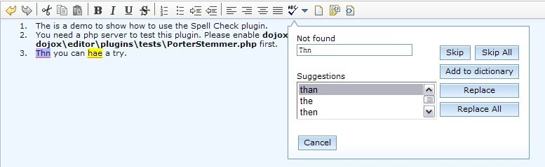
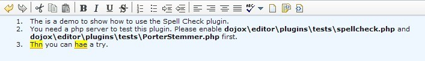
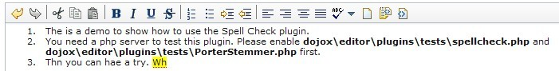
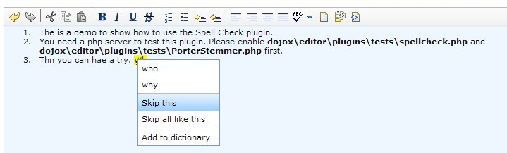

#format dojo_rst

dojox.editor.plugins.SpellCheck (Under Construction)
====================================================

:Authors: He Gu Yi
:Project owner: Jared Jurkiewicz
:Available: since V1.6

.. contents::
    :depth: 2

Have you ever wanted to make sure that your edited content was spelled correctly? You could always have a dictionary available but, otherwise, this plug-in is for you.

========
Features
========

Once required in and enabled, this plugin provides the following features to dijit.Editor

* Batch spell check that allows the user to step through the content at any time, identifying unrecognized words, allowing the user to

 * choose an alternative spelling
 * skip the unrecognized word
 * skip all instances of the unrecognized word
 * add the word to the dictionary
 * replace the word with a stored spelling
 * replace all instances of the word with a stored spelling.

* Interactive spell check which provides the same features through a context menu on unrecognized words as they are typed.

=====
Usage
=====

Basic Usage
-----------
Usage of this plugin is simple and painless. The first thing you need to do is require the editor into the page. This is done in the same spot all your dojo.require called are made, usually a head script tag. For example:

.. code-block :: html

  
  ...
  

  ...
  

Configure the server-side php file. Rename dojox\editor\tests\spellCheck.php.disable to dojox\editor\tests\spellCheck.php. These two php files are used to check a list of given words and return a list with suggested words. Then just declare the plugin and configure it as follows. Note that the location of SpellCheck.css may be changed according to the actual environment.

.. code-block :: html

  
  
  

  ...
  

And that's it. The editor instance you can reference by 'dijit.byId("editor")' is now enabled with the SpellCheck plugin!

Configurable Options
--------------------

========================  =================  ============  =======================  =============================================================================
Argument Name             Data Type          Optional      Default Value            Description
========================  =================  ============  =======================  =============================================================================
name                      String             False         SpellCheck               The name of this plugin. It should always be "spellcheck".
url                       String             False         <empty string>           The url of the speck check service.
interactive               Boolean            True          False                    Indicate if the interactive mode is on. The default value is false.
timeout                   Number             True          30                       Indicate the timeout when waiting for the server's response.
                                                                                    The default value is 30 seconds if not specified.
bufferLength              Number             True          100                      Specify the max character number in the body of a http GET request.
                                                                                    This parameter is used when the server-side has a request size restriction.
<other arguments>         N/A                True          N/A                      Any other argument that will be passed to the server untouched.
                                                                                    For example, lang: 'en', enableDebugging: true, etc. 
========================  =================  ============  =======================  =============================================================================

==============
User Interface
==============

Batch Spell Check
-----------------

Click the Batch Spell Check button to open the dialog. SpellCheck will highlight all the unrecognized words and the first unrecognized word will be selected and shown in the Not found text field.

Skip
----

There are two ways to ignore the word in the Not found text field and move to the next word. The ignored word will be considered recognized as long as the editor is not destroyed.

* Click the Skip button.
* Or type Enter in the Not found text field. 

Skip All
--------

Skip All to ignore the word displayed in the Not found text field and all similarly spelled words. All the similarly spelled words will be considered recognized as long as the editor is not destroyed.

Add to dictionary
-----------------

Click Add to dictionary to add this word into the dictionary.

Replace
-------

Take either one of the following two actions to address an unrecognized word displayed in the Not found text field.

* Select a right one from the Suggestions list box.
* Replace it directly in the Not found text field.

Then you can type Enter in the Not found text field or click Replace to replace the unrecognized one with the new one and move to the next unrecognized word.

Note that when the content of the Not found text field is changed, its label will be changed to Replace with.

.. image:: ReplaceWidth.png

Replace All
-----------

Take either one of the following two actions if the word is unrecognized.

* Select a right one from the Suggestions list box.
* Repace it directly in the Not found text field.

Then click Replace All to replace all the occurrence of this word with the new one and move to the next unrecognized word.

Cancel
------

Click Cancel to stop the replacement.

Interactive Spell Check
-----------------------

The interactive mode is on by setting the argument interactive: true when declaring the plugin. It will perform the check as the user types.

Right click on the unrecognized word and the context menu will be displayed. You can take one of the following actions.

* Select a suggested word.
* Click Skip this to skip this word.
* Click Skip all like this to skip all the word like this.
* Click Add to dictionary to add this word into the dictionary.

Customize the language preference
---------------------------------

Because different languages may have different ways to identify a "word", SpellCheck plugin provides developers with an interface to define their own words. Follow the steps below to customize the word definition.

* Declare a class that inherits from dojox.editor.plugins._SpellCheckParser
* Implement the methods parseIntoWords: function(/*String*/ text) and getIndices: function()
* Register the parser.

If there is more than one parser, the first registered one wins. An example follows.

.. code-block :: javascript

  dojo.provide("dojox.editor.plugins._CustomizedSpellCheckParser");
  
  dojo.require("dojox.editor.plugins._SpellCheckParser");
  
  dojo.declare("dojox.editor.plugins._CustomizedSpellCheckParser", dojox.editor.plugins._SpellCheckParser, {
   lang: "userDefined",
   
   parseIntoWords: function(/*String*/ text){
    // summary:
    //  Parse the text into words
    // text:
    //  Plain text without html tags
    // tags:
    //  public
    // returns:
    //  Array holding all the words
    function isCharExt(c){
     var ch = c.charCodeAt(0);
     return 48 <= ch && ch <= 57 || 65 <= ch && ch <= 90 || 97 <= ch && ch <= 122;
    }
  
    var words = this.words = [],
     indices = this.indices = [],
     index = 0,
     length = text && text.length,
     start = 0;
    
    while(index < length){
     var ch;
     // Skip the white charactor and need to treat HTML entity respectively
     while(index < length && !isCharExt(ch = text.charAt(index)) && ch != "&"){ index++; }
     if(ch == "&"){ // An HTML entity, skip it
      while(++index < length && (ch = text.charAt(index)) != ";" && isCharExt(ch)){}
     }else{ // A word
      start = index;
      while(++index < length && isCharExt(text.charAt(index))){}
      if(start < length){
       words.push(text.substring(start, index));
       indices.push(start);
      }
     }
    }
    
    return words;
   },
   
   getIndices: function(){
    // summary:
    //  Get the indices of the words. They are in one-to-one correspondence
    // tags:
    //  public
    // returns:
    //  Index array
    return this.indices;
   }
  });
  
  // Register this parser in the SpellCheck plugin.
  dojo.subscribe(dijit._scopeName + ".Editor.plugin.SpellCheck.getParser", null, function(sp){
   if(sp.parser){ return; }
   sp.parser = new dojox.editor.plugins._SpellCheckParser();
  });

===================
A11Y Considerations
===================

All fields within the Batch Spell Check dialog can be accessed with the keyboard.

===========
Limitations
===========

None.

========
Examples
========

Basic Usage
-----------

.. code-example::
  :djConfig: parseOnLoad: true
  :version: 1.4

  .. javascript::

    

  .. css::

    
    
  .. html::

    <b>Toggle the find/replace toolbar by clicking its menu bar button.</b>
     
    

    

     
    blah blah & blah!
     
    

     
    <table>
    <tbody>
    <tr>
    <td style="border-style:solid; border-width: 2px; border-color: gray;">One cell</td>
    <td style="border-style:solid; border-width: 2px; border-color: gray;">
    Two cell
    </td>
    </tr>
    </tbody>
    </table>
    <ul> 
    <li>item one</li>
    <li>
    item two
    </li>
    </ul>
    

========
See Also
========

* `dijit.Editor <dijit/Editor>`_
* `dijit._editor.plugins <dijit/_editor/plugins>`_
* `dojox.editor.plugins <dojox/editor/plugins>`_
