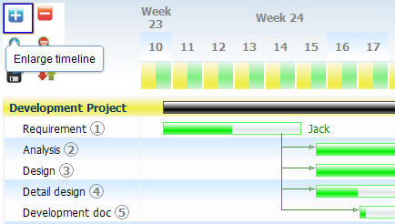
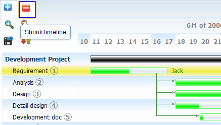
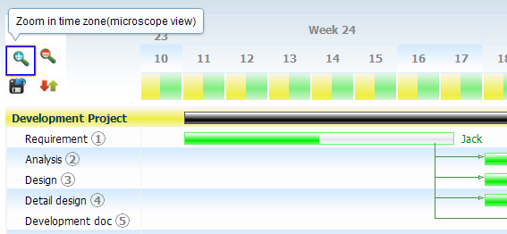
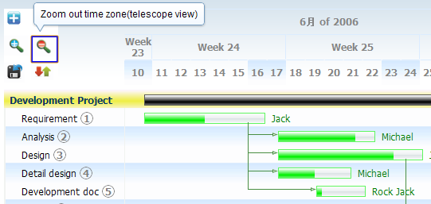
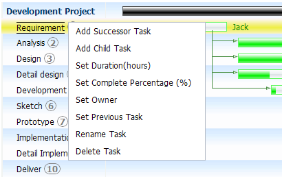
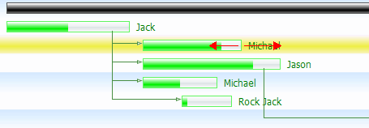
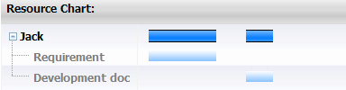

.. _dojox/gantt:

dojox.gantt
===========

:Available: since V1.6

``dojox.gantt`` gives the capability of project management.

.. contents::
   :depth: 2

============
Introduction
============

GanttChart(dojox.gantt.GanttChart) is an integrated widget for project and resource management. It includes a set of feature as follows.

  * **Toolbar** - Providing general time line control and save/load button.
  * **Project Tree** - Listing projects and their tasks.
  * **Task Cascade View** - A task view with dependency, that can be modified visually.
  * **Resource View** - A read-only view shows people resource occupation.

=====
Usage
=====

The following step shows how to create a typical gantt chart in dojo.

Step 1: Import related CSS file and required javacript:

.. code-block :: javascript
  :linenos:

  <link type="text/css" rel="stylesheet" href="{baseUrl}/dijit/themes/claro/claro.css">
  <link type="text/css" rel="stylesheet" href="{baseUrl}/dojox/gantt/resources/gantt.css">
  ...
  

Step 2: Declare gantt chart.

.. code-block :: javascript
  :linenos:

  var ganttChart = new dojox.gantt.GanttChart({
    readOnly: false,			//optional: determine if gantt chart is editable
    dataFilePath: "gantt_defalut.json",	//optional: json data file path for load and save, default is "gantt_default.json"
    height: 400,			//optional: chart height in pixel, default is 400px
    width: 1200,			//optional: chart width in pixel, default is 600px
    withResource: true			//optional: display the resource chart or not
  }, "gantt"); 				//"gantt" is the node container id of gantt chart widget

Step 3: Add project with tasks.

.. code-block :: javascript
  :linenos:

  var projec = new dojox.gantt.GanttProjectItem({
    id: 1,
    name: "Development Project",
    startDate: new Date(2006, 5, 11)
  });
  var taskRequirement = new dojox.gantt.GanttTaskItem({
    id: 1,
    name: "Requirement",
    startTime: new Date(2006, 5, 11),
    duration: 50,
    percentage: 50,
    taskOwner: "Jack"
  });
  var taskAnalysis = new dojox.gantt.GanttTaskItem({
    id: 2,
    name: "Analysis",
    startTime: new Date(2006, 5, 18),
    duration: 40,
    percentage: 0,
    previousTaskId: "1",
    taskOwner: "Michael"
  });

  project.addTask(taskRequirement);
  project.addTask(taskAnalysis);

  ganttChart.addProject(project);
				
  // Initialize and Render
  ganttChart.init();

There are several imported parameters in ``dojox.gantt.GanttTaskItem`` declaration as follows.

================ ============= ======= ===========
Name             Type          Default Description
================ ============= ======= ===========
duration         number        8       Task duration in hours.
percentage       number        0       Task progress in percentage, 50 for 50%.
previousTaskId   number|string null    The id of previous task. 
================ ============= ======= ===========

=======
Toolbar
=======

Gantt chart toolbar provides some handy controls like zooming time line time zone, and save/load button for gannt chart data.

Enlarge Time Line: it shows a more accurate time line when it enlarged.

Shrink Time Line: it shows a more general time line when it shrink.

Zoom in Time Zone

Zoom out Time Zone

============
Project Tree
============

Project tree shows all the projects and their tasks, each task has a visual bar in task cascade view in the same row. It shows the task menu when task item is hovered. The menu lists many functionality of task.

=================
Task Cascade View
=================

The task cascade view shows the task sequence and dependency between them. The "task bar" can be modified on starting time by moving horizontally, and set task duration by draging the right end of it.

=============
Resource View
=============

Resource view shows the people resource occupation and the what task the resource occupied to. The following image indicates the Jack's resource occupation, the lighter blue bar shows the resource occupation on relevant task.

 
