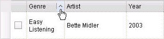
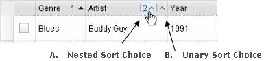

#format dojo_rst

dojox.grid.EnhancedGrid
=======================

:Status: Draft
:Version: Experimental
:Project owner: Nathan Toone
:Available: since V.1.4

Enhanced DataGrid adds numerous useful features to dojox.grid.

.. contents::
   :depth: 2

============
Introduction
============

EnhancedGrid (dojox.grid.EnhancedGrid) provides a rich set of features that enhance the capabilities of base DataGrid. The following enhancements are implemented in Dojo 1.4:

* Nested Sorting
* Built-in support for Indirect Selection (radio buttons and check boxes)
* Declarative context menu
* Selecting rows or columns by swiping
* Moving multiple rows or columns with drag-n-drop

There is currently a project to implement a `Grid plugin architecture </dojox/grid/pluginAPI>`_. To be compatible with this work, EnhancedGrid features are implemented as plugins which can be loaded on demand. As a result, the required features must first declared before they can be used.

=====
Usage
=====

The following steps show a typical usage of EnhancedGrid:

.. code-example::
  :type: inline
  :toolbar: themes, versions, dir
  :version: local
  :width: 480
  :height: 300

  .. javascript::

    

2. Declare required feature plugins 

.. code-example::
  :type: inline
  :toolbar: themes, versions, dir
  :version: local
  :width: 480
  :height: 300

  .. javascript::

    

3. Use features:

.. code-example::
  :type: inline
  :toolbar: themes, versions, dir
  :version: local
  :width: 480
  :height: 300

  .. javascript::

    

    

[TODO - Add a live EDG demo here on Dojo Campus page]

==============
Nested Sorting
==============

This feature enhances the single sorting feature of base DataGrid. Nested sorting allows users to sort on one or more columns concurrently and also control the sort direction and order.

Usage
-----

Using the nested sorting feature is pretty simple as shown below:

* Declare nested sorting feature plugin

.. code-example::
  :type: inline
  :toolbar: themes, versions, dir
  :version: local
  :width: 480
  :height: 300

  .. html::

    

* Use nested sorting feature

    ... with HTML markup
    
.. code-example::
  :type: inline
  :toolbar: themes, versions, dir
  :version: local
  :width: 480
  :height: 300

  .. html::

    

    ... with JavaScript  <<< '''This isn't code. Not sure how to fix'''
    
.. code-example::
  :type: inline
  :toolbar: themes, versions, dir
  :version: local
  :width: 480
  :height: 300

  .. javascript::

    var grid = new dojox.grid.EnhancedGrid({id: "grid", store: "store1", plugins: {nestedSorting: true}, ...}, dojo.byId("gridDiv"));
    
When nested sorting is enabled, you can also use comparatorMap for custom sorting; see `dojo.data.ItemFileReadStore <dojo/data/ItemFileReadStore>`_ on DojoCampus.org for more details.

Scenario
--------

The followings are typical scenario of nested sorting:

* When there is no sorting established, a unary (single) sort caret is shown when the mouse hovers over a column. The upward direction of the caret reflects that this will result in an ascending sort.

* Once the sort choice is selected for the 'Genre' column, the grid rows will be sorted by the values in Genre. Note that the keyboard focus moves to the sort choice in response to the mouse click.

.. image:: sort-2.png

* Then the nested sort tip will be shown when the mouse hovers over a other columns.
* Clicking region "A" will execute a nested sort, and the rows will be sorted by Artist in this example within Genre.
* Clicking region "B" will reset the sort, and the rows will be sorted by Artist alone.

* Once a column is sorted ascending, the sort choice changes to a sort descending choice.

.. image:: descending-sort-1.png

* Once a column is sorted descending, the sort choice changes to a 'remove sort' function. When a column is removed from the sort, other columns in the sort will be adjusted to reflect the new sort order. For example, Year would become the second column in the sort if is had previously been the third.

.. image:: remove-sort.png

To summarize, the sort choice cycles among sort-ascending, sort-descending, and remove sort functions.

Accessibility
-------------

Keyboard Support
~~~~~~~~~~~~~~~~

+------------+--------------------------------+
| **Key**    | **Action**                     +
+------------+--------------------------------+
| LEFT/RIGHT | Moves the keyboard focus among +
| arrow keys | column headers and regions     +
|            | within a column header         +
+------------+--------------------------------+
| SPACE key  | Chooses the sorting choice     +
|            | with the keyboard focus        +
+------------+--------------------------------+

* The above keys are only effective when keyboard focus is in the region of column headers. 

Screen Readers
~~~~~~~~~~~~~~

ARIA attributes "aria-label" and "aria-sort" are used for screen readers.

+--------------+---------------+--------------------------------------+
| **Region**   | **ARIA        + **ARIA Attribute Value**             +
|              | Attribute**   +                                      +
+--------------+---------------+--------------------------------------+
| Select       | aria-label    | Column name                          +
| region       |               |                                      +
+--------------+---------------+--------------------------------------+
| Unary sort   | aria-sort     | Sorting state, e.g. "descending"     +
| choice       |               |                                      +
+--------------+---------------+--------------------------------------+
|              | aria-label    | * Normal sate - "Column 2 Genre      +
|              |               |    single sort"                      +
|              |               |                                      +
|              |               | * Hovered - "Column 2 Genre -        +
|              |               |    Press space to choose descending  +
|              |               |    nested sort"                      +
+--------------+---------------+--------------------------------------+
| Nested sort  | aria-sort     | Sorting state, e.g. "descending"     +
| choice       |               |                                      +
+--------------+---------------+--------------------------------------+
|              | aria-label    | * Normal sate - "Column 2 Genre      +
|              |               |   nested sort sort position 1"       +
|              |               |                                      +
|              |               | * Hovered - "Column 2 Genre -        +
|              |               |    Press space to choose descending  +
|              |               |    nested sort"                      +
+--------------+---------------+--------------------------------------+

Note: In Firefox v.3.5, JAWS10 doesn't announce all the above ARIA attributes appropriately. This will be addressed when newer JAWS and Firefox versions are released.

=======================================
Built-in Support for Indirect Selection
=======================================

This feature provides indirect row selection support either through

    * Radio buttons - for single row selection, and
    * Check boxes - for multiple row selections

Please note indirect selection is completely dependent on the selection mode of EnhancedGrid so check boxes are used for "extended" and "multiple" selection mode ("extended" is the default mode), and radio buttons are used for "single" selection mode. For more details of Grid selection modes, please refer to the `specification of the base Grid <http://docs.dojocampus.org/dojox/grid>`_.

Usage
-----

* Declare indirect selection feature plugin

.. code-example::
  :type: inline
  :toolbar: themes, versions, dir
  :version: local
  :width: 480
  :height: 300

  .. html::

    

* Use indirect selection feature

    * Check boxes

    ... with HTML markup
    
.. code-example::
  :type: inline
  :toolbar: themes, versions, dir
  :version: local
  :width: 480
  :height: 300

  .. html::

   

    ... with JavaScript  <<< '''This isn't code. Not sure how to fix'''
    
.. code-example::
  :type: inline
  :toolbar: themes, versions, dir
  :version: local
  :width: 480
  :height: 300

  .. javascript::

    var grid = new dojox.grid.EnhancedGrid({id: "grid", plugins: {indirectSelection: true}, ...}, dojo.byId('gridDiv'));

    * Radio buttons

    ... with HTML markup
    
.. code-example::
  :type: inline
  :toolbar: themes, versions, dir
  :version: local
  :width: 480
  :height: 300

  .. html::

   

    ... with JavaScript  <<< '''This isn't code. Not sure how to fix'''
    
.. code-example::
  :type: inline
  :toolbar: themes, versions, dir
  :version: local
  :width: 480
  :height: 300

  .. javascript::

    var grid = new dojox.grid.EnhancedGrid({id: "grid", plugins: {indirectSelection: true}, selectionMode: “single”, ...}, dojo.byId('gridDiv'));

It is unlikely that the row headers will be desired when indirect selection is used. The following code removes the row headers from the grid.

Scenario
--------

* Indirect selection by radio buttons

.. image:: radio-buttons.png

* Indirect selection by check boxes

Besides selecting or deselecting rows by clicking on check boxes, the SHIFT key can be held during the 2nd click to select or deselect a range of rows.

.. image:: extended-selection-checkboxes.gif

* An additional selection technique is to swipe through check boxes (mouse down on the first, drag through the adjacent checkboxes and then release on the last).

.. image:: swipe-checkbox.gif

Accessibility
-------------

Keyboard Support
~~~~~~~~~~~~~~~~

+------------+--------------------------------+
| **Key**    | **Action**                     +
+------------+--------------------------------+
| UP/Down    | Navigate keyboard focus across +
| arrow keys | cells that contain radio       +
|            | buttons or check boxes         +
+------------+--------------------------------+
| SPACE key  | * Radio button - select a row  +
|            | * Check box - select or        +
|            |   de-select a row.             +
+------------+--------------------------------+
| SHIFT +    | Select or de-select a range    +
| SPACE key  | of rows                        +
+------------+--------------------------------+
| SHIFT+     | Extend the selection or        +
| UP/Down    | de-selection - only for        +
| arrow keys | check boxes   .                +
+------------+--------------------------------+

    * The above keys are only effective when keyboard focus is in the first column that contains radio buttons or check boxes.

Note that extended selection is also enabled through the row headers as well.

Tips
----

* When "Indirect Selection" feature is enabled, you could handle row selection programmatically as follows.

.. code-example::
  :type: inline
  :toolbar: themes, versions, dir
  :version: local
  :width: 480
  :height: 300

  .. javascript::

    for(var i = 0; i < selectedRows.length/*Array of selected row index*/; i++){
       grid.rowSelectCell.toggleRow(selectedRows[i], true);
    }

* A topic named "rowSelectionChangedTopic" will be published when row selections are changed. The topic can be subscribed to with the following code.

.. code-example::
  :type: inline
  :toolbar: themes, versions, dir
  :version: local
  :width: 480
  :height: 300

  .. javascript::

    dojo.subscribe(dijit.byId('grid').rowSelectionChangedTopic, function(){...});

* You can check whether a certain row is selected with the following code.

.. code-example::
  :type: inline
  :toolbar: themes, versions, dir
  :version: local
  :width: 480
  :height: 300

  .. javascript::

    dijit.byId('grid').selection.selected[rowIndex] // returns true or false
    
========================
Declarative context menu
========================

With this new feature, users can add context menus either through declarative HTML markup or JavaScript. The following menu types are supported:

* Header cell menu
* Cell menu
* Row menu

Usage
-----

* Declare menu feature plugin

.. code-example::
  :type: inline
  :toolbar: themes, versions, dir
  :version: local
  :width: 480
  :height: 300

  .. javascript::

    

* Use menu feature

    ... with HTML markup
    
.. code-example::
  :type: inline
  :toolbar: themes, versions, dir
  :version: local
  :width: 480
  :height: 300

  .. html::

    

        

            
Header Menu Item 1

        

        

            
Row Menu Item 1

        

        

            
Cell Menu Item 1

        

        

            
Action 1 for Selected Region

        

    

    ... with JavaScript  <<< '''This isn't code. Not sure how to fix'''
    
.. code-example::
  :type: inline
  :toolbar: themes, versions, dir
  :version: local
  :width: 480
  :height: 300

  .. javascript::

    var grid = new dojox.grid.EnhancedGrid({id: "grid",
        plugins: {menus:{headerMenu:’headerMenu‘, rowMenu:’rowMenu‘, cellMenu:’cellMenu‘, selectedRegionMenu:’selectedRegionMenu‘}}, ...},
        dojo.byId('gridDiv'));

Tips
----
********* TODO tips - bind events to onxxContextMenu(e) ***********

=================================
Selecting Rows/Columns with Swipe
=================================

This feature provides a mechanism to select row(s) and column(s) via mouse clicking, swiping or keyboards.

Note:

* This feature is implemented as part of the "DnD" plugin of EnhancedGrid.
* Row headers and column select regions are the only places where this feature is effective.

The following figure shows a sample of row headers and column select regions

.. image:: swipe-rows&columns.png

As noted above, swipe-select is also possible when check boxes are used for row selection.

Usage
-----

To use this feature, you need to first enable the "DnD" plugin.

* Declare DnD feature plugin

.. code-example::
  :type: inline
  :toolbar: themes, versions, dir
  :version: local
  :width: 480
  :height: 300

  .. javascript::

    

* To use DnD feature

    ... with HTML markup
    
.. code-example::
  :type: inline
  :toolbar: themes, versions, dir
  :version: local
  :width: 480
  :height: 300

  .. html::

    

    ... with JavaScript  <<< '''This isn't code. Not sure how to fix'''
    
.. code-example::
  :type: inline
  :toolbar: themes, versions, dir
  :version: local
  :width: 480
  :height: 300

  .. javascript::

    var grid = new dojox.grid.EnhancedGrid({id: "grid", store: "store1", plugins: {dnd: true}, rowSelector: "20px", ...}, dojo.byId(“gridDiv”));

========
Scenario
========

Selecting rows/columns via mouse clicking/keyboard
--------------------------------------------------

You can also select multiple non-adjacent rows/columns by holding CTRL key or select a range of adjacent rows/columns by holding SHIFT key and selecting another row.

.. image:: extended-selection-checkboxes.gif

* Selecting rows/columns by swiping.

Swiping is a useful technique for selecting multiple contiguous rows or columns.

.. image:: swipe-select.gif

Accessibility
-------------

Keyboard Support
~~~~~~~~~~~~~~~~

+------------+--------------------------------+
| **Key**    | **Action**                     +
+------------+--------------------------------+
| UP/Down    | Navigate keyboard focus across +
| arrow keys | row headers                    +
+------------+--------------------------------+
| Left/Right | Navigate keyboard focus across +
| arrow keys | column headers                 +
+------------+--------------------------------+
| SPACE key  | Select a row or column         +
+------------+--------------------------------+
| SHIFT+     | Extend the column selection or +
| Left/Right | de-selection                   +
| arrow keys |                                +
+------------+--------------------------------+
| SHIFT+     | Extend the row selection or    +
| UP/Down    | de-selection                   +
| arrow keys |                                +
+------------+--------------------------------+

    * The above keys are only effective when keyboard focus is in row headers or select regions of column headers.

Tips
----

* When "DnD" feature is enabled but "Indirect Selection" not enabled, row selection can be handled programmatically the same way as base DataGrid:

.. code-example::
  :type: inline
  :toolbar: themes, versions, dir
  :version: local
  :width: 480
  :height: 300

  .. javascript::

    for(var i = 0; i < selectedRows.length/*Array of selected row index*/; i++){
        dijit.byId('grid').selection.addToSelection(selectedRows[i]);
    }

* There are preconditions to using the "DnD" feature:
  * The "NestedSorting" feature must be enabled to use the "DnD" feature.
  * "RowSelector" should be used for "DnD", e.g.,

.. code-example::
  :type: inline
  :toolbar: themes, versions, dir
  :version: local
  :width: 480
  :height: 300

  .. HTML::

    

* When the "DnD" feature is enabled, whether a column is selected can be determined by:

.. code-example::
  :type: inline
  :toolbar: themes, versions, dir
  :version: local
  :width: 480
  :height: 300

  .. javascript::

    dijit.byId('grid').select.selectedColumns[columnIndex] // returns true or false , for column

* A topic named "rowSelectionChangedTopic" will be published when row selections are changed, you could simply subscribe the topic as:

.. code-example::
  :type: inline
  :toolbar: themes, versions, dir
  :version: local
  :width: 480
  :height: 300

  .. javascript::

    dojo.subscribe(dijit.byId('grid').rowSelectionChangedTopic, function(){...});

========
Examples
========

Programmatic example
--------------------

TODO: example

Declarative example
-------------------

TODO: example

========
See also
========

* TODO: links to other related articles
