#format dojo_rst

dojox.grid.EnhancedGrid
=======================

:Project owner: Nathan Toone
:Available: since V.1.4

Enhanced DataGrid adds numerous useful features to dojox.grid.

.. contents::
   :depth: 2

============
Introduction
============

EnhancedGrid (dojox.grid.EnhancedGrid) provides a rich set of features that enhance the capabilities of base DataGrid. The following accessible enhancements are implemented in Dojo 1.4:

* Nested Sorting
* Built-in support for Indirect Selection (radio buttons and check boxes)
* Declarative context menus
* Selecting multiple rows or columns by swiping
* Moving multiple rows or columns with drag-n-drop

EnhancedGrid features are implemented as plugins which can be loaded on demand. As a result, the required features must first declared before they can be used.

.. code-example::
  :toolbar: themes, versions, dir
  :version: local
  :width: 480
  :height: 300

  .. javascript::

    

  .. html::

    

  .. css::

    

=====
Usage
=====

The following steps show a typical usage of EnhancedGrid:

1. Import related CSS

.. code-block :: javascript
  :linenos:

  

2. Declare required feature plugins 

.. code-block :: javascript
  :linenos:

  

3. Use features:

.. code-block :: javascript
  :linenos:

  

  

==============
Nested Sorting
==============

This feature enhances the single sorting feature of base DataGrid. Nested sorting allows users to sort on one or more columns concurrently and also control the sort direction and order. Finally, columns can be removed from the sort without disturbing the rest of the sort.

.. code-example::
  :toolbar: themes, versions, dir
  :version: local
  :width: 480
  :height: 300

  .. javascript::

    

  .. html::

    

  .. css::

    

Usage
-----

Using the nested sorting feature is pretty simple as shown below:

* Declare nested sorting feature plugin

.. code-block :: javascript
  :linenos:

  

* Use nested sorting feature

...with HTML markup
    
.. code-block :: html
  :linenos:

  

  

...with JavaScript
    
.. code-block :: javascript
  :linenos:

  
    
When nested sorting is enabled, you can also use comparatorMap for custom sorting; see `dojo.data.ItemFileReadStore <dojo/data/ItemFileReadStore>`_ on DojoCampus.org for more details.

Scenario
--------

The following are typical scenarios using nested sorts:

* When there is no sorting established, a unary (single) sort caret is shown when the mouse hovers over a column. The upward direction of the caret reflects that this will result in an ascending sort.

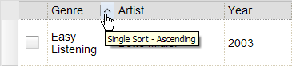

* Once the sort choice is selected for the 'Genre' column, the grid rows will be sorted ascending based on by the values in Genre. Note that the keyboard focus moves to the sort choice in response to the mouse click. The graphical label of the sort choice is a downward caret since the function would be a descending sort.

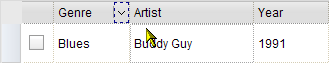

* Then the nested sort tip is shown when the mouse hovers over a other column headers.
* Clicking region "A" in the figure below will execute a nested sort, and the rows will be sorted by Artist in this example within Genre.
* Clicking region "B" will reset the sort, and the rows will be sorted by Artist alone.

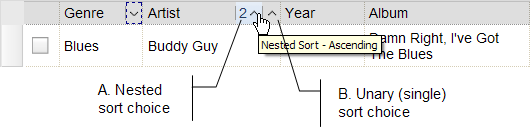

* Once a column is sorted ascending, the sort choice changes to a sort descending choice.

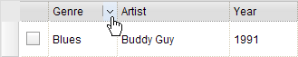

* Once a column is sorted descending, the sort choice changes to a 'remove sort' function (see the figure below). When a column is removed from the sort, other columns in the sort will be adjusted to reflect the new sort order. For example, Year would become the second column in the sort if it had previously been the third.

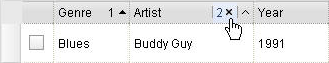

To summarize, the sort choice cycles among sort-ascending, sort-descending, and remove sort functions.

There is no limit to the number of columns that may be in the sort.

Accessibility
-------------

Keyboard Support
~~~~~~~~~~~~~~~~

+-----------------------+----------------------------------------------------------------------------------+
| Key                   | Action                                                                           |
+=======================+==================================================================================+
| LEFT/RIGHT arrow keys | Moves the keyboard focus among column headers and regions within a column header |
+-----------------------+----------------------------------------------------------------------------------+
| SPACE key             | Chooses the sorting choice with the keyboard focus                               |
+-----------------------+----------------------------------------------------------------------------------+

  * The above keys are only effective when keyboard focus is within the column headers.

Screen Readers
~~~~~~~~~~~~~~

ARIA attributes "aria-label" and "aria-sort" are used for screen readers.

+--------------------+---------------------+----------------------------------------------------------------------------+
| Region             | ARIA Attribute      | ARIA Attribute Value                                                       |
+====================+=====================+============================================================================+
| Select region      | aria-label          | Column name                                                                |
+--------------------+---------------------+----------------------------------------------------------------------------+
| Unary sort choice  | aria-sort           | Sorting state, e.g. "descending"                                           |
+--------------------+---------------------+----------------------------------------------------------------------------+
|                    | aria-label          | - Normal sate - "Column 2 Genre single sort"                               |
|                    |                     | - Hovered - "Column 2 Genre - Press space to choose descending nested sort"|
+--------------------+---------------------+----------------------------------------------------------------------------+
| Nested sort choice | aria-sort           | Sorting state, e.g. "descending"                                           |
+--------------------+---------------------+----------------------------------------------------------------------------+
|                    | aria-label          | - Normal sate - "Column 2 Genre nested sort sort position 1"               |
|                    |                     | - Hovered - "Column 2 Genre - Press space to choose descending nested sort"|
+--------------------+---------------------+----------------------------------------------------------------------------+

Note: In Firefox v.3.5, JAWS10 doesn't announce all the above ARIA attributes appropriately. This will be addressed when newer JAWS and Firefox versions are released.

=======================================
Built-in Support for Indirect Selection
=======================================

This feature provides indirect row selection support either through

  * Radio buttons - for single row selection, and
  * Check boxes - for multiple row selections

Please note indirect selection is completely dependent on the selection mode of EnhancedGrid so check boxes are used for "extended" and "multiple" selection mode ("extended" is the default mode), and radio buttons are used for "single" selection mode. For more details of Grid selection modes, please refer to the `specification of the base Grid <http://docs.dojocampus.org/dojox/grid>`_.

.. code-example::
  :toolbar: themes, versions, dir
  :version: local
  :width: 480
  :height: 300

  .. javascript::

     
    

  .. html::

    

  .. css::

    

Usage
-----

* Declare indirect selection feature plugin

.. code-block :: javascript
  :linenos:

  

* Use indirect selection feature with check boxes

... with HTML markup
    
.. code-block :: javascript
  :linenos:

  

  

... with JavaScript
    
.. code-block :: javascript
  :linenos:

  

* Use indirect selection feature with radio buttons

... with HTML markup
    
.. code-block :: javascript
  :linenos:

  

  

... with JavaScript
    
.. code-block :: javascript
  :linenos:

  

* It is unlikely that the row headers will be desired when indirect selection is used. The following code removes the row headers from the grid.

.. code-block :: html
  :linenos:

  //with HTML markup
  

 
  //with Javascript
  

Scenario
--------

* Indirect selection by radio buttons

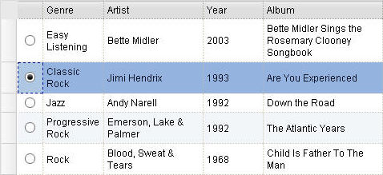

* Indirect selection by check boxes

Besides selecting or deselecting rows by clicking on check boxes, the SHIFT key can be held during the 2nd click to select or deselect a range of rows.

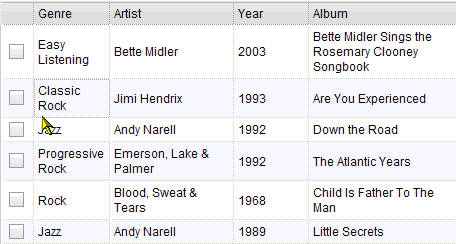

* An additional selection technique is to swipe through check boxes (mouse down on the first, drag through the adjacent check boxes and then release on the last).

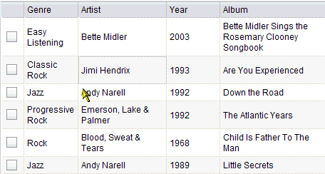

Accessibility
-------------

Keyboard Support
~~~~~~~~~~~~~~~~

+---------------------------+--------------------------------------------------------------------------------+
| Key                       | Action                                                                         |
+===========================+================================================================================+
| UP/Down arrow keys        | Navigate keyboard focus across cells that contain radio buttons or check boxes |
+---------------------------+--------------------------------------------------------------------------------+
| SPACE key	            | -	Radio button - select a row                                                  |
|                           | -	Check box - select or de-select a row.                                       |
+---------------------------+--------------------------------------------------------------------------------+
| SHIFT + Click             | Select or de-select a range of rows                                            |
| SHIFT + SPACE key         |                                                                                |
+---------------------------+--------------------------------------------------------------------------------+
| SHIFT+ UP/Down arrow keys | Extend the selection or de-selection - only for check boxes .                  |
+---------------------------+--------------------------------------------------------------------------------+

  * The above keys are only effective when keyboard focus is in the first column that contains radio buttons or check boxes.

Note that extended selection is also enabled through the row headers as well.

Tips
----
* When the "Indirect Selection" feature is enabled, you could handle row selection programmatically as follows.

.. code-block :: javascript
  :linenos:

  

* When in non-‘single’ selection mode, it’s also easy to select or deselect all rows by:

.. code-block :: javascript
  :linenos:

  

* Another handy usage is to enable or disable a check box or radio button for a certain row by:

.. code-block :: javascript
  :linenos:

  

* A topic named "rowSelectionChangedTopic" will be published when row selections are changed. The topic can be subscribed to with the following code.

.. code-block :: javascript
  :linenos:

  dojo.subscribe(dijit.byId('grid').rowSelectionChangedTopic, function(){...});

* You can check whether a certain row is selected with the following code.

.. code-block :: javascript
  :linenos:

  dijit.byId('grid').selection.selected[rowIndex] // returns true or false
    
========================
Declarative Context Menu
========================

With this new feature, users can add context menus either through declarative HTML markup or JavaScript. The following menu types are supported:

* Header cell menu
* Cell menu
* Row menu

.. code-example::
  :toolbar: themes, versions, dir
  :version: local
  :width: 480
  :height: 300

  .. javascript::

     
    

  .. html::

	

		

			
Header Menu Item 1

			
Header Menu Item 2

			
Header Menu Item 3

			
Header Menu Item 4

		

		

			
Row Menu Item 1

			
Row Menu Item 2

			
Row Menu Item 3

			
Row Menu Item 4

		

		

			
Cell Menu Item 1

			
Cell Menu Item 2

			
Cell Menu Item 3

			
Cell Menu Item 4

		

		

			
Action 1 for Selected Region

			
Action 2 for Selected Region

			
Action 3 for Selected Region

			
Action 4 for Selected Region

		
	
	

  .. css::

    

Usage
-----

* Declare menu feature plugin

.. code-block :: javascript
  :linenos:

  

* Use menu feature

... with HTML markup
    
.. code-block :: javascript
  :linenos:

  

      

          
Header Menu Item 1

      

      

          
Row Menu Item 1

      

      

          
Cell Menu Item 1

      

      

          
Action 1 for Selected Region

      

  

... with JavaScript
    
.. code-block :: javascript
  :linenos:

  var grid = new dojox.grid.EnhancedGrid({id: "grid",
      plugins: {menus:{headerMenu:’headerMenu‘, rowMenu:’rowMenu‘, cellMenu:’cellMenu‘, selectedRegionMenu:’selectedRegionMenu‘}}, ...},
      dojo.byId('gridDiv'));

Tips
----
TODO: tips - bind events to onxxContextMenu(e)

==========================================
Selecting Multiple Rows/Columns with Swipe
==========================================

This feature provides a mechanism to select row(s) and column(s) via mouse clicking, swiping or keyboards.

Note:

* This feature is implemented as part of the "DnD" plugin of EnhancedGrid.
* Row headers and column select regions are the only places where this feature is effective.

The following figure shows a sample of row headers and column select regions

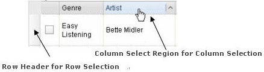

As noted above, swipe-select is also possible when the check box mode of Indirect Selection is used for row selection.

.. code-example::
  :toolbar: themes, versions, dir
  :version: local
  :width: 480
  :height: 300

  .. javascript::

     
    

  .. html::

    

  .. css::

    

Usage
-----

To use this feature, you need to first enable the "DnD" plugin.

* Declare DnD feature plugin

.. code-block :: javascript
  :linenos:

  

* To use DnD feature

... with HTML markup
    
.. code-block :: javascript
  :linenos:

  

... with JavaScript
    
.. code-block :: javascript
  :linenos:

  var grid = new dojox.grid.EnhancedGrid({id: "grid", store: "store1", plugins: {dnd: true}, rowSelector: "20px", ...}, dojo.byId("gridDiv"));

========
Scenario
========

Selecting rows/columns via mouse clicking/keyboard
--------------------------------------------------

You can also select multiple non-adjacent rows/columns by holding CTRL key or select a range of adjacent rows/columns by holding SHIFT key and selecting another row. These techniques can be used with either the row headers or checkboxes for multiple row selection.

* Selecting rows/columns by swiping.

Swiping is a useful technique for selecting multiple contiguous rows or columns.

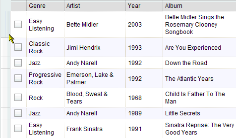

Accessibility
-------------

Keyboard Support
~~~~~~~~~~~~~~~~

+------------------------------+-----------------------------------------------+
| Key                          | Action                                        |
+==============================+===============================================+
| UP/Down arrow keys           | Navigate keyboard focus across row headers    |
+------------------------------+-----------------------------------------------+
| Left/Right arrow keys        | Navigate keyboard focus across column headers |
+------------------------------+-----------------------------------------------+
| SPACE key                    | Select a row or column                        |
+------------------------------+-----------------------------------------------+
| SHIFT+ Left/Right arrow keys | Extend the column selection or de-selection   |
+------------------------------+-----------------------------------------------+
| SHIFT + UP/Down arrow keys   | Extend the row selection or de-selection      |
+------------------------------+-----------------------------------------------+

  * The above key bindings are only effective when keyboard focus is in row headers or select regions of column headers.

Tips
----

* When "DnD" feature is enabled but "Indirect Selection" not enabled, row selection can be handled programmatically the same way as base DataGrid:

.. code-block :: javascript
  :linenos:

  for(var i = 0; i < selectedRows.length/*Array of selected row index*/; i++){
      dijit.byId('grid').selection.addToSelection(selectedRows[i]);
  }

* There are preconditions to using the "DnD" feature:
  * The "NestedSorting" feature must be enabled to use the "DnD" feature.
  * "RowSelector" should be used for "DnD", e.g.,

.. code-block :: javascript
  :linenos:

  

* When the "DnD" feature is enabled, whether a column is selected can be determined by:

.. code-block :: javascript
  :linenos:

  dijit.byId('grid').select.selectedColumns[columnIndex] // returns true or false , for column

* A topic named "rowSelectionChangedTopic" will be published when row selections are changed. You can subscribe the topic as:

.. code-block :: javascript
  :linenos:

  dojo.subscribe(dijit.byId('grid').rowSelectionChangedTopic, function(){...});

=================================
Drag-n-drop: rows, columns - MOVE
=================================

This feature is an enhancement to the single column moving feature of base DataGrid. Once rows or columns are selected, they can be moved to the target position by dragging them.
 
Note:

* This feature is implemented as part of the "DnD" plugin of EnhancedGrid.
* Rows and columns must be selected before being dragged.

.. code-example::
  :toolbar: themes, versions, dir
  :version: local
  :width: 480
  :height: 300

  .. javascript::

     
    

  .. html::

    

  .. css::

    

Usage
-----

See the usage section for "Selecting rows/columns via swipe".

Scenario
--------

* Moving contiguous rows/columns.

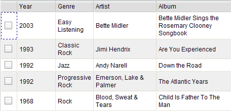

* Moving discontiguous rows/columns.

   Discontiguous rows and columns can be moved using drag-drop as well. The moved columns and rows will be adjacent, in their original relative order, after the move.

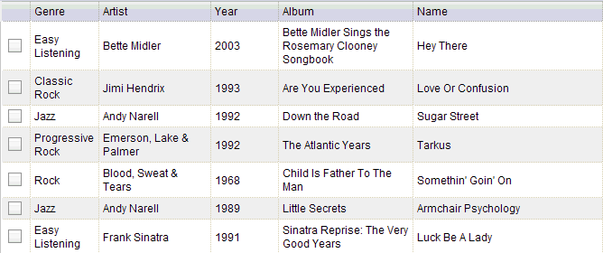

Accessibility
-------------

Keyboard Support
~~~~~~~~~~~~~~~~

+------------------------------+-----------------------------------------------------+
| Key                          | Action                                              |
+==============================+=====================================================+
| CTRL + UP/Down arrow keys    | Move row(s) upward or downward by one row.          |
+------------------------------+-----------------------------------------------------+
| CTRL + LEFT/RIGHT arrow keys | Move column(s) leftward or rightward by one column. |
+------------------------------+-----------------------------------------------------+

============
Known Issues
============

* See the `outstanding tickets for the EnhancedGrid <http://bugs.dojotoolkit.org/query?status=assigned&status=new&status=reopened&component=DojoX+Grid&order=priority&owner=Evan&type=defect&col=id&col=summary&col=status&col=type&col=priority&col=milestone&report=93#no2>`_.

========
See also
========

* `dojox.grid.DataGrid <dojox/grid/DataGrid>`_

  The base grid

* `dojox.grid.TreeGrid <dojox/grid/TreeGrid>`_

  This grid offers support for collapsable rows and model-based (`dijit.tree.ForestStoreModel <dijit/tree/ForestStoreModel>`_) structure

* `Grid Plugin API <dojox/grid/pluginAPI>`_
