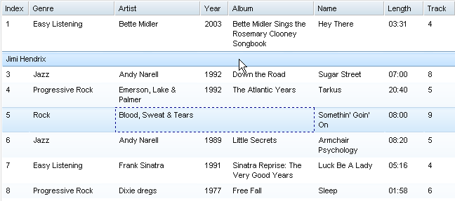

#format dojo_rst

dojox.grid.EnhancedGrid.plugins.CellMerge
=========================================

:Authors: Zhu Xiao Wen
:Project owner: Nathan Toone
:Available: since V.1.6

CellMerge plugin provides functions to merge cells within a row.

.. contents::
   :depth: 2

============
Introduction
============

CellMerge is a plugin for dojox.grid.EnhancedGrid. It provides functions to merge(un-merge) adjacent cells within one row.

=============
Configuration
=============

Prerequisites
-------------

This CellMerge plugin is only available for EnhancedGrid, so use the following statement in the head of your HTML file:

.. code-block :: javascript
  :linenos:

  dojo.require("dojox.grid.EnhancedGrid");
  dojo.require("dojox.grid.enhanced.plugins.CellMerge");

Plugin Declaration
------------------

The declaration name of this plugin is ``cellMerge`` . It is declared in the ``plugins`` property of grid.

If your grid is created declaratively:

.. code-block :: html
  :linenos:

  

If your grid is created in JavaScript:

.. code-block :: javascript
  :linenos:

  var grid = new dojox.grid.EnhancedGrid({
    id:"grid",
    store:"mystore",
    structure:"mystructure",
    plugins:{
      cellMerge: /* a Boolean value or an argument object */{}
    }
  });

As shown in the above code, you can simply set the ``cellMerge`` property to true or false (disabled), or further configure it in an argument object.

=========================  ========  ===============  =================================================================================================
Property                   Type      Default Value    Description
=========================  ========  ===============  =================================================================================================
mergedCells                Array     []               Used to define pre-merged cells. For the structure of the objects in this array please see below.
=========================  ========  ===============  =================================================================================================

Merged cell object structure:

===========  ============================  =====================  =============================================================================================================
Property     Type                          Optional/Mandatory     Description
===========  ============================  =====================  =============================================================================================================
row          Integer|function(Integer)     Mandatory              If it's an Integer, it's the index of the row which have cells to be merged.
                                                                  If it's a function, it's a predicate to decide which rows are to be merged. 
                                                                  It takes an integer (the row index), and should return true or false;        
start        Integer                       Mandatory              The column index of the left most cell that shall be merged.
end          Integer                       Mandatory              The column index of the right most cell that shall be merged.
major        Integer                       Optional               The column index of the cell whose content should be used as the content of the merged cell.
                                                                  It must be larger than or equal to the startColumnIndex, and less than or equal to the endColumnIndex.
                                                                  If it is omitted, the content of the leading edge (left-most for ltr, right most for rtl) cell will be used.
handle                                                            If a "merged cell" structure is returned from getMergedCells/getMergedCellsByRow, this field is valid, so it
                                                                  can be used to unmerge the cells.
===========  ============================  =====================  =============================================================================================================

=====
Usage
=====

This plugin exposes the following methods to the grid:

mergeCells(rowTester, start, end, major):
	Merge cells from startColumnIndex to endColumnIndex at rows that make rowTester return true, using the content of the cell at majorColumnIndex.
	Returns a merge handler, used to unmerge the cells.
	Please refer to "Merge cell object structure" for the detail of the arguments.

unmergeCells(mergeHandler)
	Unmerge the cells that are merged by the **mergeHandler**, which represents a call to the function mergeCells.

getMergedCells()
	Returns an array of records of all merged-cells.

getMergedCellsByRow(rowIndex)
	Returns an array of records of currently merged cells at the given row.

Here is some examples on how to use this API:

.. code-block :: javascript
  :linenos:

  //Merge cells of column 2, column 3 and column 4 on the second row, using the content of the cell on column 3 for the merged cell. 
  var handle1 = grid.mergeCells(1, 2, 4, 3); 

  //Merge cells of column 2, column 3 and column 4 on every third row, using the content of column 3 for the merged cells. 
  var handle2 = grid.mergeCells(function(rowIndex){
    return !((rowIndex + 1) % 3);
  }, 2, 4);

  //Unmerge some merged cells
  grid.unmergeCells(handle1);

  //Unmerge all merged cells.
  dojo.forEach(grid.getMergedCells(), function(item){
    grid.unmergeCells(item.handle);
  });

And here is the effect of merged cells:

========
See Also
========

* `dojox.grid.DataGrid <dojox/grid/DataGrid>`_ - The base grid
* `dojox.grid.EnhancedGrid <dojox/grid/EnhancedGrid>`_ - The enhanced grid supporting plugins
* `dojox.grid.EnhancedGrid.plugins <dojox/grid/EnhancedGrid/plugins>`_ - Overview of the plugins of enhanced grid
* `dojox.grid.TreeGrid <dojox/grid/TreeGrid>`_ - Grid with collapsable rows and model-based (`dijit.tree.ForestStoreModel <dijit/tree/ForestStoreModel>`_) structure
