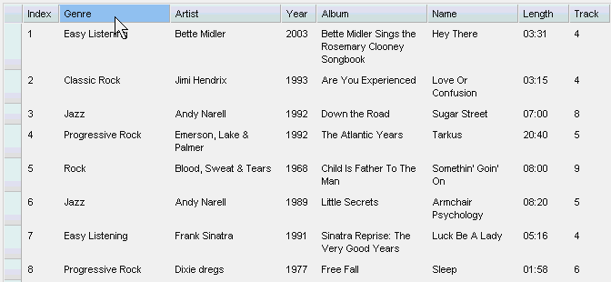
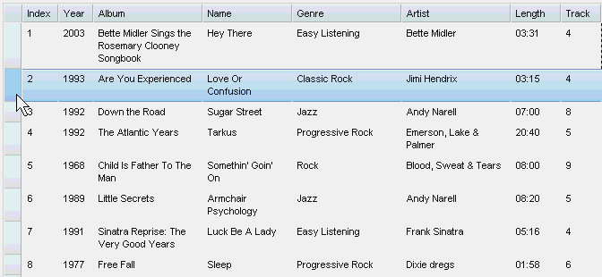
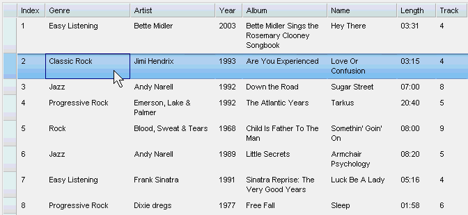
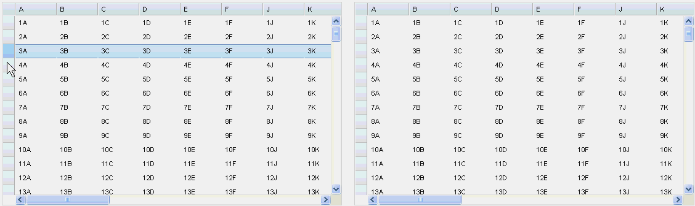
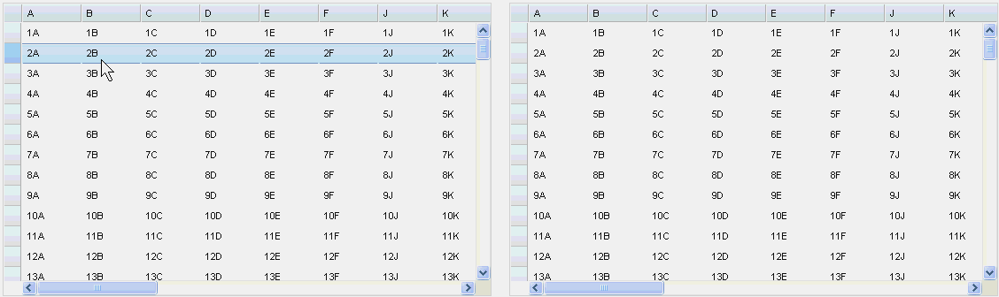
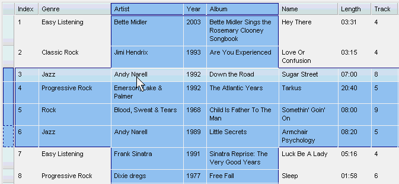
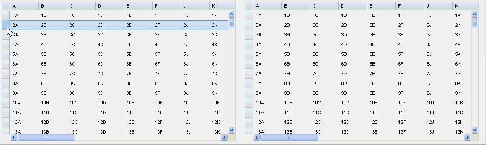
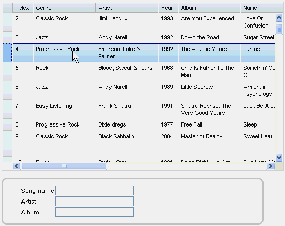

#format dojo_rst

dojox.grid.EnhancedGrid.plugins.DnD
===================================

:Project owner: Nathan Toone
:Available: since V.1.6

DnD plugin supports drag-and-drop of grid rows/column/cells.

.. contents::
   :depth: 2

============
Introduction
============

DnD is a plugin for dojox.grid.EnhancedGrid. It provides supports for drag-and-drop grid rows/column/cells. Users can not only move rows/columns/cells within a grid by dragging them, but also drag them out of grid to other widgets (can be another grid).

=============
Configuration
=============

Prerequisites
-------------

This DnD plugin is only available for EnhancedGrid, so use the following statement in the head of your HTML file:

.. code-block :: javascript
  :linenos:

  dojo.require("dojox.grid.EnhancedGrid");
  dojo.require("dojox.grid.enhanced.plugins.DnD");

Note that this DnD plugin is based on the Selector plugin, so there's no need to "require" the Selector plugin anymore if you'd like to use the its functions.

Plugin Declaration
------------------

The declaration name of this plugin is ``dnd`` . It is declared in the ``plugins`` property of grid.

If your grid is created declaratively:

.. code-block :: javascript
  :linenos:

  

If your grid is created in JavaScript:

.. code-block :: javascript
  :linenos:

  var grid = new dojox.grid.EnhancedGrid({
    id:"grid",
    store:"mystore",
    structure:"mystructure",
    plugins:{
      dnd: /* a Boolean value or an argument object */{}
    }
  });

As shown in the above code, you can simply set the ``dnd`` property to true or false (disabled), or further configure it in an argument object.

The argument object can accept the following properties:

=================  ========  ===============  ===================================================================================================================================================
Property           Type      Default Value    Description
=================  ========  ===============  ===================================================================================================================================================
copyOnly           Boolean   false            Set whether dragging from thid grid means moving or copying.
dndConfig          Object    {}               Enable/disable dnd for every draggable objects ("row", "col", and "cell") in every kind of circumstance (drag "within", "in" to, or "out" of grid).
                                              These draggable objects and circumstances are configured in a hierarchical manner.
                                              You can set either "row"/"col"/"cell" or "within"/"in"/"out" at the first level, and configure the other group at the second level.
                                              Or simply disable/enable a whole set of situations directly at the first level.
                                              Note:
                                              1. Circumstance (within/in/out) has higher priority than objects (row/col/cell).
                                              2. Default value is "true"(enabled) if anything is omitted.
=================  ========  ===============  ===================================================================================================================================================

Here is an example on how to set dndConfig:

.. code-block :: javascript
  :linenos:
  
  GridDnD: {
    dndConfig: {
      //Configure in a hierarchical manner.
      row: {
        out: false, //This rule has lower priority, it'll be overwritten.
        within: false
      },
      //Both orders are correct.
      out: {
        row: true, //This rule has higher priority, it'll be valid.
        cell: false
      },
      //Set a whole group of situations
      in: false
    }
  }

Currently, the following situations are supported:

======  ==============  =============  ==========
DnD     within          in             out
======  ==============  =============  ==========
col     supported       not supported  supported
row     supported       supported      supported
cell    supported       supported      supported
======  ==============  =============  ==========

Note:
	1. Dragging columns into a grid is NOT supported currently.
	2. Only cells forming a rectangle are draggable (do NOT support other shapes).

=====
Usage
=====

This section shows how to DnD.

Note:

   1. If using Selector plugin only, the "drag" operation will start a new selection, and "drag" while pressing and holding CTRL key will start deselection.
   2. If using this GridDnD plugin, only drag AFTER pressing and holding CTRL key will start deselection. If you press the CTRL key DURING dragging process, it means COPY instead of MOVE.

DnD within Grid
---------------

If enabled, selected rows/columns/cells can be dragged within grid.

Dragging Columns

Dragging Rows

Dragging Cells

DnD across Grids
----------------

If both grids are EnhancedGrid with this GridDnD plugin, and one has enabled dragging "out" while the other enabled dragging "in", data can be dragged across grids.
Note: Dragging columns across grids is not supported.

Moving rows across grids

Copy rows across grids

Moving cells across grids

Copy cells across grids

.. image:: dnd-togrid-cells-copy.gif

If selected cells do not form a rectangle, they can not be dragged:

Because the grid lazy loads store data, and extended selection is supported, it is possible to select rows or cells that are not loaded to the client side yet. If this situation occurs, it's not allowed to "drop" these unloaded objects to another grid:

DnD from Grid to Other Widgets
------------------------------

Other widgets/dom nodes can accept dragged data from a grid by extending dojox.grid.enhanced.plugins.GridSource instead of dojo.dnd.Source.

GridSource extends dojo.dnd.Source. Its "accept" property can support "grid/cols", "grid/rows", and "grid/cells".

GridSource provides the following events to handle grid related dnd:

onDropGridColumns(grid, columnIndexes):
	When a set of grid columns is dragged to this source.

==============  ========================  ==================================
Arguments       Type                      Description
==============  ========================  ==================================
grid            dojox.grid.EnhancedGrid   The source grid.
columnIndexes   Integer[]                 The indexes of the dragged columns
==============  ========================  ==================================

onDropGridRows(grid, rowIndexes):
	When a set of grid rows is dragged to this source.

==============  ========================  ==================================
Arguments       Type                      Description
==============  ========================  ==================================
grid            dojox.grid.EnhancedGrid   The source grid.
rowIndexes      Integer[]                 The indexes of the dragged rows
==============  ========================  ==================================

onDropGridCells(grid, leftTopPoint, rightBottomPoint):
	When a block of grid cells is dragged to this source.

================  ========================  ==============================================================================
Arguments         Type                      Description
================  ========================  ==============================================================================
grid              dojox.grid.EnhancedGrid   The source grid.
leftTopPoint  	  Object(__SelectCellItem)  The left-top cell of the selected cells. (For RTL, it's the right-top cell)
rightBottomPoint  Object(__SelectCellItem)  The right-bottom cell of the selected cells. (For RTL, it's the left-top cell)
================  ========================  ==============================================================================

The following example shows how to use these events to drag a grid row to a form.

The HTML is:

.. code-block :: html
  :linenos:
  
  

  <form id="songForm" class="container">
    <table>
      <tr>
        <td><label for="inputName">Song name</label></td>
        <td><input id="inputName" type="text" /></td>
      </tr>
      <tr>
        <td><label for="inputAuthor">Artist</label></td>
        <td><input id="inputAuthor" type="text" /></td>
      </tr>
      <tr>
        <td><label for="inputAlbum">Album</label></td>
        <td><input id="inputAlbum" type="text" /></td>
      </tr>
    </table>
  </form>

The JavaScript code is:

.. code-block :: javascript
  :linenos:

  

And here is the effect:

Public Methods
--------------

copyOnly(isCopyOnly):
	Get/set function of the copyOnly property in the argument object.

==============  ==================  ===============================  ==================================================================================
Arguments       Type                Optional/Mandatory               Description
==============  ==================  ===============================  ==================================================================================
isCopyOnly      Boolean             Optional(default to undefined)   Whether DnD is a copy operation or a move operation. If omitted, this is a getter.
[return]        Boolean|Undefined                                    If isCopyOnly is undefined, return the copyOnly property of this plugin.
==============  ==================  ===============================  ==================================================================================

setupConfig(config):
	Change the dndConfig property in the argument object.
	
==============  ==================  ===============================  ===================
Arguments       Type                Optional/Mandatory               Description
==============  ==================  ===============================  ===================
config          Object              Mandatory                        Same as dndConfig.
==============  ==================  ===============================  ===================
