#format dojo_rst

dojox.grid.EnhancedGrid.plugins.Filter
======================================

:Authors: Zhu Xiao Wen
:Project owner: Nathan Toone
:Available: since V.1.6

Filter plugin provides row filtering functionality for grid. 

.. contents::
	:depth: 2

============
Introduction
============

Filter is a plugin for dojox.grid.EnhancedGrid. It's designed to filter the grid data with a set of conditions. The grid data have types (number, string, date, time, and boolean) so, accordingly, users are able to specify filters with different conditions for different data types. This plugin not only provides a default client-side implementation, it also defines a simple protocol for server-side filtering to use where the data store is too large to be handled client-side. This plugin is independent of data store, just like grid itself. It only relies on the dojo.data.api.Read interface. 

.. code-example::
  :toolbar: themes, versions, dir
  :version: local
  :width: 480
  :height: 300

  .. javascript::

    

  .. html::

    

  .. css::

    

=============
Configuration
=============

Prerequisites
-------------

This filter plugin is only available for EnhancedGrid. Use the following statements in the head of your HTML file:

.. code-block :: javascript
  :linenos:

  dojo.require("dojox.grid.EnhancedGrid");
  dojo.require("dojox.grid.enhanced.plugins.Filter");

Plugin Declaration
------------------

The declaration name of this plugin is ``filter`` . It is declared in the ``plugins`` property of grid.

If your grid is created declaratively:

.. code-block :: html
	:linenos:

	

If your grid is created in JavaScript:

.. code-block :: javascript
  :linenos:

  var grid = new dojox.grid.EnhancedGrid({
    id:"grid",
    store:"mystore",
    structure:"mystructure",
    plugins:{
      filter: /* a Boolean value or an argument object */{}
    }
  });

As shown in the above code, you can simply set the ``filter`` property to true or false (disabled), or further configure it in an argument object.

All the available filter configuration properties are

=========================  ========  ===============  ================================================================================================================
Property                   Type      Default Value    Description
=========================  ========  ===============  ================================================================================================================
itemsName                  String    "items"          The name of the items in the data store. 
                                                      For example, if the data in the store are records of songs, you may set it to "songs", 
                                                      so the filter bar will display "10 of 100 songs" instead of "10 of 100 items".
closeFilterbarButton       Boolean   false            Whether to hide the close-filterbar button.
cacheSize                  Integer   -1               The cache size of the filter. Only valid when using client filter. 
                                                      The client filter will cache the filtered data for future use,avoiding duplicate filtering. 
                                                      Any negative value or zero means "cache all" (the cache size is infinite).
                                                      Note: A positive cache size is only meaningful when there is too much store data at server-side 
                                                      to be loaded completely to client-side, or it's not possible to implement a server-side filter.
fetchAll                   Boolean   true             If true, the grid will filter every item in the data store on the first fetch query. 
                                                      If false, the grid will stop fetching as soon as one page of filtered data is collected. 
                                                      (The page size can be configured by the "rowsPerPage" property of grid).
                                                      The default value is true, because client-side filter is most likely used for small data stores.
disabledConditions         Object    undefined        Disable some condition for some type or "anycolumn", so the user will not see them in the condition Select box.
isServerSide               Boolean   false            If this is true, the actual filtering work will be taken over by the server. 
                                                      This is used to switch between client-side filter and server-side filter.
isStateful                 Boolean   false            If this is true, and isServerSide is set to true, the filter definition will only be sent when it is defined, 
                                                      and it should be remembered at serverside until it is changed.
url                        String    ""               When both isServerSide and isStateful are true, this is a place to set the server url, 
                                                      if it cannot be retrieved by store.url.
setupFilterQuery           Function  undefined        If you'd like to use a stateless server side filter, you'll have to modify the request object, so as to add in 
                                                      the filter definition. The signiture of this function is setupFilterQuery(commands, request). See the last
                                                      section for details.
=========================  ========  ===============  ================================================================================================================

Column Configuration
--------------------

Filter provides different conditions for different data types, but the store does not have any information of types. So users should explicitly declare the data types in the structure of grid.
For example:

.. code-block :: javascript
  :linenos:

  var structure = [{
    cells:[
      {field: "Name", datatype: "string", autoComplete: true },
      {field: "Age", datatype: "number" },
      {field: "Register Date", datatype: "date" },
      {field: "dummy", filterable: false}, //set this column to be not filterable		
      {field: "Register Time", datatype: "time", disabledConditions: ["startsWith", "notStartsWith"]}
    ]
  }];

The following properties are available for column configuration:

====================================  ===================================  ========================================  ============================================================================================
Property                              Type                                 Default Value                             Description
====================================  ===================================  ========================================  ============================================================================================
filterable                            Boolean                              true                                      To set whether this column can be filtered.
datatype                              String                               "string"                                  The data type of this column, determining what conditions could be applied.
autoComplete                          Boolean                              false                                     Only valid for "string" type. If set to true, a ComboBox instead of a TextBox will be used.
disabledConditions                    String[]                             []                                        To disable some conditions for this column. For a full list of condition names, see below.
dataTypeArgs                          Object                               {}                                        A place to put data type specific arguments.
dataTypeArgs(for date/time type)      dojo.date.locale.__FormatOptions     {}                                        Defines how to parse the date/time data shown in the grid.
dataTypeArgs(for boolean type)        Object                               {trueLable: "True", falseLable: "False"}  Set the label text for true value or false value.
====================================  ===================================  ========================================  ============================================================================================

Here is a list of all the condition names (case insensitive)

======================	===================================
Condition Name			Available Data Types
======================	===================================
equalTo					number, string, date, time, boolean 
lessThan				number, date, time 
lessThanOrEqualTo		number 
largerThan				number, date, time 
largerThanOrEqualTo		number 
contains				string 
startsWith				string 
endsWith				string 
notEqualTo				number, string 
notContains				string 
notStartsWith			string 
notEndsWith				string 
range					date, time 
======================	===================================

=====
Usage
=====

The UI of this plugin consists of 3 components: a filter bar within the grid, a definition dialog, and a status tooltip.

Filter Bar
----------

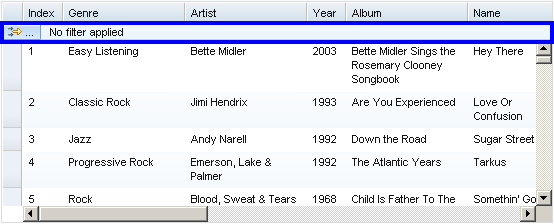

Clicking the button on the filter bar will show the Filter Definition Dialog with a default value of "Any Column". 

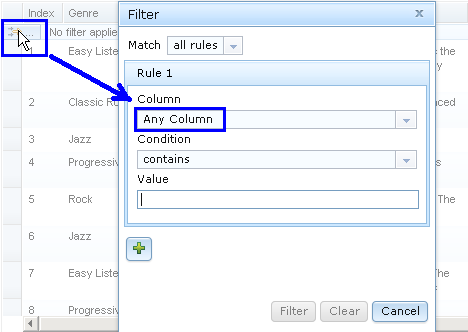

Clicking directly on the filter bar will also show the Filter Definition Dialog, but setting the value of the "Column" field to the column that the mouse is over.

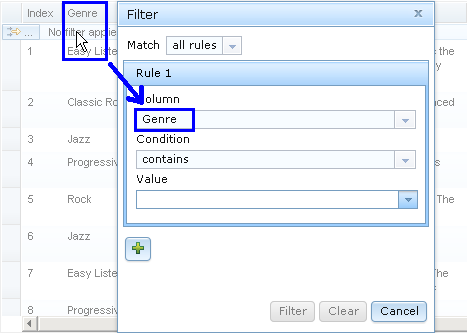

Hovering over the filterbar for 300 msec will trigger the Filter Status Tooltip.

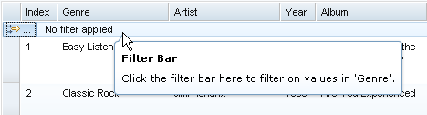

When there's a filter defined, the clear filter button will be shown, and the status tip will look like this:

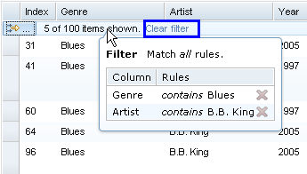

If ``closeFilterbarButton`` is true, there will be a close-filterbar button at the right end of the filter bar.

.. image:: filterbar-closebtn.png

When the filter bar is hidden, there is a function to bring it out: ``showFilterBar``

Actually there's a set of APIs related to filterbar:

showFilterBar(toShow, useAnim, animArgs):
	Show/Hide filter bar

==============  ==================  ==========================  =============================================
Arguments       Type                Optional/Mandatory          Description
==============  ==================  ==========================  =============================================
toShow          Boolean				Mandatory                   To show or to hide
useAnim         Boolean             Optional(default to true)   When showing/hiding, whether to use animation.
animArgs        dojo.__AnimArgs     Optional                    Customized animation properties.
==============  ==================  ==========================  =============================================

toggleFilterBar(useAnim, animArgs):
	Toggle the filter bar. Will call ``showFilterBar``. Please refer to the useAnim/animArgs arguments for showFilterBar method.

isFilterBarShown():
	Check the visibility of filter bar. Return boolean.

Filter Definition Dialog
------------------------

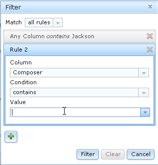

The Filter Definition Dialog is designed to define filter conditions with either of the following structures:

1. [rule 1 for column A] and [rule 2 for column B] and [rule 3 for column C]

2. [rule 1 for column A] or [rule 2 for column B] or [rule 3 for column C]

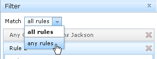

Use the "Add Rule" button to add a rule. If there are already 3 rules, this button will be disabled.
Every rule is regarded as a simple sentence with the following structure:

``[Column] [Condition Verb] [Value]``

For example: ``Column "Age", "is less than", 26``

Different data types have different sets of conditions and different kinds of form widgets.

The value field for Number type only accepts number. 

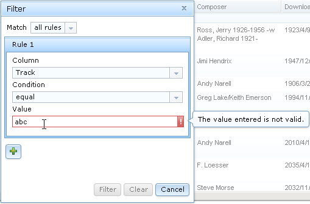

The value field for String type can have auto-complete capability (if set autoComplete in the grid structure). 

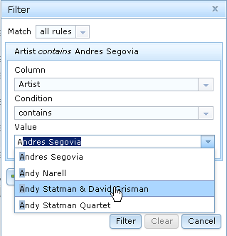

DateTextBox and TimeTextBox used for Date and Time types, respectively.

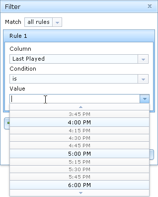

And the ``range`` condition for ``date`` and ``time`` types represents a closed range.

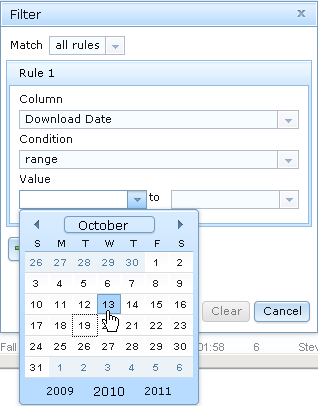

Filter Status Tooltip
---------------------

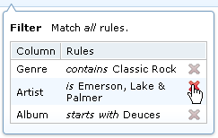

When a filter exists, the Filter Status Tooltip shows every rule of the current filter. If there are multiple rules, you can delete some of them by clicking the red 'X' at the right side of every rule.

=====================================
Introduction to Server-Side Filtering
=====================================

If the store is too big to perform efficient client-side filtering, you can implement your own server-side filter logic along with your data store implementation.

To enable server-side filtering, just set the ``isServerSide`` property to true.

Basic Protocol
--------------

By default, the server side is assumed to be stateless (REST style). In this case, you should send the filter definition to server side along with the fetch request of the store.
You can do this by modifying the request object every time before store.fetch is called.

For example:

.. code-block :: javascript
  :linenos:

  var grid = new dojox.grid.EnhancedGrid({
    id:"grid",
    store:"mystore",
    structure:"mystructure",
    plugins:{
      filter: {
        isServerSide: true,
        setupFilterQuery: setupFilter
      }
    }
  });
  var setupFilter = function(commands, request){
    //the commands object here is the same as the POSTed commands object for stateful server, see below.
    if(commands.filter && commands.enable){
      //some filter is defined and valid. You can modify the request object here.
    }else{
      //no filter is valid. 
    }
  };

Thus the filter definition will be sent to the server along with the request.
  
If you'd like to use a stateful server, which means the filter definition will only be sent when it is defined, and it should be remembered at serverside until it is changed, you can set the '''isStateful''' property:

.. code-block :: javascript
  :linenos:

  var grid = new dojox.grid.EnhancedGrid({
    id:"grid",
    store:"mystore",
    structure:"mystructure",
    plugins:{
      filter: {
        isServerSide: true,
        isStateful: true
      }
    }
  });

Then the filter store layer will send the commands via POST before normal store fetch. There are at most 4 fields in this posted data:

==========  ===========  =================  ===================  ==========================================================================================================
Name        Data Type    Always Available   Value For Example    Description
==========  ===========  =================  ===================  ==========================================================================================================
cmdlayer    String       Yes                "filter"             The name of the current store layer. In this case, it's always "filter".
enable      Integer      Yes                true                 A command to enable/disable the current store layer (in this case, the filter layer).
                                                                 If it is false, the server-side should not filter the data. This field is always valid.
clear       Boolean      No                 true                 Only meaningful for stateful server. A command to clear the filter definition.
                                                                 When this field exists and equals to true, it means the user has cleared the filter,
                                                                 so the server should return unfiltered data in later fetches.
                                                                 This field should not co-exist with the "filter" field. 
                                                                 If they both exist, the "filter" field has higher priority
filter      JSON String  No                 {...}                A command to set the filter definition.
                                                                 When this field exists, it means the user has defined a new filter,
                                                                 so the server should re-filter the data using this new filter, and return filtered data in later fetches.
                                                                 This field should not co-exist with the "clear" field. If they both exist, this field has higher priority.
==========  ===========  =================  ===================  ==========================================================================================================

When the web page loads, the first POST that the server receives is the ``clear`` command. It ensures that there's no filter defined in the session. 

Every time the user defines a filter, the server will receive a ``filter`` command. This command contains a JSON string representing the filter definition, which is covered in the next section.

The Filter Definition
---------------------

The Filter plugin will create a JSON object for the defined filter with the following recursive structure: 

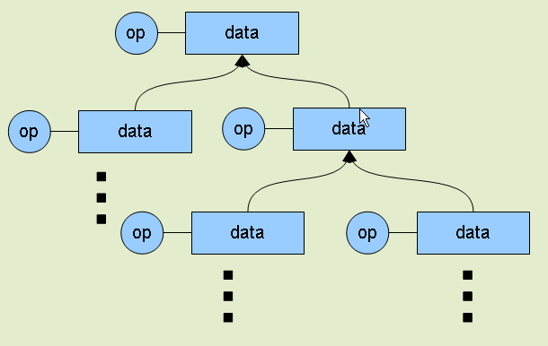

This structure represents an expression, which consists of operators and operands (data). The operands can further contain expressions, that is, deeper level of operators and operands.

All available properties in this filter definition JSON is listed below:

=====  ==========  =================  ==================  =====================================================================================================================================
Name   Data Type   Always Available   Value For Example   Description
=====  ==========  =================  ==================  =====================================================================================================================================
op     String      Yes                "equal"             The name of an operator or a data type. Currently supported operators are:
                                                          and | or | not | all | any | equal | less | lessEqual | larger | largerEqual | contains | startsWith | endsWith
                                                          Currently supported datatypes are:
                                                          string | number | date | time | boolean
data   Object      Yes                {...}               The data of the corresponding "op".
                                                          If "op" is actually an operator, this field must be an array, which contains a list of deeper level filter expressions.
                                                          If "op" is a data type, and there is no "isCol" field, this "data" field is a value of this type.
isCol  Boolean     No                 true                If "op" is a datatype, and the property "isCol" is true, this "data" field represents the field name of a column in the data store,
                                                          so the server implementer can get the value of this field, and transform it to the specified datatype.
=====  ==========  =================  ==================  =====================================================================================================================================

So the JSON object is nothing more than an object with 2 fields: ``op`` and ``data``. For example, The following filter definition means:

The data of the "Field Name" column, whose data type is string, equals to "some message".

.. code-block :: javascript
  
  {
    //op: String
    //The name of an operator or a data type. Currently supported operators are:
    //  and | or | not | all | any | equal | less | lessEqual | larger | largerEqual | contains | startsWith | endsWith
    //Currently supported datatypes are:
    //  string | number | date | time
    op: "equal",
    
    //data: Array | string | number
    //The data of the corresponding "op". If "op" is actually an operator, this field must be an array, 
    //which contains a list of deeper level filter expressions.
    data: [
      {
        op: "string",
        
        //data: Array | string | number
        //If "op" is a datatype, and there is no "isCol" field, this "data" field is a value of this type.
        data: "some message"
      },
      {
        op: "string",
        
        //isCol: Boolean
        //If this field exists and is, or can be converted to, true, 
        //then this expression represents a column in the store, 
        //and the corresponding "data" field represents the field name of this column.
        isCol: true,
        
        //data: Array | string | number
        //If "op" is a datatype, and the property "isCol" is true, 
        //this "data" field represents the field name of a column in the data store, 
        //so the server implementer can get the value of this field, and transform it to the specified datatype.
        data: "Field Name"
      }
    ]
  }

Supported Operators
-------------------

Here is a summary of all supported operators used in filter definition. The "Name" of each operator is passed as the ``op`` field in the filter definition.

===========  ====================================  =======================  ================================================================================
Name         Valid Data Types                      Number of Operands       Meaning
===========  ====================================  =======================  ================================================================================
and          boolean                               2                        Logic AND
or           boolean                               2                        Logic OR
not          boolean                               1                        Logic NOT
all          boolean                               1 ~ ruleCount            A general version of "and"
any          boolean                               1 ~ ruleCount            A general version of "or"
equal        string, number, date, time, boolean   2                        The value of 2 operands are equal
less         number, date, time                    2                        The value of the 1st operand is less than that of the 2nd operand
lessEqual    number                                2                        The value of the 1st operand is less than or equal to that of the 2nd operand
larger       number, date, time                    2                        The value of the 1st operand is larger than that of the 2nd operand
largerEqual  number                                2                        The value of the 1st operand is larger than or equal to that of the 2nd operand
contains     string                                2                        The value of the 1st operand contains that of the 2nd operand
startsWith   string                                2                        The value of the 1st operand starts with that of the 2nd operand
endsWith     string                                2                        The value of the 1st operand ends with that of the 2nd operand
===========  ====================================  =======================  ================================================================================

========
See Also
========

* `dojox.grid.DataGrid <dojox/grid/DataGrid>`_ - The base grid
* `dojox.grid.EnhancedGrid <dojox/grid/EnhancedGrid>`_ - The enhanced grid supporting plugins
* `dojox.grid.EnhancedGrid.plugins <dojox/grid/EnhancedGrid/plugins>`_ - Overview of the plugins of enhanced grid
* `dojox.grid.TreeGrid <dojox/grid/TreeGrid>`_ - Grid with collapsable rows and model-based (`dijit.tree.ForestStoreModel <dijit/tree/ForestStoreModel>`_) structure
