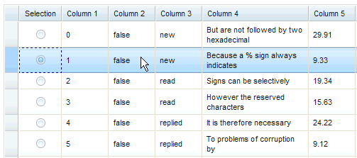
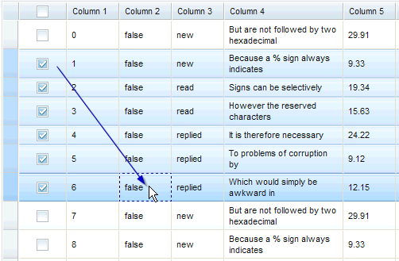

#format dojo_rst

dojox.grid.EnhancedGrid.plugins.IndirectSelection
=================================================

:Authors: Evan Huang
:Project owner: Evan Huang
:Available: since V.1.6

.. contents::
   :depth: 2

==============
Introduction
==============

This feature provides indirect row selection support either through

  * Radio buttons - for single row selection, and
  * Check boxes - for multiple row selections

Please note indirect selection is completely dependent on the selection mode of EnhancedGrid so check boxes are used for "extended" and "multiple" selection mode ("extended" is the default mode), and radio buttons are used for "single" selection mode. For more details of Grid selection modes, please refer to the `specification of the base Grid <dojox/grid>`_.

.. code-example::
  :toolbar: themes, versions, dir
  :version: local
  :width: 480
  :height: 300

  .. javascript::

    

  .. html::

    

  .. css::

    

Usage
-----

* Declare indirect selection feature plugin

.. code-block :: javascript
  :linenos:

  

* Use indirect selection feature with check boxes

... with HTML markup
    
.. code-block :: javascript
  :linenos:

  

  

... with JavaScript
    
.. code-block :: javascript
  :linenos:

  

* Use indirect selection feature with radio buttons

... with HTML markup
    
.. code-block :: javascript
  :linenos:

  

  

... with JavaScript
    
.. code-block :: javascript
  :linenos:

  

* It is unlikely that the row headers will be desired when indirect selection is used. The following code removes the row headers from the grid.

.. code-block :: html
  :linenos:

  //with HTML markup
  

 
  //with Javascript
  

Scenario
--------

* Indirect selection by radio buttons

* Indirect selection by check boxes

Besides selecting or deselecting rows by clicking on check boxes, the SHIFT key can be held during the 2nd click to select or deselect a range of rows.

* An additional selection technique is to swipe through check boxes (mouse down on the first, drag through the adjacent check boxes and then release on the last).

Accessibility
-------------

Keyboard Support
~~~~~~~~~~~~~~~~

+---------------------------+--------------------------------------------------------------------------------+
| Key                       | Action                                                                         |
+===========================+================================================================================+
| UP/Down arrow keys        | Navigate keyboard focus across cells that contain radio buttons or check boxes |
+---------------------------+--------------------------------------------------------------------------------+
| SPACE key	            | -	Radio button - select a row                                                  |
|                           | -	Check box - select or de-select a row.                                       |
+---------------------------+--------------------------------------------------------------------------------+
| SHIFT + Click             | Select or de-select a range of rows                                            |
| SHIFT + SPACE key         |                                                                                |
+---------------------------+--------------------------------------------------------------------------------+
| SHIFT+ UP/Down arrow keys | Extend the selection or de-selection - only for check boxes .                  |
+---------------------------+--------------------------------------------------------------------------------+

  * The above keys are only effective when keyboard focus is in the first column that contains radio buttons or check boxes.

Note that extended selection is also enabled through the row headers as well.

Usages
------
* Turn on Select All checkbox in the column header

.. code-block :: javascript
  :linenos:

  

* Listen to events when the check box/radio button is checked/unchecked

.. code-block :: javascript
  :linenos:

  dojo.connect(grid.selection, 'onSelected'|'onDeselected', function(rowIndex){...})

  //when Select All checkbox is changed
  dojo.connect(grid.rowSelectCell, 'toggleAllSelection', function(newValue){...})

* When the "Indirect Selection" feature is enabled, you could handle row selection programmatically as follows.

.. code-block :: javascript
  :linenos:

  

* When in non-‘single’ selection mode, it’s also easy to select or deselect all rows by:

.. code-block :: javascript
  :linenos:

  

* Another handy usage is to enable or disable a check box or radio button for a certain row by:

.. code-block :: javascript
  :linenos:

  

* You can check whether a certain row is selected with the following code.

.. code-block :: javascript
  :linenos:

  dijit.byId('grid').selection.isSelected(rowIndex) // returns true or false

* It's also possible to make some styling customizations for the indirect selection column.

.. code-block :: javascript
  :linenos:

  

    
or 

.. code-block :: javascript
  :linenos:

  

============
Known Issues
============

* There are known compatibility issues when Indirect Selection is used together with `Selector <Selector>`_ plugin

========
See Also
========

* `dojox.grid.EnhancedGrid <dojox/grid/EnhancedGrid>`_ - The enhanced grid supporting plugins
* `dojox.grid.EnhancedGrid.plugins <dojox/grid/EnhancedGrid/plugins>`_ - Overview of the plugins of enhanced grid 
