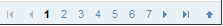
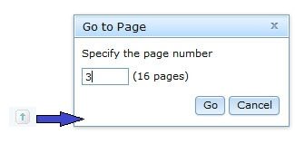
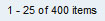
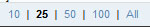

#format dojo_rst

dojox.grid.EnhancedGrid.plugins.Pagination
==========================================

:Authors: Wang Qiang
:Project owner: Evan Huang
:Available: since V.1.6

Pagination plugin provides paging functionality for grid. 

.. contents::
	:depth: 2

============
Introduction
============

Pagination is a plugin for dojox.grid.EnhnacedGrid. It's designed to allow the user to navigate within the grid data by page. It provides page navigation and page length choices. The following documentation describes how to use the pagination plugin and its public API.

.. code-example::
  :toolbar: themes, versions, dir
  :width: 550
  :height: 330

  .. javascript::

    

  .. html::

	

  .. css::

    

=============
Configuration
=============

Prerequisites
-------------

The pagination plugin is only available for EnhancedGrid. Please use the following statement at first:

.. code-block :: javascript
  :linenos:

  dojo.require("dojox.grid.EnhancedGrid");
  dojo.require("dojox.grid.enhanced.plugins.Pagination");
  
Plugin Declaration
------------------

The declaration name of this plugin is ``pagination``. It is declared in the ``plugins`` property of grid.

If your grid is created declaratively:

.. code-block :: html
	:linenos:

	

If your grid is created programmatically:

.. code-block :: javascript
  :linenos:

  var grid = new dojox.grid.EnhancedGrid({
    id:"grid",
    store:"mystore",
    structure:"mystructure",
    plugins:{
      pagination: /* a Boolean value or an configuration object */{}
    }
  });

As shown in the above code, you can simply set the ``pagination`` property to ``true`` (enabled) or ``false`` (disabled), or further configure it in an argument object. The available pagination configuration arguments are described in Table 1 with reference to Figure 1.

Below is all of pagination configuration arguments:

=========================  =======================  ===============  ================================================================================================================
Property                   Type                     Default Value    Description
=========================  =======================  ===============  ================================================================================================================
description                Boolean|String|Integer   true             Indicates whether or not display the current position display if it is set to a boolean.
                                                                     Indicates the width of the current position dislay when it is set to a String/Integer, if description is set to
                                                                     a negative number, 0, "0" etc, the current position dislapy will not be displayed, otherwise, it will define the
                                                                     width of the current position display in given unit(default is pixels).
sizeSwitch                 Boolean|String|Integer   true             Indicates whether or not display the page length menu. if it is set to a boolean.
                                                                     Indicates the width of the page length menu when it is set to a String/Integer, if description is set to
                                                                     a negative number, 0, "0" etc, the page length menu will not be displayed, otherwise, it will define the
                                                                     width of the page length menu in given unit(default is pixels).
pageStepper                Boolean|String|Integer   true             Indicates whether or not display the page navigation choices. if it is set to a boolean.
                                                                     Indicates the width of the page navigation choices when it is set to a String/Integer, if description is set to
                                                                     a negative number, 0, "0" etc, the page navigation choices will not be displayed, otherwise, it will define the
                                                                     width of the page navigation choices in given unit(default is pixels).
gotoButton                 Boolean                  false            Indicates whether or not the go to page button.
position                   String                   "bottom"         Indicates the pagination control bar's position. 
                                                                     There are three options: top (place the pagination bar top of the grid); bottom (place the pagination bar bottom
                                                                     of the grid); both (place the pagination bar both the top and bottom of the grid).
itemTitle                  String                   "item"           Customize the unit of the items displayed on the description.
pageSizes                  Array                    ["10", "25",     Customize the page length menu options. The element of the array must be an integer string or 
                                                    "50", "100",     "All"(case-insensitive).
                                                    "All"]           
maxPageStep                integer                  7                Indicates how many page navigation choices will be displayed (Suggested that the value should be less than 10).
=========================  =======================  ===============  ================================================================================================================

=====
Usage
=====

User Interface
--------------

The pagination bar has one main element and three optional elements: *paging navigation choices* (main element), *current position display*, *page length menu* and *go to page button*.

The following image is an overview of pagination's UI.

.. image:: pagination_ui_overview.bmp

The *page navigation choices* is the main element of the pagination. The *paging navigation choices* including two main parts: 1) the relative (first, previous, next, last) and specific page choices and 2) the go to page button.

The go to page button is an optional element. A go to page dialog will show when clicking the *Go to page* button. The grid will go to the specified page after the user enters a vaild page number and clicks the "go" button or presses ENTER. This process is canceled by clicking the "Cancel" button or pressing ESC.

The *current position display* includes information like total number of items and item range of current page. The current position display can be omitted by setting ``showDescription`` to ``false``. Also, the user can specify the string to use to display the type of item.

The user can change the number of items displayed on each page by clicking the *page length choice*. It can be omitted by setting ``showSizeSwitch`` to ``false``. The page length menu choices can be specified through the ``pageSizeArr`` parameter.

Accessibility
-------------

Below is a summary of all supported keyboard operators.

=============================  ============================================================
Key                            Action
=============================  ============================================================
Tab from inside the grid       The page length menu receives the focus.
Tab from the page length menu  The page navigation choices receive the focus.
First/Last                     The next specific page navigation choice receives the focus.
=============================  ============================================================

==========
Public API
==========

All available methods of the pagination are listed below:

==================  =====================================  =======  ================================================
Name                Parameters                             Return   Description
==================  =====================================  =======  ================================================
gotoPage            pageIdx(integer): page index           N/A      Function to handle shifting to the specific page
nextPage            N/A                                    N/A      Function to handle shifting to the next page
prevPage            N/A                                    N/A      Function to handle shifting to the previous page
gotoFirstPage       N/A                                    N/A      Jump to first page
gotoLastPage        N/A                                    N/A      Jump to last page
changePageSize      size(integer): size of items per page  N/A      Change size of items per page
scrollToRow         rowIndex(integer): row index           N/A      Override the grid.ScrollToRow().
                                                                    Scroll to give row automatically, if the given 
                                                                    row is not in this page, will jump to the right
                                                                    page and scroll to the row
showGotoPageButton  flag(boolean): Indicator of show/hide  N/A      Function to show/hide the Goto page button
                    the Goto page button                            dynamically
==================  =====================================  =======  ================================================

Tips
----
* Set the default displayed page

.. code-block :: javascript
  :linenos:

  

========
See Also
========

* `dojox.grid.DataGrid <dojox/grid/DataGrid>`_ - The base grid
* `dojox.grid.EnhancedGrid <dojox/grid/EnhancedGrid>`_ - The enhanced grid supporting plugins
* `dojox.grid.EnhancedGrid.plugins <dojox/grid/EnhancedGrid/plugins>`_ - Overview of the plugins of enhanced grid
