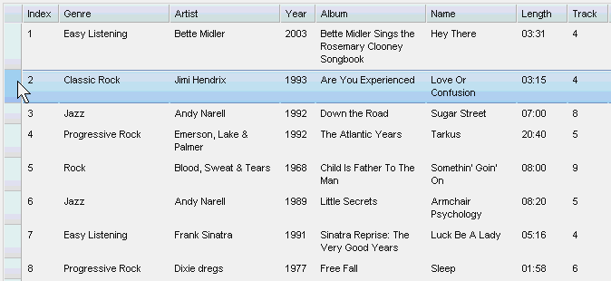
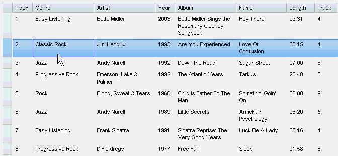
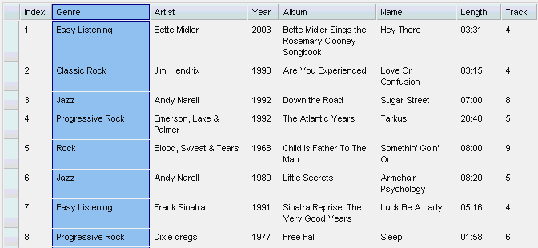
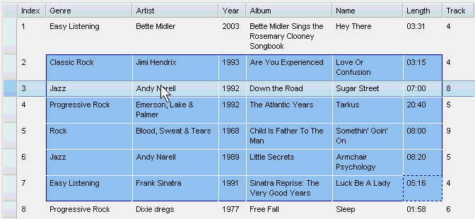

#format dojo_rst

dojox.grid.EnhancedGrid.plugins.Selector
========================================

:Authors: Zhu Xiao Wen
:Project owner: Nathan Toone
:Available: since V.1.6

Selector plugin provides extended selection for columns, rows and cells.

.. contents::
   :depth: 2
   
Selector is a plugin for dojox.grid.EnhancedGrid. It supports extended selection for columns, rows, and cells.

=============
Configuration
=============

Prerequisites
-------------

This selector plugin is only available for EnhancedGrid, so use the following statement in the head of your HTML file:

.. code-block :: javascript
  :linenos:

  dojo.require("dojox.grid.EnhancedGrid");
  dojo.require("dojox.grid.enhanced.plugins.Selector");

Plugin Declaration
------------------

The declaration name of this plugin is ``selector`` . It is declared in the ``plugins`` property of grid.

If your grid is created declaratively:

.. code-block :: html
  :linenos:

  

If your grid is created in JavaScript:

.. code-block :: javascript
  :linenos:

  var grid = new dojox.grid.EnhancedGrid({
    id:"grid",
    store:"mystore",
    structure:"mystructure",
    plugins:{
      selector: /* a Boolean value or an configuration object */{}
    }
  });

As shown in the above code, you can simply set the ``selector`` property to true or false (disabled), or further configure it in an configuration object.

In the configuration object, you can further configure the selection mode for rows/columns/cells:

==========  =================  ===============  ===============================================================================================
Property    Type               Default Value    Description
==========  =================  ===============  ===============================================================================================
row         String|Boolean     "multi"          Can be "single", "multi", "disabled". If false, means "disabled". Any other value means "multi"
col         String|Boolean     "multi"          Can be "single", "multi", "disabled". If false, means "disabled". Any other value means "multi"
cell        String|Boolean     "multi"          Can be "single", "multi", "disabled". If false, means "disabled". Any other value means "multi"
==========  =================  ===============  ===============================================================================================

=====
Usage
=====

Extended Selection
------------------

Extended selection allows the following operations:

=========================  ==================================================================================================  ===========================================================================  ==========================================================================================
Operation                  Use Mouse                                                                                           Use Keyboard                                                                 Result
=========================  ==================================================================================================  ===========================================================================  ==========================================================================================
Point Selection            Click mouse selection button with pointer on object to be selected.                                 With cursor on object to be selected, press Space or Enter.                  Deselects all other objects in this grid, selects single identified object.
Swipe Range Selection      Press mouse selection button at the start point and hold while move the pointer to the end point;   Press Shift at the start point and hold while using cursor-movement          Deselects all other objects in this grid; 
                           release the mouse selection button at the end point.                                                keys to move the cursor to the end point; release shift at end point.        selects all objects in order from the identified start point to the identified end point.
Click Range Selection      Click mouse selection button at the start point;                                                    Press Space or Enter to select the start point; use cursor-movement          Deselects all other objects in this grid; 
                           press Shift and click the mouse selection button at the end point, then release Shift key.          keys to move the cursor to the end point;                                    selects all objects in order from the identified start point to the identified end point.
                                                                                                                               Press Shift ANDSpace/Enter at the end point.
=========================  ==================================================================================================  ===========================================================================  ==========================================================================================

Here the selection "object" can be rows, columns or cells.

The user can also press and hold **CTRL** key while selecting, to modify (deselect) the current selection.

Here's some demos for selecting operations:

Swipe range selection using mouse:

Extend selection using keyboard:

Hole CTRL to modify current selection:

Events
------

This plugin provides several events to the grid, as the following table shows:

onStartSelect(type, startPoint):
	When some of the grid contents are starting to be selected. A typical time point is when the user presses down the mouse selection button.

onEndSelect(type, startPoint, endPoint):
	When the selection completes. A typical time point is when the user releases the the mouse selection button.

onStartDeselect(type, startPoint):
	When the user start to deselect some grid contents. i.e. removing some parts of the current selection.

onEndDeselect(type, startPoint, endPoint):
	When the user completes the deselection.

onSelectCleared(type):
	When all the selection status are cleared.

============ ==================  ===========================================================================
Arguments    Type                Description
============ ==================  ===========================================================================
type         String              One of "row", "col", "cell"
startPoint   Object              The start point of selection. See description of __SelectItem for details.
endPoint     Object              The end point of selection. See description of __SelectItem for details.
============ ==================  ===========================================================================

Arguments "start point" and "end point" can be one of __SelectColItem, __SelectRowItem, and __SelectCellItem, which are extended classes of __SelectItem, as the following shows:

.. code-block :: javascript
  :linenos:
  
  /*===== These classes do NOT really exist, they are just concepts for illustration.

  dojo.declare("__SelectItem", null,{
    // summary:
    //		An abstract representation of an item.
  });
  dojo.declare("__SelectCellItem", __SelectItem,{
    // summary:
    //		An abstract representation of a cell.

    // row: Integer
    //		Row index of this cell
    row: 0,

    // col: Integer
    //		Column index of this cell
    col: 0
  });
  dojo.declare("__SelectRowItem", __SelectItem,{
    // summary:
    //		An abstract representation of a row.

    // row: Integer
    //		Row index of this row
    row: 0,

    // except: Integer[]
    //		An array of column indexes of all the unselected cells in this row.
    except: []
  });
  dojo.declare("__SelectColItem", __SelectItem,{
    // summary:
    //		An abstract representation of a column.

    // col: Integer
    //		Column index of this column
    col: 0,

    // except: Integer[]
    //		An array of row indexes of all the unselected cells in this column.
    except: []
  });
  
  =====*/

To connect to these events, just say (for example):

.. code-block :: javascript
  :linenos:
  
  var handle = dojo.connect(grid, "onEndSelect", function(type, startPoint, endPoint, selected){
    //Your code goes here.
  });

Public Methods
--------------

This Plugin exposes the following methods to grid widget:

setupConfig(config):
	Set selection mode for row/col/cell.

==============  ==================  ==========================  ========================================
Arguments       Type                Optional/Mandatory          Description
==============  ==================  ==========================  ========================================
config          Object              Mandatory                   Same as the plugin configuration object.
==============  ==================  ==========================  ========================================

isSelected(type, rowIndex, colIndex):
	Check whether an item (a cell, a column or a row) is selected.

select(type, rowIndex, colIndex):
	Select an item (a cell, a column or a row).

deselect(type, rowIndex, colIndex):
	Deselect an item (a cell, a column or a row).

==============  ==================  ==============================  ===============================================================================================
Arguments       Type                Optional/Mandatory              Description
==============  ==================  ==============================  ===============================================================================================
type            String              Mandatory                       "row" or "col" or "cell"
rowIndex        Integer             Mandatory                       If type is "row" or "cell", this is the row index.
                                                                    If type if "col", this is the column index.
colIndex        Integer             Optional(defualt to undefined)  Only valid when type is "cell"
[return]        Boolean                                             true if selected, false if not. If cell is covered by a selected column or row, it's selected.
==============  ==================  ==============================  ===============================================================================================

selectRange(type, start, end):
	Select a continuous range (a block of cells, a set of continuous columns or rows)

==============  =============================  ==============================  ==============================================================================
Arguments       Type                           Optional/Mandatory              Description
==============  =============================  ==============================  ==============================================================================
type            String                         Mandatory                       "row" or "col" or "cell"
start           Integer | __SelectCellItem     Mandatory                       If type is "row" or "col", this is the index of the starting row or column.
                                                                               If type if "cell", this is the left-top cell of the range.
end             Integer | __SelectCellItem     Mandatory                       If type is "row" or "col", this is the index of the ending row or column.
                                                                               If type if "cell", this is the right-bottom cell of the range.
==============  =============================  ==============================  ==============================================================================

clear(type):
	Clear all selections of given type.

==============  ==================  ==============================  =================================================
Arguments       Type                Optional/Mandatory              Description
==============  ==================  ==============================  =================================================	
type            String              Optional(default to undefined)  "row" or "col" or "cell". If omitted, clear all.
==============  ==================  ==============================  =================================================

getSelected(type, includeExceptions):
	Get an array of selected items. (__SelectItem[])

==================  ==================  ==============================  ==================================================================================
Arguments           Type                Optional/Mandatory              Description
==================  ==================  ==============================  ==================================================================================
type                String              Mandatory                       "row" or "col" or "cell"
includeExceptions   Boolean             Optional(default to false)      Only meaningful for rows/columns. 
                                                                        If true, all selected rows/cols, even they are partly selected, are all returned.
[return]            __SelectItem[]                                      Array of selected items.
==================  ==================  ==============================  ==================================================================================

========
See Also
========

* `dojox.grid.DataGrid <dojox/grid/DataGrid>`_ - The base grid
* `dojox.grid.EnhancedGrid <dojox/grid/EnhancedGrid>`_ - The enhanced grid supporting plugins
* `dojox.grid.EnhancedGrid.plugins <dojox/grid/EnhancedGrid/plugins>`_ - Overview of the plugins of enhanced grid
* `dojox.grid.TreeGrid <dojox/grid/TreeGrid>`_ - Grid with collapsable rows and model-based (`dijit.tree.ForestStoreModel <dijit/tree/ForestStoreModel>`_) structure
