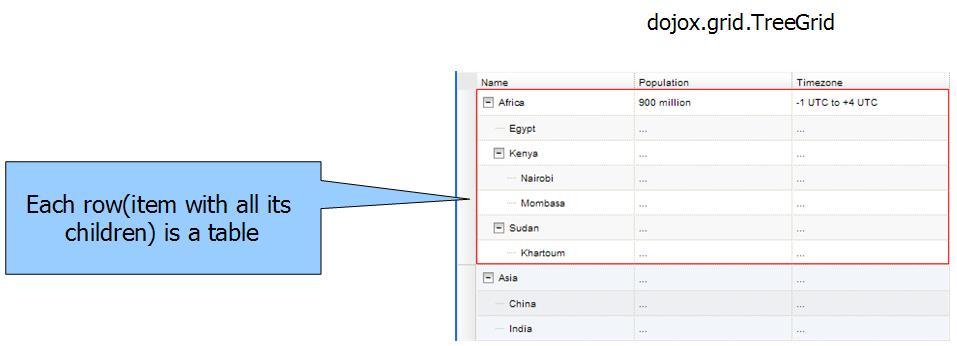
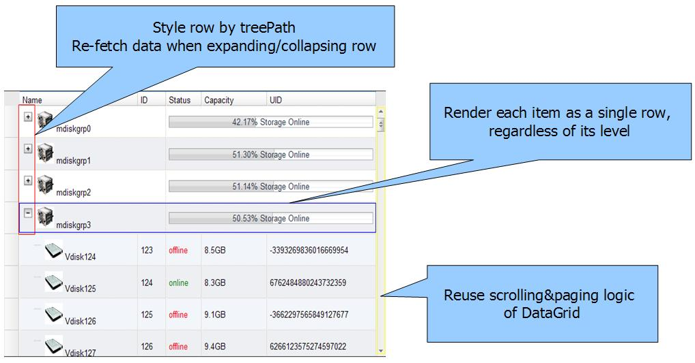

#format dojo_rst

dojox.grid.LazyTreeGrid
=======================

:Status: Draft
:Version: 1.0
:Authors: Wang Qiang
:Project owner: Nathan Toone
:Available: since V1.6

.. contents::
   :depth: 2

This is a stub help page for the new dojox.grid.LazyTreeGrid which is still in progress. The information on this page may be out-of-date due to the fact that the API for the TreeGrid is still very much in flux.

============
Introduction
============

The Lazy-loading-TreeGrid(dojox.grid.LazyTreeGrid) is an extension of dojox.grid.TreeGrid, it is specifically designed for data store with huge nested-level rows. For the reason of the original TreeGrid can only do lazy-load on the 1st-level items, it doesn’t work well with large number of nested-level items. The Lazy-loading-TreeGrid renders each data item as an independent row no matter which level it is, and reuse the virtual scrolling model of DataGrid for paging of either top/nested level rows. This Widget inherits from dojo.grid.TreeGrid, hence all methods and properties pertaining to that Widget are also applicable.

Supported Data Structure
------------------------

For the reason of lazy loading children items, the dojox.grid.LazyTreeGrid could accept the flatted data. For example:

.. code-block :: javascript
  :linenos:

  data = {
    identifier: 'id',
    label: 'name',
    items: [
      {id: 'AF', name:'Africa', children: true},
      {id: 'EG', name:'Egypt', children: false},
      {id: 'KE', name:'Kenya', children: true},
      ......
    ]}
  }

In this case, the "children" attribute would be a flag rather than a truely value. (The name of "children" attribute would be specified by the TreeModel)

Also, the nested data structure is available in normally case (small data or data is stored at client side). For example:

.. code-block :: javascript
  :linenos:
  
  data = {
    identifier: 'id',
    label: 'name',
    items: [
      {id: 'AF', name:'Africa',
        children:[
          {id: 'EG', name:'Egypt' },
          {id: 'KE', name:'Kenya',
            children:[
              {id: 'Nairobi', name:'Nairobi', type:'city' },
              {id: 'Mombasa', name:'Mombasa', type:'city' }
            ]
          },
          ...
        ]
      },
    ...
    ]
  }
  
Even more, for the situations where there are many children of some items as well as there are very few children of other items, you could use the following data structure:

.. code-block :: javascript
  :linenos:

  data = {
    identifier: 'id',
    label: 'name',
    items: [
      {id: 'AF', name:'Africa', children: true},
      {id: 'EG', name:'Egypt' , children: false},
      {id: 'KE', name:'Kenya',
        children:[
          {id: 'Nairobi', name:'Nairobi', type:'city'},
          {id: 'Mombasa', name:'Mombasa', type:'city'}
        ]
      },
      ...
    ]
  }

Please note the flatted data structure (case 1&3) could be used only when using a dojox.grid.LazyTreeGridStoreModel, and if you want to use a dijit.tree.ForestStoreModel in your page, please make sure the returned data is nested structure. (For more details, please see TreeModel below)

The Mechanism of Rendering
--------------------------

For dojox.grid.TreeGrid, the root item and all of its children/sub-children would be rendered in a single row:

This might case performance issue when there are huge children item, because all of them will be rendered at a single time.

Regarding dojox.grid.LazyTreeGrid, each item would be rendered in a single row:

=====
Usage
=====

Prerequisites
-------------

The dojox.grid.LazyTreeGrid can either be defined declaratively in HTML or programatically. For the most part, the dojox.grid.LazyTreeGrid follows the same structure and formatting as dojox.grid.TreeGrid with the following exceptions:

  * LazyTreeGrid must have a TreeModel, the TreeModel could be the dijit.tree.ForestStoreModel/dojox.grid.LazyTreeGridStoreModel, or a custom TreeModel that inherited from them.
  * LazyTreeGrid structures does not contain “children” values for nested level rows.(See dojox.grid.TreeGrid - Structure Definition)
  * LazyTreeGrid does not contain an aggregate row, and its formatters don’t handle negative rowIndex values.
  * LazyTreeGrid formatters receive a level parameter. (See "Formatting" below)
  * defaultOpen/openAtLevels/aggregate/itemAggregates do not be available any more.
  * The getItem function only accept a row index.
  
The following parameters are supported in the dojox.grid.LazyTreeGrid:

====================================  ===================================  ========================================  ============================================================================================
Parameter                             Type                                 Default Value                             Description
====================================  ===================================  ========================================  ============================================================================================
rowsPerPage                           Integer                              25                                        Number of rows to render at a time
autoWidth                             Boolean                              false                                     If autoWidth is true, grid width is automatically set to fit the data
autoHeight                            Boolean/Integer                      ""                                        Boolean: If autoHeight is true, grid height is automatically set to fit the data.
                                                                                                                     Integer: The height will be set to show that many rows as specified; but if there are fewer 
                                                                                                                     rows than that specified number, the grid height will be automatically set to fit the data.
defaultHeight                         String                               "15em"                                    Default height of the grid, measured in any valid css unit.
height	                              String                               ""                                        Explicit height of the grid, measured in any valid css unit. This will be populated
                                                                                                                     (and overridden) if the height: css attribute exists on the source node
selectionMode                         String                               "extended"                                Set the selection mode of grid's Selection (select row by click row or rowSelector). Value 
                                                                                                                     must be 'single', 'multiple' or 'extended'. (assume there is no indirect selection being used)
rowSelector                           String/Boolean                       ""                                        If set to true, will add a row selector view to this grid. If set to a CSS width, will add a 
                                                                                                                     row selector of that width to this grid
headerMenu                            dijit.Menu                           null                                      If set to a dijit.Menu, will use this as a context menu for the grid headers
selectable                            Boolean                              false                                     Set to true if you want the user to be able to select the text within the grid
structure                             dojox.grid.__ViewDef                 null                                      Layout definition
query                                 Object                               null                                      The query may be optional in some data store implementations. Each different data store 
                                                                                                                     implementation may have its own notion of what a query should look like. In general for 
                                                                                                                     query objects that accept strings as attribute value matches, the store should also support 
                                                                                                                     basic filtering capability, such as * (match any character) and ? (match single character). 
                                                                                                                     An example query that is a query object would be like: { attrFoo: "value*"}. Which generally 
                                                                                                                     means match all items where they have an attribute named attrFoo, with a value that starts 
                                                                                                                     with 'value'. It is more like a simple filter because that only be used to compare items' 
                                                                                                                     attribute and query object atribute are equal or not.
treeModel                             dijit.tree.ForestStoreModel          null                                      This parameter is used instead of using aggregates in dojox.grid.TreeGrid. Its mainly role 
                                      /dojox.grid.LazyTreeGridStoreModel                                             in Lazy-loading-TreeGrid is to indicate the children attribute name of data item.
colSpans                              Object                               null                                      A Json object that flexibly defines detail column spans for all levels. This is a new 
                                                                                                                     parameter in Lazy-loading-TreeGrid                                      
====================================  ===================================  ========================================  ============================================================================================

TreeModel
---------

LazyTreeGrid must have a TreeModel, the TreeModel could be the dijit.tree.ForestStoreModel/dojox.grid.LazyTreeGridStoreModel, or a custom TreeModel that inherited from them.

When using a dijit.tree.ForestStoreModel, the children items won't be lazy loaded but still could be lazy rendered. This is more applicable to the situation small data or data stored on client side. The dojo.grid.LazyTreeGridStoreModel is designed for lazy loading children items, it will call store.fetch() with a query object {parentId: value} and start index, count number when LazyTreeGrid ask for sub-rows and these sub-items are not be loaded. There is a attribute called "serverStore" of LazyTreeGridStoreModel, this attribute indicate whether or not the data with flatted data structure is stored in server side (the data structure SHOULD BE nested when data is stored in client side since lazy loading would not be needed in that case), default is false. an example LazyTreeGridStoreModel definition would look like this:

.. code-block :: javascript
  :linenos:
  
  // programmatic
  var treeModel = new dojox.grid.LazyTreeGridStoreModel({
    store: queryReadStore,
    serverStore: true
  });
  
  // declarative
  
  
  
Structure Definition
--------------------

LazyTreeGrid does not support nested structure, as well as aggregate and itemAggregates. The following example is a LazyTreeGrid defined via HTML, just like the `dojox.grid.DataGrid <dojox/grid/DataGrid>`_:

.. code-block :: javascript
  :linenos:
  
  <table jsid="grid" dojoType="dojox.grid.LazyTreeGrid" rowsPerPage=25
      rowSelector="20px" treeModel="forestStoreModel">
    <thead>
      <tr>
        <th field="name" width="150px" formatter="fmtName">Name</th>
        <th field="id" width="30px">ID</th>
        <th field="status" width="40px" formatter="fmtStatus">Status</th>
        <th field="capacity" width="80px" formatter="fmtCapacity">Capacity</th>
        <th field="uid" width="auto">UID</th>
      </tr>
    </thead>
  </table>
  
Formatting
----------

In order to the users can format content freely for cells in different levels, the LazyTreeGrid formatters receives a "level" parameter,which is 0-based. But LazyTreeGrid formatters won't be able to handle a negative value for row nubmer parameter since there is no aggregation for the LazyTreeGrid. Below is a simply example of the formatter:

.. code-block :: javascript
  :linenos:

  var fmt = function(value, idx, level) {
    if(level == 0) {
      return value == "true" ? "online" : offline";
    }else{
      return"online";
    }
  }
  
Cells Merging
-------------

In order to display better for different levels, user could do cells merge based on different level via "colSpans" attribute. The value of "colSpans" is a JSON object, an example colSpans definition would look like this:

.. code-block :: javascript
  :linenos:

  colSpans = {
    0: [
      {start: 0, end: 1, primary: 0},
      {start: 2, end: 4, primary: 3}
    ],
    1: [
      {start: 0, end: 3, primary: 1}
    ]
  };
  
The attributes of "colSpans" object (0, 1, 2, ...) indicate what level it is. The level is 0-based. The value of these attributes would be a JSON object array, each element of these array would indicate the detail of column span, the start indicate the start column index of colspan, end is end column index of colspan, and the primary is index of column which content will be dispalyed (start value by default).

========
Examples
========

For example of the LazyTreeGrid with a ForestStoreModel and client side data source, please see the file dojox/grid/tests/test_treegrid_lazyloading.html. For the example which with a LazyTreeGridStoreModel and server side data source, please see http://9.123.237.211:8088/TreeGrid/TreeGrid.jsp(internal&temporary)

========
See Also
========

* `dojox.grid.DataGrid <dojox/grid/DataGrid>`_

  The base grid

* `dojox.grid.EnhancedGrid <dojox/grid/EnhancedGrid>`_

  An enhanced version of the base grid, which extends it in numerous useful ways

* `dojox.grid.TreeGrid <dojox/grid/TreeGrid>`_

  This grid offers support for collapsable rows and model-based (`dijit.tree.ForestStoreModel <dijit/tree/ForestStoreModel>`_) structure

* `Grid Plugin API <dojox/grid/pluginAPI>`_
