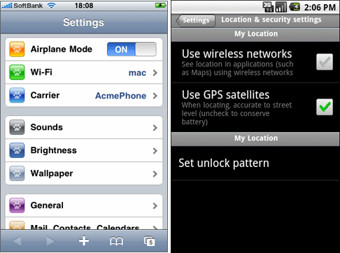

#format dojo_rst

dojox.mobile
============

:Authors: Yoshiroh Kamiyama, Doug Hays
:Developers: Yoshiroh Kamiyama, Doug Hays
:Available: since V1.5

.. contents::
    :depth: 2

============
Introduction
============

dojox.mobile provides a number of widgets that can be used to build web-based applications for mobile devices such as iPhone, Android, or BlackBerry. These widgets work best with webkit-based browsers, such as Safari or Chrome, since webkit-specific CSS3 features are extensively used. However, the widgets should work in a "graceful degradation" manner even on non-CSS3 browsers, such as IE or (older) Firefox. In that case, fancy effects, such as animation, gradient color, or round corner rectangle, may not work, but you can still operate your application.
Furthermore, as a separate file, a compatibility module, dojox.mobile.compat, is available, which simulates some of CSS3 features used in this module. If you use the compatibility module, fancy visual effects work better even on non-CSS3 browsers.

dojox.mobile is designed to be as lightweight as possible to achieve a better user experience on mobile. It has only a few dependencies on other dojo/dijit modules. It has less dependency even on the dojo/dijit base modules, so many of the base modules can be eliminated at build time. Also, it has its own very small parser that is a subset of dojo.parser, but has enough capability to bootstrap your application.

=================
Available Widgets
=================

Views
-----

* `View <dojox/mobile/View>`_

  A container that represents a mobile device screen

* `ScrollableView <dojox/mobile/ScrollableView>`_

  A view with touch scroll capability

* `SwapView <dojox/mobile/SwapView>`_

  A view that can be swiped horizontally (formerly known as FlippableView)

Heading
-------

* `Heading <dojox/mobile/Heading>`_

  A navigation bar that appears at the top

* `ToolBarButton <dojox/mobile/ToolBarButton>`_

  A button that is placed in the Heading widget

Lists
-----

* `RoundRectCategory <dojox/mobile/RoundRectCategory>`_

  Rounded-corner list category

* `EdgeToEdgeCategory <dojox/mobile/EdgeToEdgeCategory>`_

  Edge-To-Edge list category

* `RoundRectList <dojox/mobile/RoundRectList>`_

  A list of items in a rounded-corner rectangle

* `EdgeToEdgeList <dojox/mobile/EdgeToEdgeList>`_

  A list of items with equal width

* `ListItem <dojox/mobile/ListItem>`_

  A list item to use in a list widget

IconContainer
-------------

* `IconContainer <dojox/mobile/IconContainer>`_

  A container to house icons for actions/events

* `IconItem <dojox/mobile/IconItem>`_

  A widget for representing an icon and associated actions

TabBar
------

* `TabBar <dojox/mobile/TabBar>`_

  A bar that can have TabBarButtons to control visibility of views

* `TabBarButton <dojox/mobile/TabBarButton>`_

  A button that is placed in the TabBar widget

Panes
-----

* `RoundRect <dojox/mobile/RoundRect>`_

  A rounded-corner rectangle boxes

* `ContentPane <dojox/mobile/ContentPane>`_

  A 

Openers
-------

* `Opener <dojox/mobile/Opener>`_

  A 

* `Overlay <dojox/mobile/Overlay>`_

  A 

* `Tooltip <dojox/mobile/Tooltip>`_

  A 

From Controls
-------------

* `Button <dojox/mobile/Button>`_

  A button that changes the color when pressed

* `CheckBox <dojox/mobile/CheckBox>`_

  A 

* `ComboBox <dojox/mobile/ComboBox>`_

  A 

* `ExpandingTextArea <dojox/mobile/ExpandingTextArea>`_

  A 

* `RadioButton <dojox/mobile/RadioButton>`_

  A 

* `Slider <dojox/mobile/Slider>`_

  A 

* `Switch <dojox/mobile/Switch>`_

  A toggle switch with a sliding knob

* `TextArea <dojox/mobile/TextArea>`_

  A 

* `TextBox <dojox/mobile/TextBox>`_

  A 

* `ToggleButton <dojox/mobile/ToggleButton>`_

  A 

Layout
------

* `FixedSplitter <dojox/mobile/FixedSplitter>`_

  A

* `FixedSplitterPane <dojox/mobile/FixedSplitterPane>`_

  A

Indicators
----------

* `PageIndicator <dojox/mobile/PageIndicator>`_

  A

* `ProgressIndicator <dojox/mobile/ProgressIndicator>`_

  A round spinning graphical indicator

Carousel
--------

* `Carousel <dojox/mobile/Carousel>`_

  A widget that manages a list of images

===============
Getting Started
===============

Loading the basic dojox.mobile codebase is extremely simple.  It's a couple requires and then selecting the CSS.  That's it.

Loading Dojo Mobile (using Dojo 1.7+ preferred api's):
------------------------------------------------------

This example assumes Dojo script is being loaded asynchronously with "async:1" config property.  Using this approach
helps ensure the bare minimum code is used, and loaded as fast as possible.

.. code-block :: javascript
 
  require([
    "dojox/mobile/parser", 	// (Optional) This mobile app uses declarative programming with fast mobile parser
    "dojox/mobile",		// (Required) This is a mobile app.
    "dojox/mobile/compat" 	// (Optional) This mobile app supports running on desktop browsers
  ],function(parser,mobile,compat){ Optional module aliases that can then be referenced inside callback block
    // Do something with mobile api's.  At this point Dojo Mobile api's are ready for use.
  );

If you prefer to use "progressive enhancement" design techniques and not use Dojo's simple declarative programming model, you can choose not to specify the dojox/mobile/parser module and in script construct widgets programmatically.

If you don't need compatibility support for modern desktop browsers (FF, IE8+), you can choose note to specify the dojox/mobile/compat module.  In this case, mobile support will only work properly on Webkit-based mobile browsers (Dojo Mobile's default environment support).

Loading Dojo Mobile (using Dojo pre-1.7 style api's):
-----------------------------------------------------

This example uses synchronous loading, and loads all of Dojo core.  This results in more code being loaded than the bare minimum, and uses a synchronous loader which will be slower to load modules than the above async example (preferred).

.. code-block :: javascript 
     
    dojo.require("dojox.mobile"); // Load the basic mobile widget kernel and support code.
    dojo.require("dojox.mobile.parser"); // (Optional) Load the lightweight parser.  dojo.parser can also be used, but it requires much more code to be loaded.
    dojo.requireIf(!dojo.isWebKit, "dojox.mobile.compat"); // (Optional) Load the compat layer if the incoming browser isn't webkit based
    // Do something with Dojo Mobile...

Applying a Mobile Device Theme Using CSS
----------------------------------------

Selecting the CSS to apply (iphone, android, blackberry or custom) is equally simple:

.. code-block :: html

  <link rel="stylesheet" type="text/css" href="dojox/mobile/themes/iphone/iphone.css"></link>

Automatically Applying Mobile Device Themes Using CSS
-----------------------------------------------------
You can also use Dojo Mobile's automatic device detection and theme loading by adding the "dojox/mobile/deviceTheme" to your requires list.  When automatic device detection and theme loading is enabled, Dojo Mobile will insert appropriate stylesheet links dynamically into the header, based on user agent sniffing.

When this approach is taken, you can also pass an additional query parameter string, device={theme id} to force a specific theme from a browser url input (this feature is useful for creating samples and demos as well as testing what a page looks like on various devices).

Typical Use
-----------

Typical usage is to create one or more views in a page, and create a round rectangle list, an edge-to-edge list, an icon container, etc. in the views. You can specify an animated transition between the views.
The following example shows how to create views and make a transition between them.

.. image:: hello-example.png

..

Example (using HTML5 validating declarative markup and mobile parser)

.. html::

   01:<!DOCTYPE HTML>
   02: <html>
   03:   <head>
   04:     <meta name="viewport" content="width=device-width,initial-scale=1,
       maximum-scale=1,minimum-scale=1,user-scalable=no"/>
   05:     <meta name="apple-mobile-web-app-capable" content="yes" />
   06:     <link href="dojox/mobile/themes/iphone/iphone.css" rel="stylesheet"></link>
   07:     
   08:     
   14:   </head>
   15:   <body>
   16:     

   17:       <h1 data-dojo-type="dojox.mobile.Heading">View 1</h1>
   18:       <ul data-dojo-type="dojox.mobile.RoundRectList">
   19:         <li data-dojo-type="dojox.mobile.ListItem" moveTo="bar" label="Hello"
   20: 	    icon="dojox/mobile/tests/images/i-icon-1.png"></li>
   21:       </ul>
   22:     

   23: 
   24:     

   25:       <h1 data-dojo-type="dojox.mobile.Heading" back="Home" moveTo="foo">View 2</h1>
   26:       <ul data-dojo-type="dojox.mobile.RoundRectList">
   27:         <li data-dojo-type="dojox.mobile.ListItem" label="World"
   28: 	    icon="dojox/mobile/tests/images/i-icon-2.png"></li>
   29:       </ul>
   30:     

   31:   </body>
   32: </html>
..

Example (using older HTML (non-validating) and mobile parser)

.. html::

   01: <!DOCTYPE HTML PUBLIC "-//W3C//DTD HTML 4.01//EN" "http://www.w3.org/TR/html4/strict.dtd">
   02: <html>
   03:   <head>
   04:     <meta name="viewport" content="width=device-width,initial-scale=1,
       maximum-scale=1,minimum-scale=1,user-scalable=no"/>
   05:     <meta name="apple-mobile-web-app-capable" content="yes" />
   06:     <link href="dojox/mobile/themes/iphone/iphone.css" rel="stylesheet"></link>
   07:     
   08:     
   14:   </head>
   15:   <body>
   16:     

   17:       <h1 dojoType="dojox.mobile.Heading">View 1</h1>
   18:       <ul dojoType="dojox.mobile.RoundRectList">
   19:         <li dojoType="dojox.mobile.ListItem" moveTo="bar" label="Hello"
   20: 	    icon="dojox/mobile/tests/images/i-icon-1.png"></li>
   21:       </ul>
   22:     

   23: 
   24:     

   25:       <h1 dojoType="dojox.mobile.Heading" back="Home" moveTo="foo">View 2</h1>
   26:       <ul dojoType="dojox.mobile.RoundRectList">
   27:         <li dojoType="dojox.mobile.ListItem" label="World"
   28: 	    icon="dojox/mobile/tests/images/i-icon-2.png"></li>
   29:       </ul>
   30:     

   31:   </body>
   32: </html>

..

* Line 4 is a viewport setting, which sets the width, height and scale of the browser area used to display the content. Mobile Safari recognizes this meta tag.

* Line 5 tells iPhone/iPad that the web application should run in full-screen mode.

* Line 6 loads a style sheet for iPhone theme. You may want to load a different theme instead.

* Line 10 loads lightweight mobile parser, since this example uses declarative markup.  The parser will automatically instantiates the mobile widgets associated with dom elements. You can of course use the default parser (dojo/parser) instead if you're using dijit widgets on views, but the mobile parser is much smaller and has enough capability to bootstrap simple dojo application pages like this example.

  The desktop browser compatability module for non-CSS3 browsers is not used in this example, so it will likely only render properly on webkit-based browsers.

* Line 16 through Line 22 is the first view. It contains a heading and a round rectangle list. This view will be shown at start up, since it is the first view and the selected="true" attribute is not specified for the second view.

* Line 24 through Line 30 is the second view, which will be shown when you tap on a list item in the first view.

==================
Programmer's Guide
==================

* `Dynamic Content Loading <dojox/mobile/dynamic-content-loading>`_
* `Listening to Transition Events <dojox/mobile/transition-events>`_
* `FAQ about dojox.mobile.parser <dojox/mobile/parser-faq>`_
* `Cross-browser Support <dojox/mobile/cross-browser-support>`_
* `Internationalization (i18n) <dojox/mobile/internationalization>`_
* `Build <dojox/mobile/build>`_

========
Appendix
========

* `Differences between 1.6 and 1.7 <dojox/mobile/differences-16-17>`_
