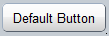
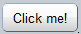

#format dojo_rst

dojox.mobile.Button
===================

:Status: Draft
:Version: 1.0
:Authors: Yoshiroh Kamiyama, Jared Jurkiewicz, Doug Hays
:Developers: Yoshiroh Kamiyama, Doug Hays
:Available: since V1.5

.. contents::
    :depth: 2

Button is a very simple button widget.  When pressed, it generates an onClick event and changes CSS classes temporarily to emulate a native HTML BUTTON element press-and-release.

======================
Constructor Parameters
======================

+--------------+----------+--------------+-----------------------------------------------------------------------------------------------------------+
|Parameter     |Type      |Default       |Description                                                                                                |
+--------------+----------+--------------+-----------------------------------------------------------------------------------------------------------+
|baseClass     |String 	  |mblButton     |Default CSS class name used to render the button.                                                          |
+--------------+----------+--------------+-----------------------------------------------------------------------------------------------------------+
|class         |String 	  |              |Additional CSS class names to add to baseClass.                                                            |
+--------------+----------+--------------+-----------------------------------------------------------------------------------------------------------+
|duration      |Number    |1000          |Duration of the selected CSS change in milliseconds.                                                       |
+--------------+----------+--------------+-----------------------------------------------------------------------------------------------------------+
|label         |String    |              |A label of the button. If the label is not specified, innerHTML is used as a label.                        |
+--------------+----------+--------------+-----------------------------------------------------------------------------------------------------------+
|onClick       |Function  |              |An event handler used for press notifications.                                                             |
+--------------+----------+--------------+-----------------------------------------------------------------------------------------------------------+

========
Examples
========

Default Button
--------------

.. code-block :: html

  <button dojoType="dojox.mobile.Button">Default Button</button>

Custom Button
-------------

You can define your own style for Button and specify it with the class and style parameters.

.. code-block :: html

  

.. code-block :: html

  <button dojoType="dojox.mobile.Button" class="redButton" style="width:120px">Custom Button</button>

onClick handler in HTML5 format
-------------------------------

.. code-block :: html

  <button data-dojo-type="dojox.mobile.Button" data-dojo-props='label:"Click me!", onClick:function(e){ alert("button clicked");return true; }'></button>

