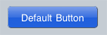
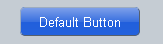

#format dojo_rst

dojox.mobile.Button
===================

:Status: Draft
:Version: 1.0
:Authors: Jared Jurkiewicz, Yoshiroh Kamiyama
:Developers: Yoshiroh Kamiyama, Jared Jurkiewicz
:Available: since V1.5

.. contents::
    :depth: 2

Button is a very simple button widget whose only capability is to change the button color when pressed and then return to normal after a given period of time.

======================
Constructor Parameters
======================

+--------------+----------+--------------+-----------------------------------------------------------------------------------------------------------+
|Parameter     |Type      |Default       |Description                                                                                                |
+--------------+----------+--------------+-----------------------------------------------------------------------------------------------------------+
|btnClass      |String 	  |mblBlueButton |A button class name. The default value is "mblBlueButton". Note that there is no relationship between this |
|              |          |              |Button widget and the button classes that are defined in dojox/mobile/themes/buttons.css.                  |
+--------------+----------+--------------+-----------------------------------------------------------------------------------------------------------+
|duration      |Number    |1000          |Duration of the selected color status in milliseconds.                                                     |
+--------------+----------+--------------+-----------------------------------------------------------------------------------------------------------+
|label         |String    |              |A label of the button. If the label is not specified, innerHTML is used as a label.                        |
+--------------+----------+--------------+-----------------------------------------------------------------------------------------------------------+

========
Examples
========

Default Button
--------------

.. code-block :: html

  <button dojoType="dojox.mobile.Button" style="width:120px">Default Button</button>

Custom Button
-------------

You can define your own style for Button and specify it with the btnClass parameter.

.. code-block :: html

  

.. code-block :: html

  <button dojoType="dojox.mobile.Button" btnClass="redButton" style="width:120px">Custom Button</button>

.. image:: Button-example2.png
