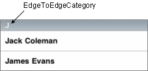

#format dojo_rst

dojox.mobile.EdgeToEdgeCategory
===============================

:Status: Draft
:Version: 1.0
:Authors: Jared Jurkiewicz, Yoshiroh Kamiyama
:Developers: Yoshiroh Kamiyama, Jared Jurkiewicz
:Available: since V1.5

.. contents::
    :depth: 2

EdgeToEdgeCategory is a category header for an `edge-to-edge list <dojox/mobile/EdgeToEdgeList>`_. 

======================
Constructor Parameters
======================

+--------------+----------+---------+-----------------------------------------------------------------------------------------------------------+
|Parameter     |Type      |Required |Description                                                                                                |
+--------------+----------+---------+-----------------------------------------------------------------------------------------------------------+
|label         |String    |No       |A label of the category. If the label is not specified, innerHTML is used as a label.                      |
+--------------+----------+---------+-----------------------------------------------------------------------------------------------------------+

========
Examples
========

Declarative example
-------------------

.. code-block :: html

  <h2 dojoType="dojox.mobile.EdgeToEdgeCategory">J</h2>
