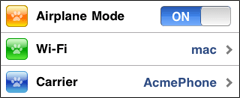
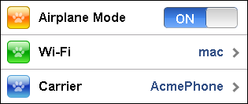

#format dojo_rst

dojox.mobile.EdgeToEdgeList
===========================

:Status: Draft
:Version: 1.0
:Authors: Yoshiroh Kamiyama
:Developers: Yoshiroh Kamiyama
:Available: since V1.5

.. contents::
    :depth: 2

EdgeToEdgeList is an edge-to-edge layout list, which displays all items in equally sized rows. Each item must be dojox.mobile.ListItem.

======================
Constructor Parameters
======================

+--------------+----------+---------+-----------------------------------------------------------------------------------------------------------+
|Parameter     |Type      |Required |Description                                                                                                |
+--------------+----------+---------+-----------------------------------------------------------------------------------------------------------+
|transition    |String    |No       |A type of animated transition effect. "slide", "fade", "flip", or "none". The default value is "slide".    |
+--------------+----------+---------+-----------------------------------------------------------------------------------------------------------+
|iconBase      |String    |No       |The default icon path for child items. If a child item does not have its own icon parameter specified,     |
|              |          |         |this value is used as its icon path. This parameter is especially useful when all or most of the icons are |
|              |          |         |the same, or you use CSS sprite icons, where you specify an aggregated icon image with this parameter and  |
|              |          |         |an icon position for each icon.                                                                            |
+--------------+----------+---------+-----------------------------------------------------------------------------------------------------------+
|iconPos       |String    |No       |The default icon position for child items. This parameter is especially useful when all or most of the     |
|              |          |         |icons are the same.                                                                                        |
+--------------+----------+---------+-----------------------------------------------------------------------------------------------------------+

========
Examples
========

Declarative example
-------------------

In this example, <ul> and <li> are used just because they are typically used to create a list in html. You can use 
 instead.

.. code-block :: html

  <ul dojoType="dojox.mobile.EdgeToEdgeList">
    <li dojoType="dojox.mobile.ListItem" icon="images/i-icon-3.png" rightText="Off" moveTo="bar">
      Wi-Fi
    </li>
    <li dojoType="dojox.mobile.ListItem" icon="images/i-icon-4.png" rightText="VPN" moveTo="bar">
      VPN
    </li>
  </ul>

CSS sprite example
------------------

In this example, an aggregated icon image as below is used for each list item icon. This way the number of requests to the server can be reduced and thus the performance could be improved.

(all-icons.png)

.. code-block :: html

  <ul dojoType="dojox.mobile.EdgeToEdgeList" iconBase="images/i-icon-all.png">
    <li dojoType="dojox.mobile.ListItem" iconPos="0,0,29,29">
      Airplane Mode
      

    </li>
    <li dojoType="dojox.mobile.ListItem" iconPos="0,29,29,29" rightText="mac" href="test_iPhone-Icon.html">
      Wi-Fi
    </li>
    <li dojoType="dojox.mobile.ListItem" iconPos="0,58,29,29" rightText="AcmePhone" moveTo="general">
      Carrier
    </li>
  </ul>

