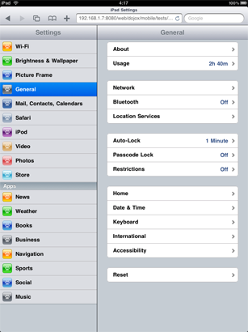
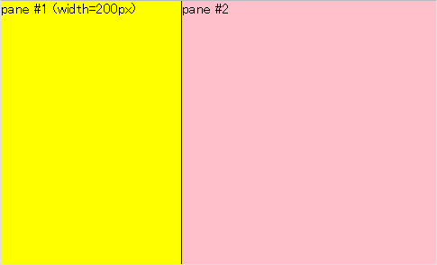
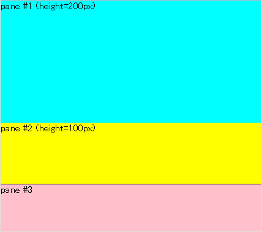

#format dojo_rst

dojox.mobile.FixedSplitter
==========================

:Authors: Yoshiroh Kamiyama
:Developers: Yoshiroh Kamiyama
:Available: since V1.7

.. contents::
    :depth: 2

FixedSplitter is a very simple container widget that layouts its child dom nodes side by side either horizontally or vertically. An example usage of this widget would be to realize the split view on iPad. There is no visual splitter between the children, and there is no function to resize the child panes with drag-and-drop. If you need a visual splitter, you can specify a border of a child dom node with CSS. A child of the widget can be a plain 
 or FixedSplitterPane.

=====
Usage
=====

FixedSplitter is in a separate module file from _base.js. You need to dojo.require FixedSplitter as below. If you load FixedSplitter, FixedSplitterPane will be loaded as well.

.. code-block :: javascript

  

  dojo.require("dojox.mobile.FixedSplitter");

======================
Constructor Parameters
======================

+--------------+----------+---------+-----------------------------------------------------------------------------------------------------------+
|Parameter     |Type      |Default  |Description                                                                                                |
+--------------+----------+---------+-----------------------------------------------------------------------------------------------------------+
|orientation   | String   |"H"      |The direction of split. If "H" is specified, panes are split horizontally. If "V" is specified, panes are  |
|              |          |         |split vertically.                                                                                          |
+--------------+----------+---------+-----------------------------------------------------------------------------------------------------------+

========
Examples
========

Declarative example1
--------------------

.. code-block :: html

  

      

          pane #1 (width=200px)
      

      

          pane #2
      

  

Declarative example2
--------------------

.. code-block :: html

  

      

          pane #1 (height=200px)
      

      

          pane #2 (height=100px)
      

      

          pane #3
      

  

