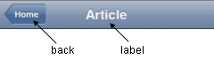

#format dojo_rst

dojox.mobile.Heading
====================

:Status: Draft
:Version: 1.0
:Authors: Jared Jurkiewicz, Yoshiroh Kamiyama
:Developers: Yoshiroh Kamiyama, Jared Jurkiewicz
:Available: since V1.5

.. contents::
    :depth: 2

Heading is a widget that represents a navigation bar, which usually appears at the top of an application. It usually displays the title of the current view and can contain a navigational control.
If you use it with ScrollableView, it can also be used as a fixed header bar or a fixed footer bar. In such cases, specify the fixed="top" attribute to be a fixed header bar or the fixed="bottom" attribute to be a fixed footer bar.
Heading can have one or more ToolBarButton widgets as its children.

======================
Constructor Parameters
======================

+--------------+----------+---------+-----------------------------------------------------------------------------------------------------------+
|Parameter     |Type      |Required |Description                                                                                                |
+--------------+----------+---------+-----------------------------------------------------------------------------------------------------------+
|back          |String 	  |No       |A label for the navigational control to return to the previous View.                                       |
+--------------+----------+---------+-----------------------------------------------------------------------------------------------------------+
|href 	       |String    |No       |A URL to open when the navigational control is pressed.                                                    |
+--------------+----------+---------+-----------------------------------------------------------------------------------------------------------+
|moveTo        |String    |No       |An id of a View to which the current view moves when the navigational control is pressed.                  |
+--------------+----------+---------+-----------------------------------------------------------------------------------------------------------+
|transition    |String    |No       |A type of animated transition effect. "slide", "fade", "flip", or "none". The default value is "slide".    |
+--------------+----------+---------+-----------------------------------------------------------------------------------------------------------+
|label 	       |String    |No       |A title text of the heading. If the label is not specified, the innerHTML of the node is used as a label   |
+--------------+----------+---------+-----------------------------------------------------------------------------------------------------------+
|iconBase      |String    |No       |The default icon path for child items. If a child item does not have its own icon parameter specified,     |
|              |          |         |this value is used as its icon path. This parameter is especially useful when all or most of the icons are |
|              |          |         |the same, or you use CSS sprite icons, where you specify an aggregated icon image with this parameter and  |
|              |          |         |an icon position for each icon.                                                                            |
+--------------+----------+---------+-----------------------------------------------------------------------------------------------------------+

========
Examples
========

Example 1
---------
.. code-block :: html

  <h1 dojoType="dojox.mobile.Heading" back="Settings" moveTo="settings">General</h1>

Example 2
---------
.. code-block :: html

  <h1 dojoType="dojox.mobile.Heading" label="World Clock">
    
Edit

    

  </h1>

Example 3
---------
.. code-block :: html

  <h1 dojoType="dojox.mobile.Heading" label="Voice Memos">
    

    

  </h1>

Example 4
---------
.. code-block :: html

  <h1 dojoType="dojox.mobile.Heading" label="Updates">
    <!-- dummy hidden button to center the label -->
    

    

  </h1>

Example 5
---------
.. code-block :: html

  <h1 dojoType="dojox.mobile.Heading" label="News" back="Bookmarks" moveTo="bookmarks">
    

  </h1>

Example 6
---------
.. code-block :: html

  <h1 dojoType="dojox.mobile.Heading">
    

    

  </h1>

Example 7
---------
.. code-block :: html

  

    
New

    
Toggle

    

    

    

  

Example 8
---------
.. code-block :: html

  <h1 dojoType="dojox.mobile.Heading">
    <ul dojoType="dojox.mobile.TabBar" barType="segmentedControl" style="float:left;margin-left:6px;">
      <li dojoType="dojox.mobile.TabBarButton" style="width:80px" selected="true">Catalog</li>
      <li dojoType="dojox.mobile.TabBarButton" style="width:80px">Share</li>
      <li dojoType="dojox.mobile.TabBarButton" style="width:80px">Download</li>
    </ul>
    

  </h1>

Example 9
---------
.. code-block :: html

  <h1 dojoType="dojox.mobile.Heading" align="center">
    <table cellpadding="0" cellspacing="0" style="width:100%;"><tr>
    <td>

</td>
    <td align="center">

      
Search

      
Directions

    
</td>
    <td align="right">

</td>
    </tr></table>
  </h1>

Example 10
----------
.. code-block :: html

  <h1 dojoType="dojox.mobile.Heading" back="Inbox" label="1 of 10">
    <ul dojoType="dojox.mobile.TabBar" barType="segmentedControl" style="float:right;margin-right:6px;">
      <li dojoType="dojox.mobile.TabBarButton" class="mblDomButton mblDomButtonUpArrow_2" selectOne="false"></li>
      <li dojoType="dojox.mobile.TabBarButton" class="mblDomButton mblDomButtonDownArrow_2" selectOne="false"></li>
    </ul>
  </h1>

Example 11
----------
.. code-block :: html

  <h1 dojoType="dojox.mobile.Heading" back="Top" label="Inbox(32)">
    

    

    

  </h1>

