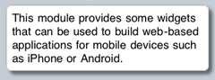

#format dojo_rst

dojox.mobile.RounRect
=====================

:Status: Draft
:Version: 1.0
:Authors: Jared Jurkiewicz, Yoshiroh Kamiyama
:Developers: Yoshiroh Kamiyama, Jared Jurkiewicz
:Available: since V1.5

.. contents::
    :depth: 2

RoundRect is a simple round rectangle container for any HTML and/or widgets. You can achieve the same appearance by just applying the -webkit-border-radius style to a div tag. However, if you use RoundRect, you can get a round rectangle even on non-CSS3 browsers such as IE.

======================
Constructor Parameters
======================

+--------------+----------+---------+-----------------------------------------------------------------------------------------------------------+
|Parameter     |Type      |Required |Description                                                                                                |
+--------------+----------+---------+-----------------------------------------------------------------------------------------------------------+
|shadow        |Boolean   |No       |If true, adds a shadow effect to the container element. The default value is false.                        |
+--------------+----------+---------+-----------------------------------------------------------------------------------------------------------+

========
Examples
========

Declarative example
-------------------

.. code-block :: html

  

    This module provides some widgets that can be used to build web-based
    applications for mobile devices such as iPhone or Android.
  

