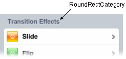

.. _dojox/mobile/RoundRectCategory:

dojox.mobile.RoundRectCategory
==============================

:Authors: Yoshiroh Kamiyama
:Developers: Yoshiroh Kamiyama
:Available: since V1.5

.. contents::
    :depth: 2

RoundRectCategory is a category header for a rounded rectangle list.

======================
Constructor Parameters
======================

+--------------+----------+---------+-----------------------------------------------------------------------------------------------------------+
|Parameter     |Type      |Default  |Description                                                                                                |
+--------------+----------+---------+-----------------------------------------------------------------------------------------------------------+
|label         |Boolean   |""       |A label of the category. If the label is not specified, innerHTML is used as a label.                      |
+--------------+----------+---------+-----------------------------------------------------------------------------------------------------------+

========
Examples
========

Declarative example
-------------------

.. code-block :: html

  <h2 dojoType="dojox.mobile.RoundRectCategory">Transition Effects</h2>
