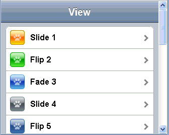

#format dojo_rst

dojox.mobile.ScrollableView
===========================

:Status: Draft
:Version: 1.0
:Authors: Yoshiroh Kamiyama
:Developers: Yoshiroh Kamiyama
:Available: since V1.6

.. contents::
    :depth: 2

ScrollableView is a container widget that represents entire mobile device screen, and has a touch scrolling capability. ScrollableView is a subclass of View (=dojox.mobile.View). Unlike the base View class, ScrollableView's domNode always stays at the top of the screen and its height is "100%" of the screen. Inside this fixed domNode, containerNode scrolls. Browser's default scrolling behavior is disabled, and the scrolling machinery is re-implemented with JavaScript. Thus the user does not need to use the two-finger operation to scroll an inner DIV (containerNode). The main purpose of this widget is to realize fixed-positioned header and/or footer bars.

The animation below shows the difference of scrolling behavior between View and ScrollableView.

======================
Constructor Parameters
======================

Inherited from dojox.mobile.View:
---------------------------------

+--------------+----------+---------+-----------------------------------------------------------------------------------------------------------+
|Parameter     |Type      |Required |Description                                                                                                |
+--------------+----------+---------+-----------------------------------------------------------------------------------------------------------+
|selected      |Boolean   |No       |If true, the view is displayed at startup time. The default value is false.                                |
+--------------+----------+---------+-----------------------------------------------------------------------------------------------------------+
|keepScrollPos |Boolean   |No       |If true, the scroll position is kept when transition occurs between views. The default value is true.      |
+--------------+----------+---------+-----------------------------------------------------------------------------------------------------------+

Inherited from dojox.mobile.scrollable:
---------------------------------------

+----------------------+----------+---------+-----------------------------------------------------------------------------------------------------------------+
|Parameter             |Type      |Required |Description                                                                                                      |
+----------------------+----------+---------+-----------------------------------------------------------------------------------------------------------------+
|scrollBar             |Boolean   |No       |If true, scroll bar is displayed. The default value is true.                                                     |
+----------------------+----------+---------+-----------------------------------------------------------------------------------------------------------------+
|scrollDir             |String    |No       |Specify a scrolling direction. "v" for vertical, "h" for horizontal, or "vh" for both. The default value is "v". |
+----------------------+----------+---------+-----------------------------------------------------------------------------------------------------------------+
|fadeScrollBar         |Boolean   |No       |Use the fade animation to hide scroll bar. The default value is true.                                            |
+----------------------+----------+---------+-----------------------------------------------------------------------------------------------------------------+
|disableFlashScrollBar |Boolean   |No       |Disable flashing of scroll bar when a view is shown. The default value is false.                                 |
+----------------------+----------+---------+-----------------------------------------------------------------------------------------------------------------+

=====
Usage
=====
Basic usage is the same as for `dojox.mobile.View <dojox/mobile/View>`_. If you do not need fixed-positioned header and/or footer bars, you should use `dojox.mobile.View <dojox/mobile/View>`_.

========
Examples
========

View header/footer bar example
------------------------------

View header/footer bars are fixed-positioned bars that are local to the view to which they belong. That is, the bars stay at the fixed position while their parent view is shown, but when the view moves to another, they go away with the view.

To make a bar widget (Heading, TabBar, or perhaps your custom bar widget) fixed-positioned,

1. Place it outside ScrollableView
2. Add fixed="top" for a header bar, or fixed="bottom" for a footer bar

.. code-block :: html

  

    <h1 dojoType="dojox.mobile.Heading" fixed="top">View Header Bar</h1>
    ....
    <h1 dojoType="dojox.mobile.Heading" fixed="bottom">View Footer Bar</h1>
  

Application header/footer bar example
-------------------------------------

Application header/footer bars are fixed-positioned bars that are global to the application (=page). That is, the bars always stay at the fixed position regardless of what view is currently shown.

To make a bar widget (Heading, TabBar, or perhaps your custom bar widget) fixed-positioned,

1. Place it outside ScrollableView
2. Add fixed="top" for a header bar, or fixed="bottom" for a footer bar

.. code-block :: html

  <h1 dojoType="dojox.mobile.Heading" fixed="top">Application Header Bar</h1>
  

      ....
  

  

      ....
  

  <h1 dojoType="dojox.mobile.Heading" fixed="bottom">Application Footer Bar</h1>
