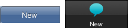

#format dojo_rst

dojox.mobile.TabBarButton
=========================

:Status: Draft
:Version: 1.0
:Authors: Yoshiroh Kamiyama
:Developers: Yoshiroh Kamiyama
:Available: since V1.6

.. contents::
    :depth: 2

TabBarButton is a button that is placed in the TabBar widget. It is a subclass of dojox.mobile.AbstractItem just like ListItem or IconItem. So, unlike Button, it has similar capability as ListItem or IconItem, such as icon support, transition, etc.

======================
Constructor Parameters
======================

+--------------+----------+---------+-----------------------------------------------------------------------------------------------------------+
|Parameter     |Type      |Default  |Description                                                                                                |
+--------------+----------+---------+-----------------------------------------------------------------------------------------------------------+
|transition    |String    |none     |A type of animated transition effect. "slide", "fade", "flip", or "none". The default value is "none".     |
+--------------+----------+---------+-----------------------------------------------------------------------------------------------------------+
|transitionDir |Number    |1        |The transition direction. If 1, transition forward. If -1, transition backward. For example, the slide     |
|              |          |         |transition slides the view from right to left when dir == 1, and from left to right when dir == -1.        |
+--------------+----------+---------+-----------------------------------------------------------------------------------------------------------+
|icon1         |String    |         |A path for the unselected (typically dark) icon. If icon is not specified, the iconBase parameter of the   |
|              |          |         |parent widget is used.                                                                                     |
+--------------+----------+---------+-----------------------------------------------------------------------------------------------------------+
|icon2         |String    |         |A path for the unselected (typically highlight) icon. If icon is not specified, the iconBase parameter of  |
|              |          |         |the parent widget or icon1 is used.                                                                        |
+--------------+----------+---------+-----------------------------------------------------------------------------------------------------------+
|iconPos1      |String    |         |The position of an aggregated unselected (typically dark) icon. IconPos1 is comma separated values like    |
|              |          |         |top,left,width,height (ex. "0,0,29,29"). If iconPos1 is not specified, the iconPos parameter of the parent |
|              |          |         |widget is used.                                                                                            |
+--------------+----------+---------+-----------------------------------------------------------------------------------------------------------+
|iconPos2      |String    |         |The position of an aggregated selected (typically highlight) icon. IconPos2 is comma separated values like |
|              |          |         |top,left,width,height (ex. "0,0,29,29"). If iconPos2 is not specified, the iconPos parameter of the parent |
|              |          |         |widget or iconPos1 is used.                                                                                |
+--------------+----------+---------+-----------------------------------------------------------------------------------------------------------+
|moveTo        |String    |         |The id of the transition destination view which resides in the current page. If you add the hash sign ('#')|
|              |          |         |before the id, the view transition updates the hash in the browser URL so that the user can bookmark the   |
|              |          |         |destination view. The user can also use the browser's back/forward button to navigate through the views in |
|              |          |         |the browser history.                                                                                       |
+--------------+----------+---------+-----------------------------------------------------------------------------------------------------------+
|href          |String    |         |A URL of another web page to go to.                                                                        |
+--------------+----------+---------+-----------------------------------------------------------------------------------------------------------+
|hrefTarget    |String    |         |A target that specifies where to open a page specified by href. The value will be passed to the 2nd        |
|              |          |         |argument of window.open().                                                                                 |
+--------------+----------+---------+-----------------------------------------------------------------------------------------------------------+
|url           |String    |         |A URL of an html fragment page or JSON data that represents a new view content (See examples below). The   |
|              |          |         |view content is loaded with XHR and inserted in the current page. Then a view transition occurs to the     |
|              |          |         |newly created view. The view is cached so that subsequent requests would not load the content again.       |
+--------------+----------+---------+-----------------------------------------------------------------------------------------------------------+
|callback      |Function  |         |A callback function that is called when the transition has been finished. A function reference, or name of |
|              |          |         |a function in context.                                                                                     |
+--------------+----------+---------+-----------------------------------------------------------------------------------------------------------+
|sync          |Boolean   |true     |If true, XHR for the view content specified with the url parameter is performed synchronously. If false, it|
|              |          |         |is done asynchronously and the progress indicator is displayed while loading the content. This parameter is|
|              |          |         |effective only when the url parameter is used.                                                             |
+--------------+----------+---------+-----------------------------------------------------------------------------------------------------------+
|label         |String    |         |A label of the item. If the label is not specified, innerHTML is used as a label.                          |
+--------------+----------+---------+-----------------------------------------------------------------------------------------------------------+
|selected      |Boolean   |false    |If true, the button is in the selected status. The default value is false.                                 |
+--------------+----------+---------+-----------------------------------------------------------------------------------------------------------+

=====
Usage
=====

Use this widget as child widgets of the `dojox.mobile.TabBar <dojox/mobile/TabBar>`_ widget.

========
Examples
========

See the `dojox.mobile.TabBar <dojox/mobile/TabBar>`_ widget for various examples.
