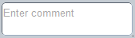

#format dojo_rst

dojox.mobile.TextArea
=====================

:Status: Draft
:Version: 1.0
:Authors: Doug Hays
:Developers: Doug Hays
:Available: since V1.7

.. contents::
    :depth: 2

TextArea is a very simple TEXTAREA widget.

======================
Constructor Parameters
======================

+--------------+----------+--------------+-----------------------------------------------------------------------------------------------------------+
|Parameter     |Type      |Default       |Description                                                                                                |
+--------------+----------+--------------+-----------------------------------------------------------------------------------------------------------+
|baseClass     |String 	  |mblTextArea   |Default CSS class name used to render the TEXTAREA.                                                        |
+--------------+----------+--------------+-----------------------------------------------------------------------------------------------------------+
|class         |String 	  |              |Additional CSS class names to add to baseClass.                                                            |
+--------------+----------+--------------+-----------------------------------------------------------------------------------------------------------+
|value         |String 	  |              |Initial value of the editable text.  If omitted, then the TEXTAREA's innerHTML is used.                    |
+--------------+----------+--------------+-----------------------------------------------------------------------------------------------------------+
|placeHolder   |String    |              |Prompt text to display inside the TEXTAREA when it would otherwise be empty.                               |
+--------------+----------+--------------+-----------------------------------------------------------------------------------------------------------+
|onChange      |Function  |              |An event handler used for TEXTAREA value change notifications.                                             |
+--------------+----------+--------------+-----------------------------------------------------------------------------------------------------------+

========
Examples
========

Simple TextArea
---------------

.. code-block :: html

  <textarea dojoType="dojox.mobile.TextArea" placeHolder="Enter comment"></textarea>

onChange handler in HTML5 format
--------------------------------

.. code-block :: html

  <textarea data-dojo-type="dojox.mobile.TextArea" rows="5" cols="40"
        data-dojo-props='value:"some data\nline 2", onChange:function(newValue){ alert("value changed to " + newValue); }'></textarea>

.. image:: HTML5MobileTextArea.png
