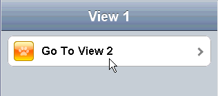

#format dojo_rst

dojox.mobile.View
=================

:Status: Draft
:Version: 1.0
:Authors: Yoshiroh Kamiyama, Jared Jurkiewicz
:Developers: Yoshiroh Kamiyama, Jared Jurkiewicz
:Available: since V1.5

.. contents::
    :depth: 2

View is a container widget that represents entire mobile device screen. One html page can have multiple Views but only one View is visible at a time.  The user can navigate through views with animated transition effects.

======================
Constructor Parameters
======================

+--------------+----------+---------+-----------------------------------------------------------------------------------------------------------+
|Parameter     |Type      |Required |Description                                                                                                |
+--------------+----------+---------+-----------------------------------------------------------------------------------------------------------+
|selected      |Boolean   |No       |If true, the view is displayed at startup time. The default value is false.                                |
+--------------+----------+---------+-----------------------------------------------------------------------------------------------------------+
|keepScrollPos |Boolean   |No       |If true, the scroll position is kept when transition occurs between views. The default value is true.      |
+--------------+----------+---------+-----------------------------------------------------------------------------------------------------------+

=====
Usage
=====
View is a container that represents the device screen. You should place all the contents in a View. There may be one or more Views in a page. Only one of them must have the selected=true parameter so that it is displayed at startup time.

========
Examples
========

Declarative example
-------------------

In this example, there are two Views, "view1" and "view2", and the user can move the views back and forth.

.. code-block :: html

  

    <h1 dojoType="dojox.mobile.Heading">View 1</h1>
    <ul dojoType="dojox.mobile.RoundRectList">
      <li dojoType="dojox.mobile.ListItem" icon="images/i-icon-1.png" moveTo="view2" transition="slide">
	Go To View 2
      </li>
    </ul>
  

  

    <h1 dojoType="dojox.mobile.Heading" back="View 1" moveTo="view1">View 2</h1>
  

Declarative example
-------------------

.. code-block :: javascript

  var view1 = new dojox.mobile.View({
    id: "foo",
    selected: true
  }, "view1");
  view1.startup();

.. code-block :: html

  <body>
    

  </body>
