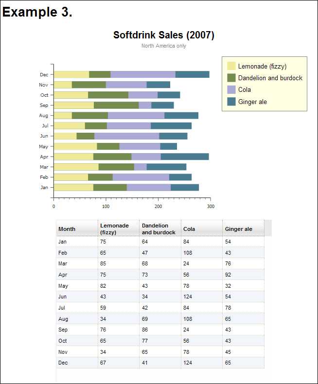

#format dojo_rst

dojox.widget.DataPresentation
=============================

:Status: Draft
:Version: Experimental
:Project owner: Dean Williams
:Author: Dave Clark
:Available: since V.1.4

.. contents::
   :depth: 2

Overview
--------

DataPresentation is a widget that connects to a data store in a simple manner, and also provides some additional convenience mechanisms for connecting to common data sources without needing to explicitly construct a Dojo data store. 

The widget can then present the data in several forms: as a graphical chart, as a tabular grid, or as display panels presenting meta-data (title, creation information, etc) from the data. 

The widget can also create and manage several of these forms in one simple construction. 

Example 1
---------

This example uses the following sample data, used to define the chart title, footer, range names and data values.
 
.. code-block :: javascript
 :linenos:
    
 var jsondata0 = {
	"title"  : "Softdrink Sales (2007)",
	"footer" : "North America only",
	"range"  : [ "Jan", "Feb", "Mar", "Apr", "May", "Jun", "Jul", "Aug", "Sep", "Oct", "Nov", "Dec" ],
	"series" : [                            
		{ "legend" : "Cola", 		"values" : [  35, 37,  44, 41, 43,  57,  62,  69,  74,  86, 101, 124 ] },
		{ "legend" : "Lemonade", 	"values" : [ 122, 99, 111, 98, 82,  77,  76,  67,  72,  75,  66,  67 ] },
		{ "legend" : "Dandelion",	"values" : [  99, 98,  98, 99, 97, 102, 100,  99, 102,  97,  95,  98 ] },
		{ "legend" : "Ginger ale", 	"values" : [  54, 59,  76, 84, 98, 110, 126, 121, 115, 109, 104,  99 ] },
		{ "legend" : "Creme soda", 	"values" : [  44, 58,  44, 36, 48,  54,  34,  38,  24,  56,  48,  34 ] },
		{ "legend" : "Orangeade", 	"values" : [  45, 25,  45, 31, 42,  33,  49,  34,  46,  25,  44,  37 ] },
		{ "legend" : "Diet lemonade", 	"values" : [  34, 17,  38, 13, 33,  14,  22,  39,  26,  17,  35,  21 ] },
		{ "legend" : "Shandy", 		"values" : [  14, 23,  16, 32, 12,  24,  18,  25,  13,  33,  15,  25 ] }
		]
	};

'Series' function This function is used to parse the above data and define which series and which properties are to be used for the chart. 

.. code-block :: javascript
 :linenos:

 var makeseries = function(data) {
	return[ { datapoints: "range", name: "Month", type: "range", chart: false },
       		{ datapoints: "series[0].values", namefield: "series[0].legend" },
       		{ datapoints: "series[1].values", name: "Lemonade (fizzy)"      },
		{ datapoints: "series[2].values", namefield: "series[2].legend" },
       		{ datapoints: "series[3].values", namefield: "series[3].legend" }
      		];
	}

Finally, create a DataPresentation object using the above data and series objects. 
The chart is placed in 'chartdiv', and the legend is placed in 'legenddiv'.

.. code-block :: javascript
 :linenos:
 
 dojo.require("dojox.widget.DataPresentation");
 dojo.require("dojox.charting.themes.Distinctive");

	var dp;

	dojo.addOnLoad(function() {

	dp = new dojox.widget.DataPresentation("chartdiv", {
		type: "chart",
		chartType: "ClusteredColumns",
		data: jsondata0,
		series: makeseries(jsondata0),
        	legendNode: "legenddiv",
        	theme: "dojox.charting.themes.Distinctive"
		});
	});
 

.. code-block :: html
 :linenos:
 
 

 

fig 1.

.. cv-compound::
  :type: inline
  :height: 430
  :version: 1.4

  .. cv:: javascript

    

  .. cv:: html

    

    

  

  .. cv:: css

    

		

Example 2.
~~~~~~~~~~

 To add a DataGrid to the above chart simply add the 'gridNode' property and target it at the relevant HTML element.

.. code-block :: javascript
 :linenos:

 dojo.require("dojox.widget.DataPresentation");
 dojo.require("dojox.charting.themes.Distinctive");
 
  	var dp;

	dojo.addOnLoad(function() {

	dp = new dojox.widget.DataPresentation("chartdiv", {
		type: "chart",
		chartType: "StackedColumns",
		data: jsondata0,
		series: makeseries(jsondata0),
       		legendNode: "legenddiv",
	        gridNode: "griddiv",
       		theme: "dojox.charting.themes.Distinctive"
		});
	});

.. code-block :: html
 :linenos:
 

 

 

     	

 

 
   
 

fig 2.

.. cv-compound::
  :type: inline
  :height: 430
  :version: 1.4

  .. cv:: javascript

    

  .. cv:: html

    

    

    

       

    
 

 

  .. cv:: css

    

Example 3.
~~~~~~~~~~

To see how the widget can cope with different data shapes, switch from jsondata0 to jsondata1 as the input data. jsondata0 is structured as complete 'series' of values, gathered into an array with series titles. jsondata1 is structures as 'data points', each containing multiple sales values. 

.. code-block :: javascript
 :linenos:

 var jsondata1 = {
  "title"  : "Softdrink Sales (2007)",
  "footer" : "North America only",
  "sales"  : [
   { "month": "Jan", "cola": "84", "lemonade": "75", "dandelionandburdock": "64", "gingerale": "54" },
   { "month": "Feb", "cola": "108", "lemonade": "65", "dandelionandburdock": "47", "gingerale": "43" },
   { "month": "Mar", "cola": "24", "lemonade": "85", "dandelionandburdock": "68", "gingerale": "76" },
   { "month": "Apr", "cola": "56", "lemonade": "75", "dandelionandburdock": "73", "gingerale": "92" },
   { "month": "May", "cola": "78", "lemonade": "82", "dandelionandburdock": "43", "gingerale": "32" },
   { "month": "Jun", "cola": "124", "lemonade": "43", "dandelionandburdock": "34", "gingerale": "54" },
   { "month": "Jul", "cola": "84", "lemonade": "59", "dandelionandburdock": "42", "gingerale": "78" },
   { "month": "Aug", "cola": "108", "lemonade": "34", "dandelionandburdock": "69", "gingerale": "65" },
   { "month": "Sep", "cola": "24", "lemonade": "76", "dandelionandburdock": "86", "gingerale": "43" },
   { "month": "Oct", "cola": "56", "lemonade": "65", "dandelionandburdock": "77", "gingerale": "43" },
   { "month": "Nov", "cola": "78", "lemonade": "34", "dandelionandburdock": "65", "gingerale": "45" },
   { "month": "Dec", "cola": "124", "lemonade": "67", "dandelionandburdock": "41", "gingerale": "65" }
  ]
 };

'Series' function. This function is used to parse the above data and define which series and which properties are to be used for the chart.

.. code-block :: javascript
 :linenos:

 var makeseries = function(data) {
  return [ 
   { datapoints: "sales", field: "month", name: "Month", type: "range", chart: false },
   { datapoints: "sales", field: "lemonade", name: "Lemonade (fizzy)" },
   { datapoints: "sales", field: "dandelionandburdock", name: "Dandelion and burdock" },
   { datapoints: "sales", field: "cola", name: "Cola" },
   { datapoints: "sales", field: "gingerale", name: "Ginger ale" }
  ];
 }

.. code-block :: javascript
 :linenos:

 dojo.require("dojox.widget.DataPresentation");
 dojo.require("dojox.charting.themes.Distinctive");
 
 var dp;

 dojo.addOnLoad(function() {

 dp = new dojox.widget.DataPresentation("chartdiv", {
  type: "chart",
  chartType: "StackedBars",
  data: jsondata1,
  refreshInterval: 3000,
  series: makeseries(jsondata1),
  legendNode: "legenddiv",
  legendVertical: true,
  gridNode: "griddiv",
  titleNode: "title",
  footerNode: "footer",
  theme: "dojox.charting.themes.Distinctive"
  });
 });

.. code-block :: html
 :linenos:
 
 <h1>Example 3.</h1>

 

  <h2 id="title" style="margin-bottom: 0;"></h2>
  

 

 <table border="0"><tr valign="top">
  <td>
   

  </td>

  <td>  
   
    
    

   

  </td>

 </tr></table>	
	
 

  

 
   
 

fig 3.

Properties
----------

store: Object
~~~~~~~~~~~~~
 Dojo data store used to supply data to be presented. This may be supplied on construction or created implicitly based on other construction parameters.

query: String
~~~~~~~~~~~~~
 Query to apply to the Dojo data store used to supply data to be presented.
		
queryOptions: String
~~~~~~~~~~~~~~~~~~~~
 Query options to apply to the Dojo data store used to supply data to be presented.
		
data: Object
~~~~~~~~~~~~
 Data to be presented. If supplied on construction this property will override any value supplied for the 'store' property.
		
url: String
~~~~~~~~~~~
 URL to fetch data from in JSON format. If supplied on construction this property will override any values supplied for the 'store' and/or 'data' properties.

urlError: function
~~~~~~~~~~~~~~~~~~
 A function to be called if an error is encountered when fetching data from the supplied URL. This function will be supplied with two parameters exactly as the error function supplied to the dojo.xhrGet function. This function may be called multiple times if a refresh interval has been supplied.
		
refreshInterval: Number
~~~~~~~~~~~~~~~~~~~~~~~
 The time interval in milliseconds after which the data supplied via the 'data' property or fetched from a URL via the 'url' property should be regularly refreshed. This property is ignored if neither the 'data' nor 'url' property has been supplied. If the refresh interval is zero, no regular refresh is done.
		
refreshIntervalPending:
~~~~~~~~~~~~~~~~~~~~~~~
 The JavaScript set interval currently in progress, if any

series: Array
~~~~~~~~~~~~~
 An array of objects describing the data series to be included in the data presentation. Each object may contain the following fields:

  datapoints: the name of the field from the source data which contains an array of the data points for this data series. If not supplied, the source data is assumed to be an array of data points to be used.

  field: the name of the field within each data point which contains the data for this data series. If not supplied, each data point is assumed to be the value for the series.

  name: a name for the series, used in the legend and grid headings

  namefield: the name of the field from the source data which contains the name the series, used in the legend and grid headings. If both name and namefield are supplied, name takes precedence. If neither are supplied, a default name is used.

  chart: true if the series should be included in a chart presentation (default: true)

  charttype: the type of presentation of the series in the chart, which can be "range", "line", "bar" (default: "bar")

  linestyle: the stroke style for lines (if applicable) (default: "Solid")

  axis: the dependant axis to which the series will be attached in the chart, which can be "primary" or "secondary" 

  grid: true if the series should be included in a data grid presentation (default: true)

  gridformatter: an optional formatter to use for this series in the data grid
		
 a call-back function may alternatively be supplied. The function takes a single parameter, which will be the data (from the 'data' field or      loaded from the value in the 'url' field), and should return the array of objects describing the data series to be included in the data 	      presentation. This enables the series structures to be built dynamically after data load, and rebuilt if necessary on data refresh. The call-back       function will be called each time new data is set, loaded or refreshed. A call-back function cannot be used if the data is supplied directly 	      from a Dojo data store.

		
type: String
~~~~~~~~~~~~
 The type of presentation to be applied at the DOM attach point. This can be 'chart', 'legend', 'grid', 'title', 'footer'. 
 The default type is 'chart'.
		
chartType: String
~~~~~~~~~~~~~~~~~
 The type of chart to display. This can be 'clusteredbars', 'areas', 'stackedcolumns', 'stackedbars', 'stackedareas', 'lines', 'hybrid'. 
 The default type is 'bar'.

reverse: Boolean
~~~~~~~~~~~~~~~~
 true if the chart independent axis should be reversed.

animate: Object
~~~~~~~~~~~~~~~
 default = false, or override duration ... eg { duration: 1000 } sets animation to 1 second 

labelMod: Integer
~~~~~~~~~~~~~~~~~
 The frequency of label annotations to be included on the independent axis. 1=every label. 
 The default is 1.
		
legendVertical: Boolean
~~~~~~~~~~~~~~~~~~~~~~~
 true if the legend should be rendered vertically. 
 The default is false (legend rendered horizontally).

theme: String|Theme
~~~~~~~~~~~~~~~~~~~
 A theme to use for the chart, or the name of a theme.
		
chartNode: String|DomNode
~~~~~~~~~~~~~~~~~~~~~~~~~
 An optional DOM node or the id of a DOM node to receive a chart presentation of the data. Supply only when a chart is required and the type is not 'chart'; when the type is 'chart' this property will be set to the widget attach point.
		
legendNode: String|DomNode
~~~~~~~~~~~~~~~~~~~~~~~~~~
 An optional DOM node or the id of a DOM node to receive a chart legend for the data. Supply only when a legend is required and the type is not legend'; when the type is 'legend' this property will be set to the widget attach point.
		
gridNode: String|DomNode
~~~~~~~~~~~~~~~~~~~~~~~~
 An optional DOM node or the id of a DOM node to receive a grid presentation of the data. Supply only when a grid is required and the type is not 'grid'; when the type is 'grid' this property will be set to the widget attach point.
		
titleNode: String|DomNode
~~~~~~~~~~~~~~~~~~~~~~~~~
 An optional DOM node or the id of a DOM node to receive a title for the data. Supply only when a title is 		      required and the type is not 'title'; when the type is 'title' this property will be set to the widget attach point.
		
footerNode: String|DomNode
~~~~~~~~~~~~~~~~~~~~~~~~~~
 An optional DOM node or the id of a DOM node to receive a footer presentation of the data. Supply only when a footer is required and the type is not 'footer'; when the type is 'footer' this property will be set to the widget attach point.
		
chartWidget: Object
~~~~~~~~~~~~~~~~~~~
 The chart widget, if any
		
legendWidget: Object
~~~~~~~~~~~~~~~~~~~~
 The legend widget, if any
		
gridWidget: Object
~~~~~~~~~~~~~~~~~~
 The grid widget, if any

 
Demos
-----

fig 2. DataPresentation Demo: http://dleadt.torolab.ibm.com/dl/charts/testd.html

.. image:: datapres6.png
